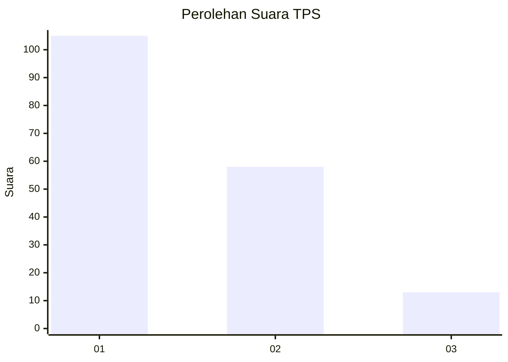
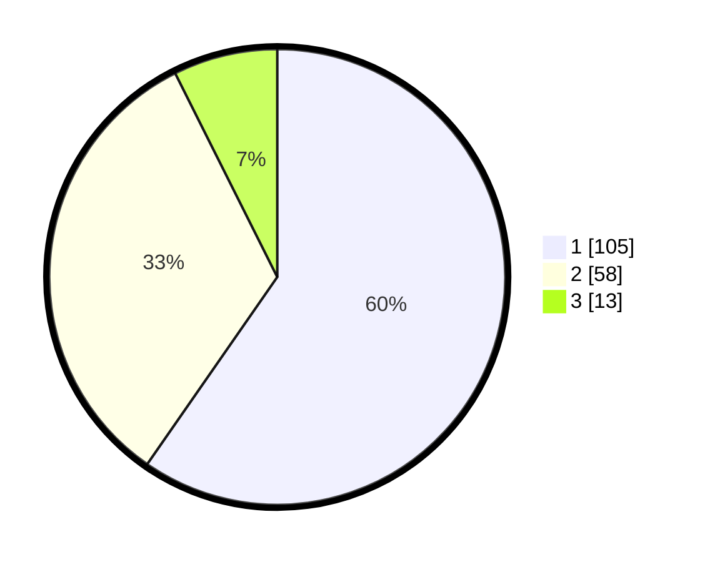

# Hasil

## Grafik

## Tabel

| No. | Nama Paslon    | Suara | Suara (raw) | Persentase |
|:--- |:-------------- | -----:| -----------:| ----------:|
| 1   | ANIES MUHAIMIN | 105   | [105][p-1]  | 59,66      |
| 2   | PRABOWO GIBRAN | 58    | [58][p-2]   | 32,95      |
| 3   | GANJAR MAHFUD  | 13    | [13][p-3]   | 7,39       |

[p-1]: https://github.com/gigit-pemilu/pemilu-2024/blob/main/pilpres/hitung-suara/sub/12-sumatera-utara/sub/71-kota-medan/sub/11-medan-johor/sub/1004-pangkalan-mansur/sub/113-tps/sub/paslon-1.txt
[p-2]: https://github.com/gigit-pemilu/pemilu-2024/blob/main/pilpres/hitung-suara/sub/12-sumatera-utara/sub/71-kota-medan/sub/11-medan-johor/sub/1004-pangkalan-mansur/sub/113-tps/sub/paslon-2.txt
[p-3]: https://github.com/gigit-pemilu/pemilu-2024/blob/main/pilpres/hitung-suara/sub/12-sumatera-utara/sub/71-kota-medan/sub/11-medan-johor/sub/1004-pangkalan-mansur/sub/113-tps/sub/paslon-3.txt

## Foto C Plano

https://sirekap-obj-formc.kpu.go.id/501f/pemilu/ppwp/12/71/11/10/04/1271111004113-20240215-075359--c2579093-faa3-4aef-8a52-a3ab61132b35.jpg

https://sirekap-obj-formc.kpu.go.id/501f/pemilu/ppwp/12/71/11/10/04/1271111004113-20240215-075525--048265c0-ba2d-425b-9c85-91bf501a60e5.jpg

https://sirekap-obj-formc.kpu.go.id/501f/pemilu/ppwp/12/71/11/10/04/1271111004113-20240215-080141--811b4493-5c21-413f-9498-32cf37f314e3.jpg

## Metadata

| Key        | Value               |
| ---------- | ------------------- |
| Time Stamp | 2024-02-25 12:00:00 |

