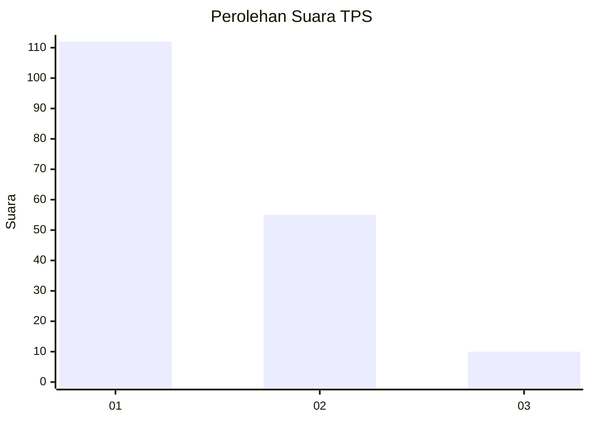
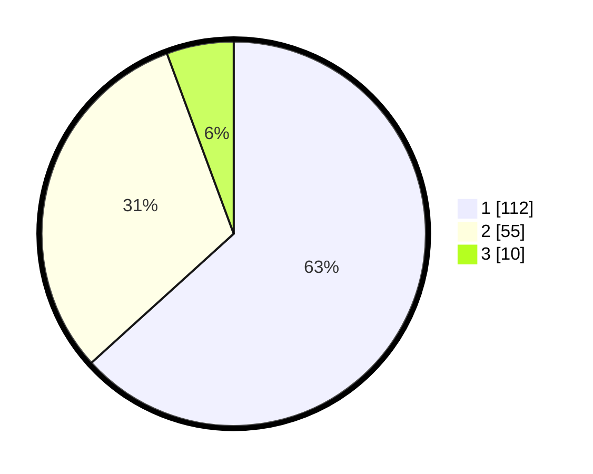

# Hasil

## Grafik

## Tabel

| No. | Nama Paslon    | Suara | Suara (raw) | Persentase |
|:--- |:-------------- | -----:| -----------:| ----------:|
| 1   | ANIES MUHAIMIN | 112   | [112][p-1]  | 63,28      |
| 2   | PRABOWO GIBRAN | 55    | [55][p-2]   | 31,07      |
| 3   | GANJAR MAHFUD  | 10    | [10][p-3]   | 5,65       |

[p-1]: https://github.com/gigit-pemilu/pemilu-2024/blob/main/pilpres/hitung-suara/sub/12-sumatera-utara/sub/71-kota-medan/sub/11-medan-johor/sub/1005-gedung-johor/sub/005-tps/sub/paslon-1.txt
[p-2]: https://github.com/gigit-pemilu/pemilu-2024/blob/main/pilpres/hitung-suara/sub/12-sumatera-utara/sub/71-kota-medan/sub/11-medan-johor/sub/1005-gedung-johor/sub/005-tps/sub/paslon-2.txt
[p-3]: https://github.com/gigit-pemilu/pemilu-2024/blob/main/pilpres/hitung-suara/sub/12-sumatera-utara/sub/71-kota-medan/sub/11-medan-johor/sub/1005-gedung-johor/sub/005-tps/sub/paslon-3.txt

## Foto C Plano

https://sirekap-obj-formc.kpu.go.id/b82e/pemilu/ppwp/12/71/11/10/05/1271111005005-20240214-193106--959eb3ec-a74a-446b-8138-4699c93902ff.jpg

https://sirekap-obj-formc.kpu.go.id/b82e/pemilu/ppwp/12/71/11/10/05/1271111005005-20240214-193221--85dd2d60-52d5-416f-982a-82bb35d697e2.jpg

https://sirekap-obj-formc.kpu.go.id/b82e/pemilu/ppwp/12/71/11/10/05/1271111005005-20240214-193324--339c200e-1cd8-46f5-9d44-d59e174b9837.jpg

## Metadata

| Key        | Value               |
| ---------- | ------------------- |
| Time Stamp | 2024-02-16 00:00:26 |

