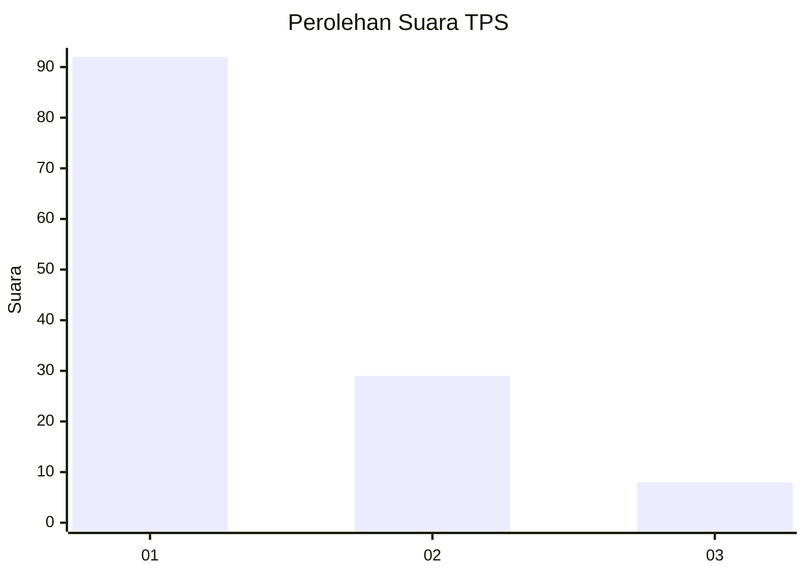
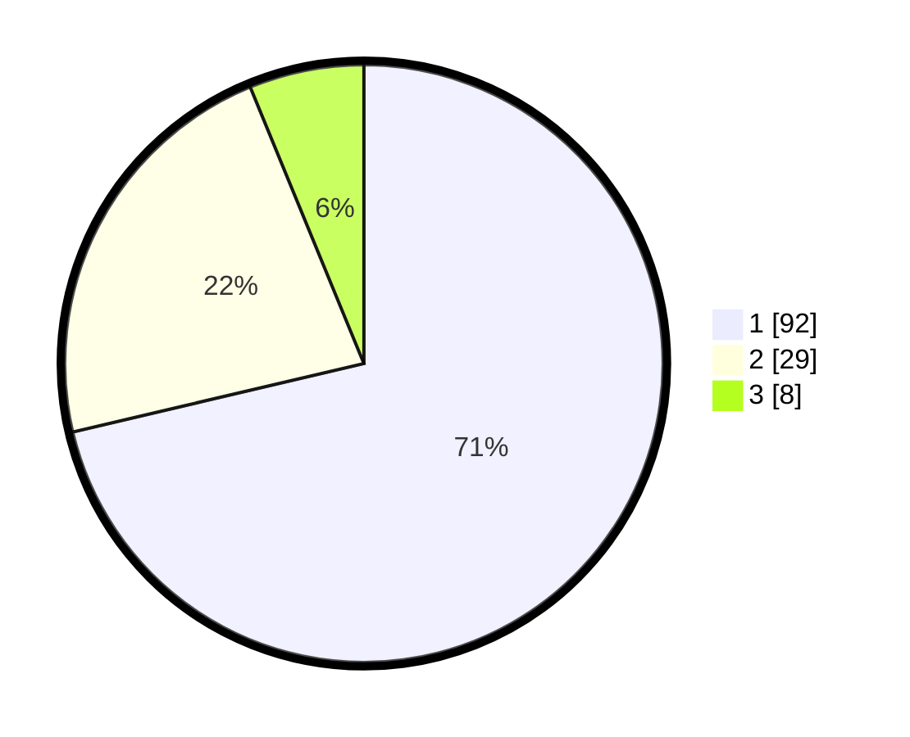

# Hasil

## Grafik

## Tabel

| No. | Nama Paslon    | Suara | Suara (raw) | Persentase |
|:--- |:-------------- | -----:| -----------:| ----------:|
| 1   | ANIES MUHAIMIN | 92    | [92][p-1]   | 71,32      |
| 2   | PRABOWO GIBRAN | 29    | [29][p-2]   | 22,48      |
| 3   | GANJAR MAHFUD  | 8     | [8][p-3]    | 6,20       |

[p-1]: https://github.com/gigit-pemilu/pemilu-2024/blob/main/pilpres/hitung-suara/sub/12-sumatera-utara/sub/71-kota-medan/sub/11-medan-johor/sub/1005-gedung-johor/sub/025-tps/sub/paslon-1.txt
[p-2]: https://github.com/gigit-pemilu/pemilu-2024/blob/main/pilpres/hitung-suara/sub/12-sumatera-utara/sub/71-kota-medan/sub/11-medan-johor/sub/1005-gedung-johor/sub/025-tps/sub/paslon-2.txt
[p-3]: https://github.com/gigit-pemilu/pemilu-2024/blob/main/pilpres/hitung-suara/sub/12-sumatera-utara/sub/71-kota-medan/sub/11-medan-johor/sub/1005-gedung-johor/sub/025-tps/sub/paslon-3.txt

## Foto C Plano

https://sirekap-obj-formc.kpu.go.id/e539/pemilu/ppwp/12/71/11/10/05/1271111005025-20240214-214527--c5673287-9ab0-451a-9543-378c43847533.jpg

https://sirekap-obj-formc.kpu.go.id/e539/pemilu/ppwp/12/71/11/10/05/1271111005025-20240214-214636--dec1986b-30ec-43ff-a70a-c15043b148f2.jpg

https://sirekap-obj-formc.kpu.go.id/e539/pemilu/ppwp/12/71/11/10/05/1271111005025-20240214-214913--c86bae5d-a5dc-434f-9317-4521c63bae94.jpg

## Metadata

| Key        | Value               |
| ---------- | ------------------- |
| Time Stamp | 2024-02-25 15:00:00 |

