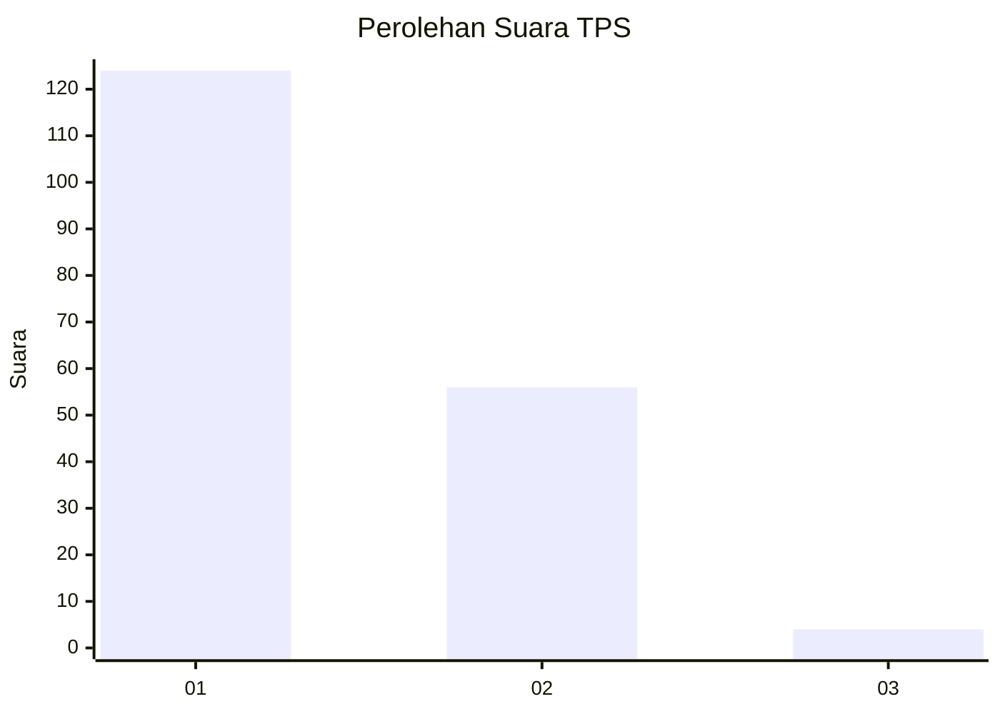
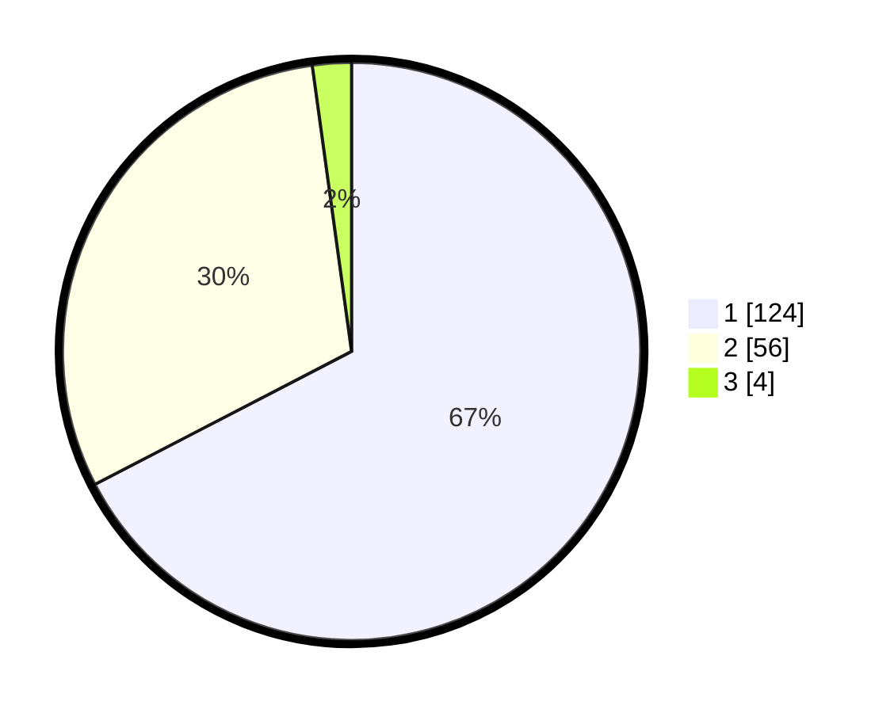

# Hasil

## Grafik

## Tabel

| No. | Nama Paslon    | Suara | Suara (raw) | Persentase |
|:--- |:-------------- | -----:| -----------:| ----------:|
| 1   | ANIES MUHAIMIN | 124   | [124][p-1]  | 67,39      |
| 2   | PRABOWO GIBRAN | 56    | [56][p-2]   | 30,43      |
| 3   | GANJAR MAHFUD  | 4     | [4][p-3]    | 2,17       |

[p-1]: https://github.com/gigit-pemilu/pemilu-2024/blob/main/pilpres/hitung-suara/sub/12-sumatera-utara/sub/71-kota-medan/sub/11-medan-johor/sub/1005-gedung-johor/sub/042-tps/sub/paslon-1.txt
[p-2]: https://github.com/gigit-pemilu/pemilu-2024/blob/main/pilpres/hitung-suara/sub/12-sumatera-utara/sub/71-kota-medan/sub/11-medan-johor/sub/1005-gedung-johor/sub/042-tps/sub/paslon-2.txt
[p-3]: https://github.com/gigit-pemilu/pemilu-2024/blob/main/pilpres/hitung-suara/sub/12-sumatera-utara/sub/71-kota-medan/sub/11-medan-johor/sub/1005-gedung-johor/sub/042-tps/sub/paslon-3.txt

## Foto C Plano

https://sirekap-obj-formc.kpu.go.id/1c26/pemilu/ppwp/12/71/11/10/05/1271111005042-20240215-050936--5c407751-7d07-4bab-b5c4-40ad508520e8.jpg

https://sirekap-obj-formc.kpu.go.id/1c26/pemilu/ppwp/12/71/11/10/05/1271111005042-20240215-051101--237c9eed-6278-455e-9765-cc06619bfe8b.jpg

https://sirekap-obj-formc.kpu.go.id/1c26/pemilu/ppwp/12/71/11/10/05/1271111005042-20240215-040832--f20edf8f-1c5f-435c-b3d3-669af508afe9.jpg

## Metadata

| Key        | Value               |
| ---------- | ------------------- |
| Time Stamp | 2024-02-26 14:00:00 |

