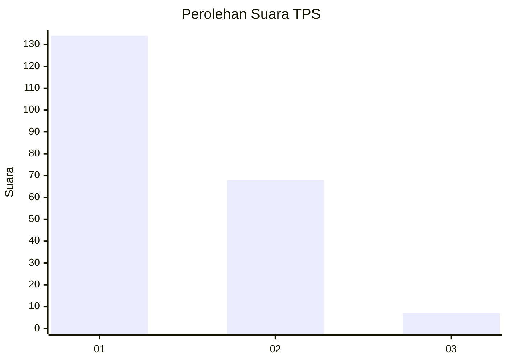
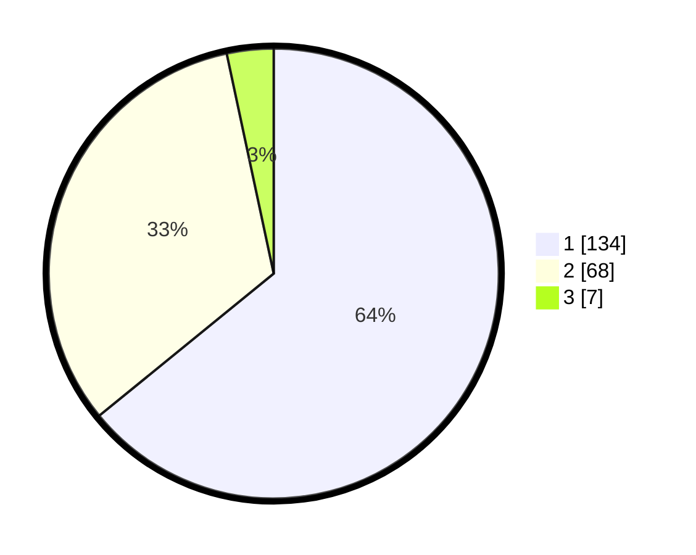

# Hasil

## Grafik

## Tabel

| No. | Nama Paslon    | Suara | Suara (raw) | Persentase |
|:--- |:-------------- | -----:| -----------:| ----------:|
| 1   | ANIES MUHAIMIN | 134   | [134][p-1]  | 64,11      |
| 2   | PRABOWO GIBRAN | 68    | [68][p-2]   | 32,54      |
| 3   | GANJAR MAHFUD  | 7     | [7][p-3]    | 3,35       |

[p-1]: https://github.com/gigit-pemilu/pemilu-2024/blob/main/pilpres/hitung-suara/sub/12-sumatera-utara/sub/71-kota-medan/sub/11-medan-johor/sub/1005-gedung-johor/sub/052-tps/sub/paslon-1.txt
[p-2]: https://github.com/gigit-pemilu/pemilu-2024/blob/main/pilpres/hitung-suara/sub/12-sumatera-utara/sub/71-kota-medan/sub/11-medan-johor/sub/1005-gedung-johor/sub/052-tps/sub/paslon-2.txt
[p-3]: https://github.com/gigit-pemilu/pemilu-2024/blob/main/pilpres/hitung-suara/sub/12-sumatera-utara/sub/71-kota-medan/sub/11-medan-johor/sub/1005-gedung-johor/sub/052-tps/sub/paslon-3.txt

## Foto C Plano

https://sirekap-obj-formc.kpu.go.id/3e3f/pemilu/ppwp/12/71/11/10/05/1271111005052-20240215-004655--814c7dd4-145e-43d6-8942-7ec275c0119f.jpg

https://sirekap-obj-formc.kpu.go.id/3e3f/pemilu/ppwp/12/71/11/10/05/1271111005052-20240215-004747--5940f962-4921-41b4-8764-e828e58ead0b.jpg

https://sirekap-obj-formc.kpu.go.id/3e3f/pemilu/ppwp/12/71/11/10/05/1271111005052-20240215-005248--88eda6ea-11c6-4013-9759-e07f3e9bf64f.jpg

## Metadata

| Key        | Value               |
| ---------- | ------------------- |
| Time Stamp | 2024-02-26 14:00:00 |

