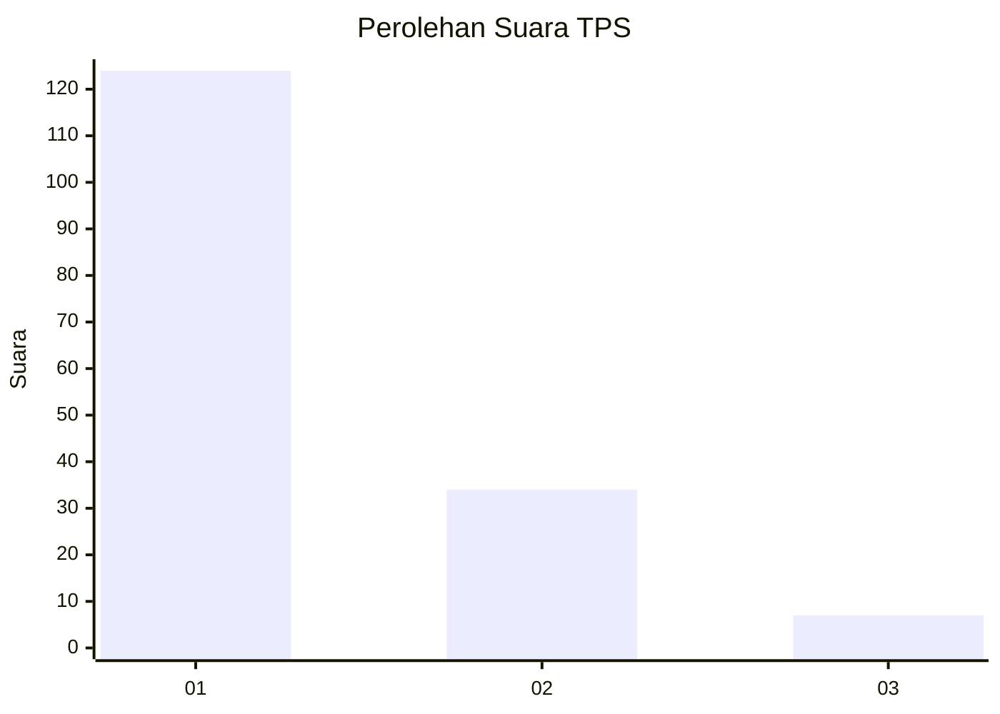
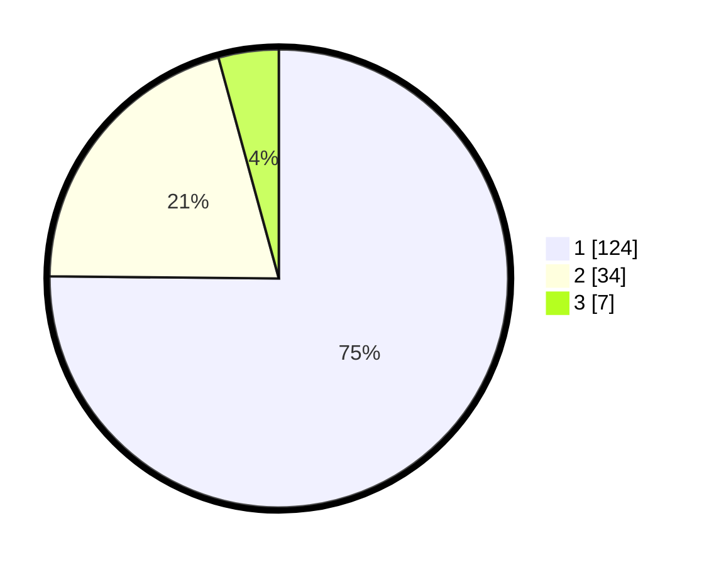

# Hasil

## Grafik

## Tabel

| No. | Nama Paslon    | Suara | Suara (raw) | Persentase |
|:--- |:-------------- | -----:| -----------:| ----------:|
| 1   | ANIES MUHAIMIN | 124   | [124][p-1]  | 75,15      |
| 2   | PRABOWO GIBRAN | 34    | [34][p-2]   | 20,61      |
| 3   | GANJAR MAHFUD  | 7     | [7][p-3]    | 4,24       |

[p-1]: https://github.com/gigit-pemilu/pemilu-2024/blob/main/pilpres/hitung-suara/sub/12-sumatera-utara/sub/71-kota-medan/sub/11-medan-johor/sub/1005-gedung-johor/sub/065-tps/sub/paslon-1.txt
[p-2]: https://github.com/gigit-pemilu/pemilu-2024/blob/main/pilpres/hitung-suara/sub/12-sumatera-utara/sub/71-kota-medan/sub/11-medan-johor/sub/1005-gedung-johor/sub/065-tps/sub/paslon-2.txt
[p-3]: https://github.com/gigit-pemilu/pemilu-2024/blob/main/pilpres/hitung-suara/sub/12-sumatera-utara/sub/71-kota-medan/sub/11-medan-johor/sub/1005-gedung-johor/sub/065-tps/sub/paslon-3.txt

## Foto C Plano

https://sirekap-obj-formc.kpu.go.id/a65c/pemilu/ppwp/12/71/11/10/05/1271111005065-20240214-211057--79262715-319a-44c2-a16a-8c326bd5d054.jpg

https://sirekap-obj-formc.kpu.go.id/a65c/pemilu/ppwp/12/71/11/10/05/1271111005065-20240214-211238--870ad436-a052-447d-be83-8b4df0b3cea1.jpg

https://sirekap-obj-formc.kpu.go.id/a65c/pemilu/ppwp/12/71/11/10/05/1271111005065-20240214-221754--ba2c69c6-146e-4776-808c-2642c8b72808.jpg

## Metadata

| Key        | Value               |
| ---------- | ------------------- |
| Time Stamp | 2024-02-25 14:00:00 |

