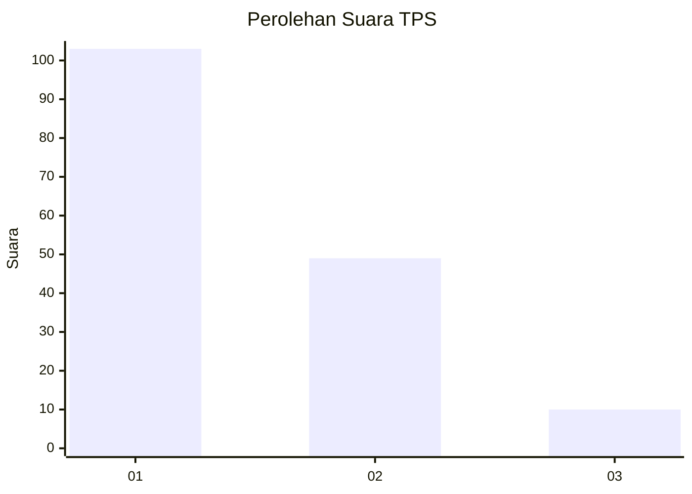
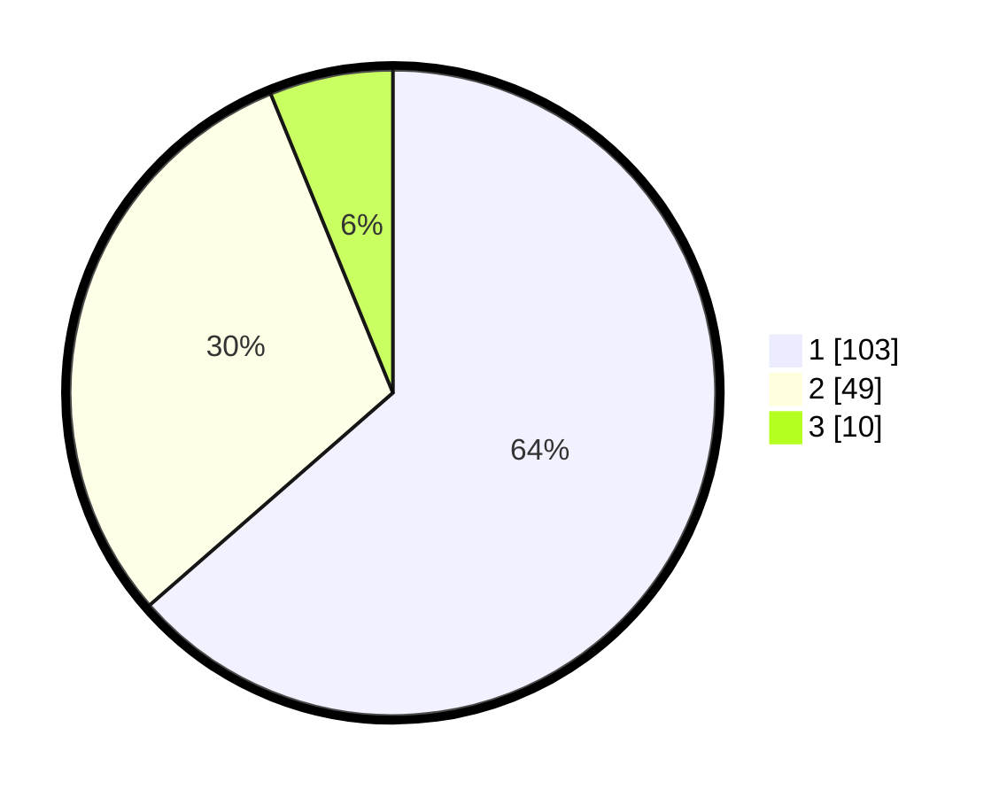

# Hasil

## Grafik

## Tabel

| No. | Nama Paslon    | Suara | Suara (raw) | Persentase |
|:--- |:-------------- | -----:| -----------:| ----------:|
| 1   | ANIES MUHAIMIN | 103   | [103][p-1]  | 63,58      |
| 2   | PRABOWO GIBRAN | 49    | [49][p-2]   | 30,25      |
| 3   | GANJAR MAHFUD  | 10    | [10][p-3]   | 6,17       |

[p-1]: https://github.com/gigit-pemilu/pemilu-2024/blob/main/pilpres/hitung-suara/sub/12-sumatera-utara/sub/71-kota-medan/sub/11-medan-johor/sub/1005-gedung-johor/sub/066-tps/sub/paslon-1.txt
[p-2]: https://github.com/gigit-pemilu/pemilu-2024/blob/main/pilpres/hitung-suara/sub/12-sumatera-utara/sub/71-kota-medan/sub/11-medan-johor/sub/1005-gedung-johor/sub/066-tps/sub/paslon-2.txt
[p-3]: https://github.com/gigit-pemilu/pemilu-2024/blob/main/pilpres/hitung-suara/sub/12-sumatera-utara/sub/71-kota-medan/sub/11-medan-johor/sub/1005-gedung-johor/sub/066-tps/sub/paslon-3.txt

## Foto C Plano

https://sirekap-obj-formc.kpu.go.id/b520/pemilu/ppwp/12/71/11/10/05/1271111005066-20240214-221051--192cdd00-cb22-4031-9020-c7b8fdae3abe.jpg

https://sirekap-obj-formc.kpu.go.id/b520/pemilu/ppwp/12/71/11/10/05/1271111005066-20240214-221331--9d891251-bf16-4b0a-acd9-79b06ab9420b.jpg

https://sirekap-obj-formc.kpu.go.id/b520/pemilu/ppwp/12/71/11/10/05/1271111005066-20240214-221441--793ce27a-393f-4f28-8eae-b2f87851e5bf.jpg

## Metadata

| Key        | Value               |
| ---------- | ------------------- |
| Time Stamp | 2024-02-25 14:00:00 |

