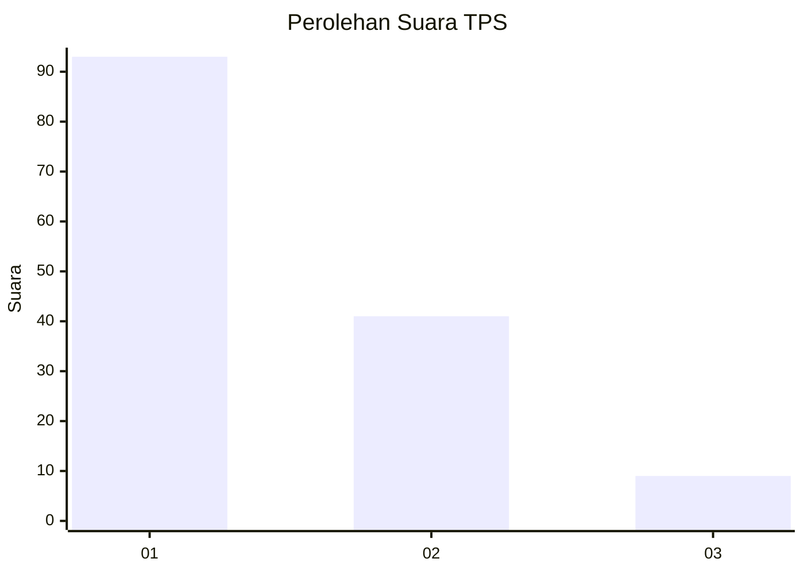
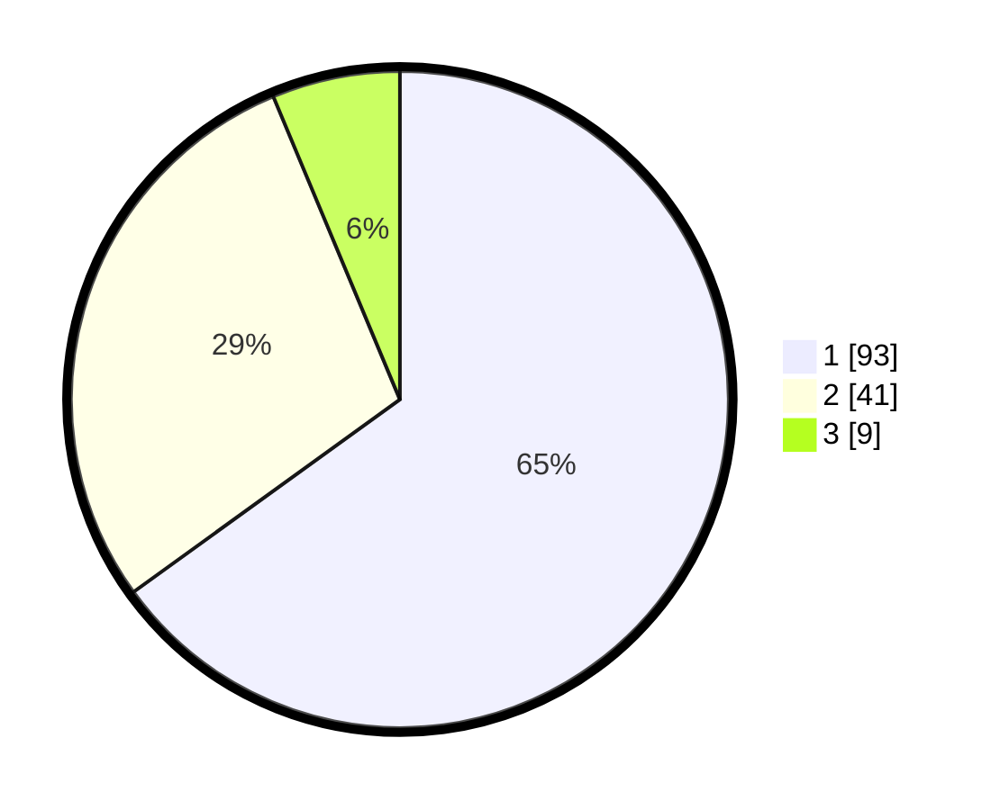

# Hasil

## Grafik

## Tabel

| No. | Nama Paslon    | Suara | Suara (raw) | Persentase |
|:--- |:-------------- | -----:| -----------:| ----------:|
| 1   | ANIES MUHAIMIN | 93    | [93][p-1]   | 65,03      |
| 2   | PRABOWO GIBRAN | 41    | [41][p-2]   | 28,67      |
| 3   | GANJAR MAHFUD  | 9     | [9][p-3]    | 6,29       |

[p-1]: https://github.com/gigit-pemilu/pemilu-2024/blob/main/pilpres/hitung-suara/sub/12-sumatera-utara/sub/71-kota-medan/sub/11-medan-johor/sub/1005-gedung-johor/sub/076-tps/sub/paslon-1.txt
[p-2]: https://github.com/gigit-pemilu/pemilu-2024/blob/main/pilpres/hitung-suara/sub/12-sumatera-utara/sub/71-kota-medan/sub/11-medan-johor/sub/1005-gedung-johor/sub/076-tps/sub/paslon-2.txt
[p-3]: https://github.com/gigit-pemilu/pemilu-2024/blob/main/pilpres/hitung-suara/sub/12-sumatera-utara/sub/71-kota-medan/sub/11-medan-johor/sub/1005-gedung-johor/sub/076-tps/sub/paslon-3.txt

## Foto C Plano

https://sirekap-obj-formc.kpu.go.id/ce44/pemilu/ppwp/12/71/11/10/05/1271111005076-20240214-233101--2e5ea16f-2dc6-49f2-8f1a-454b1242d020.jpg

https://sirekap-obj-formc.kpu.go.id/ce44/pemilu/ppwp/12/71/11/10/05/1271111005076-20240214-224138--58122a9c-a672-4a2f-b8bb-8bfccbf491d1.jpg

https://sirekap-obj-formc.kpu.go.id/ce44/pemilu/ppwp/12/71/11/10/05/1271111005076-20240214-211718--7fe5bd69-7aed-4bd1-a9a0-92544acbbb38.jpg

## Metadata

| Key        | Value               |
| ---------- | ------------------- |
| Time Stamp | 2024-02-24 22:31:28 |

