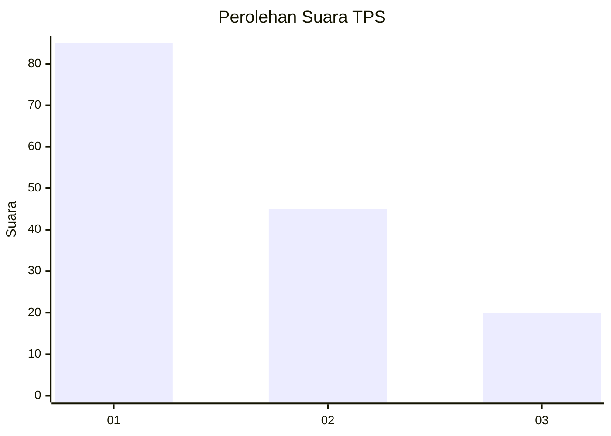
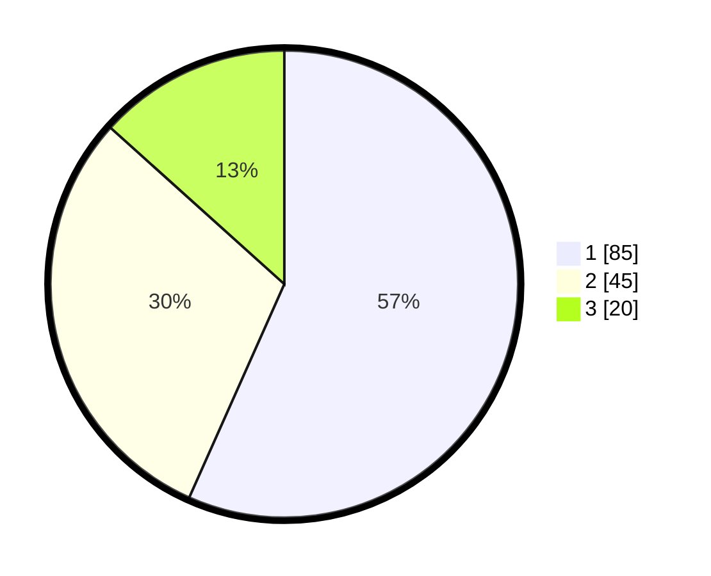

# Hasil

## Grafik

## Tabel

| No. | Nama Paslon    | Suara | Suara (raw) | Persentase |
|:--- |:-------------- | -----:| -----------:| ----------:|
| 1   | ANIES MUHAIMIN | 85    | [85][p-1]   | 56,67      |
| 2   | PRABOWO GIBRAN | 45    | [45][p-2]   | 30,00      |
| 3   | GANJAR MAHFUD  | 20    | [20][p-3]   | 13,33      |

[p-1]: https://github.com/gigit-pemilu/pemilu-2024/blob/main/pilpres/hitung-suara/sub/12-sumatera-utara/sub/71-kota-medan/sub/11-medan-johor/sub/1005-gedung-johor/sub/079-tps/sub/paslon-1.txt
[p-2]: https://github.com/gigit-pemilu/pemilu-2024/blob/main/pilpres/hitung-suara/sub/12-sumatera-utara/sub/71-kota-medan/sub/11-medan-johor/sub/1005-gedung-johor/sub/079-tps/sub/paslon-2.txt
[p-3]: https://github.com/gigit-pemilu/pemilu-2024/blob/main/pilpres/hitung-suara/sub/12-sumatera-utara/sub/71-kota-medan/sub/11-medan-johor/sub/1005-gedung-johor/sub/079-tps/sub/paslon-3.txt

## Foto C Plano

https://sirekap-obj-formc.kpu.go.id/1da4/pemilu/ppwp/12/71/11/10/05/1271111005079-20240215-002328--1907e1fd-7324-4922-b901-df5fdc902fda.jpg

https://sirekap-obj-formc.kpu.go.id/1da4/pemilu/ppwp/12/71/11/10/05/1271111005079-20240215-002825--300b039a-93b5-4744-a044-c88dc1b8a465.jpg

https://sirekap-obj-formc.kpu.go.id/1da4/pemilu/ppwp/12/71/11/10/05/1271111005079-20240215-003536--17b8d99f-2f3c-4fe0-9d3e-d353495fa6cc.jpg

## Metadata

| Key        | Value               |
| ---------- | ------------------- |
| Time Stamp | 2024-02-25 12:00:00 |

