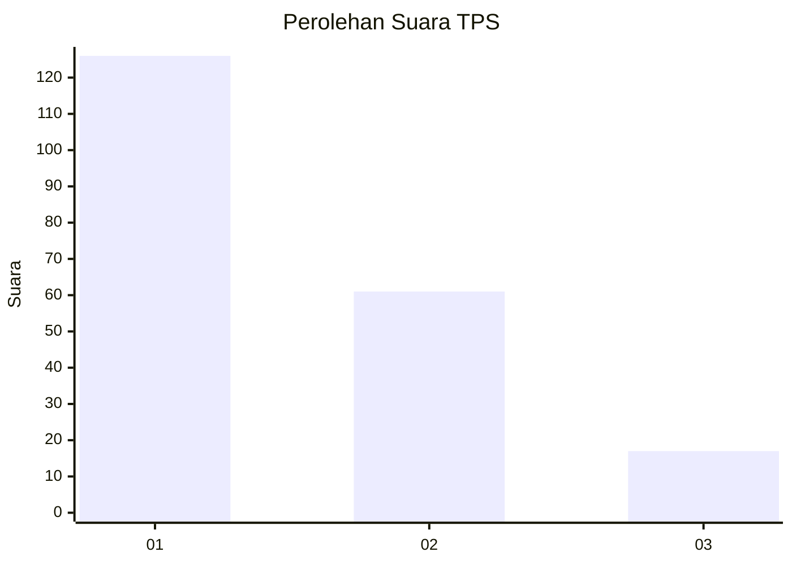
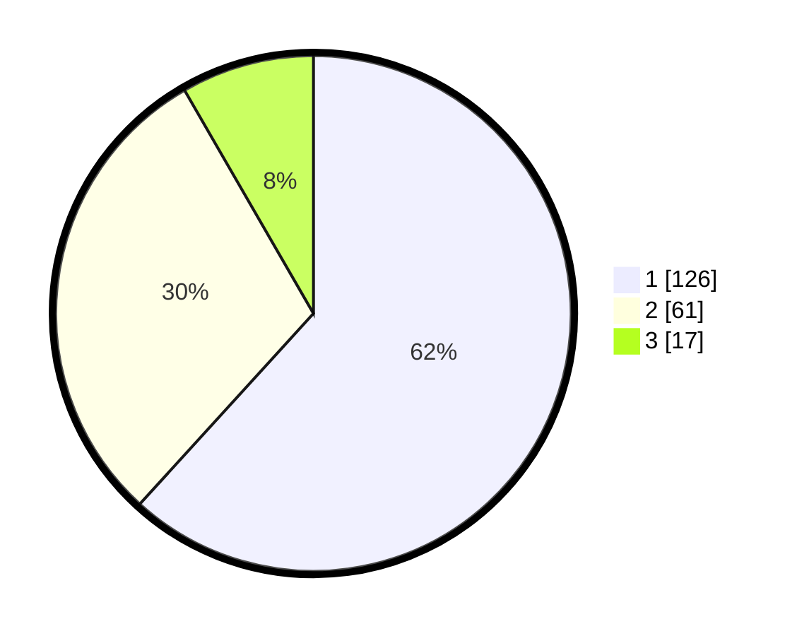

# Hasil

## Grafik

## Tabel

| No. | Nama Paslon    | Suara | Suara (raw) | Persentase |
|:--- |:-------------- | -----:| -----------:| ----------:|
| 1   | ANIES MUHAIMIN | 126   | [126][p-1]  | 61,76      |
| 2   | PRABOWO GIBRAN | 61    | [61][p-2]   | 29,90      |
| 3   | GANJAR MAHFUD  | 17    | [17][p-3]   | 8,33       |

[p-1]: https://github.com/gigit-pemilu/pemilu-2024/blob/main/pilpres/hitung-suara/sub/12-sumatera-utara/sub/71-kota-medan/sub/11-medan-johor/sub/1005-gedung-johor/sub/090-tps/sub/paslon-1.txt
[p-2]: https://github.com/gigit-pemilu/pemilu-2024/blob/main/pilpres/hitung-suara/sub/12-sumatera-utara/sub/71-kota-medan/sub/11-medan-johor/sub/1005-gedung-johor/sub/090-tps/sub/paslon-2.txt
[p-3]: https://github.com/gigit-pemilu/pemilu-2024/blob/main/pilpres/hitung-suara/sub/12-sumatera-utara/sub/71-kota-medan/sub/11-medan-johor/sub/1005-gedung-johor/sub/090-tps/sub/paslon-3.txt

## Foto C Plano

https://sirekap-obj-formc.kpu.go.id/8b7a/pemilu/ppwp/12/71/11/10/05/1271111005090-20240214-194403--0d5050fb-f631-47d8-bb37-b6d8ad211a7b.jpg

https://sirekap-obj-formc.kpu.go.id/8b7a/pemilu/ppwp/12/71/11/10/05/1271111005090-20240214-205501--af13a98e-eabc-4d73-aeca-e20059aaedfc.jpg

https://sirekap-obj-formc.kpu.go.id/8b7a/pemilu/ppwp/12/71/11/10/05/1271111005090-20240214-195431--47672f18-d9d9-4386-b6ff-9d5762feabef.jpg

## Metadata

| Key        | Value               |
| ---------- | ------------------- |
| Time Stamp | 2024-02-24 23:00:00 |

