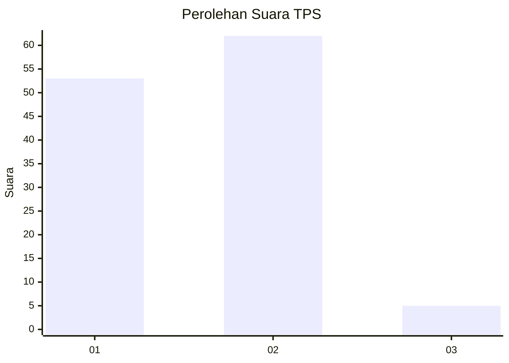
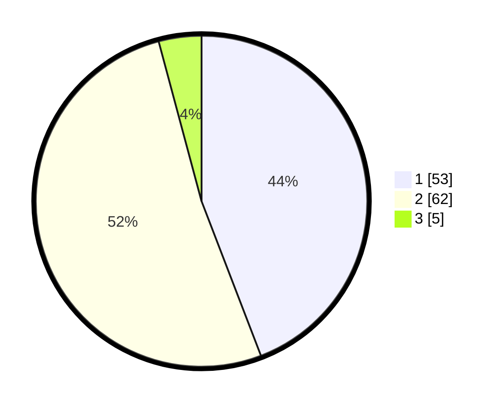

# Hasil

## Grafik

## Tabel

| No. | Nama Paslon    | Suara | Suara (raw) | Persentase |
|:--- |:-------------- | -----:| -----------:| ----------:|
| 1   | ANIES MUHAIMIN | 53    | [53][p-1]   | 44,17      |
| 2   | PRABOWO GIBRAN | 62    | [62][p-2]   | 51,67      |
| 3   | GANJAR MAHFUD  | 5     | [5][p-3]    | 4,17       |

[p-1]: https://github.com/gigit-pemilu/pemilu-2024/blob/main/pilpres/hitung-suara/sub/12-sumatera-utara/sub/71-kota-medan/sub/12-medan-marelan/sub/1001-labuhan-deli/sub/002-tps/sub/paslon-1.txt
[p-2]: https://github.com/gigit-pemilu/pemilu-2024/blob/main/pilpres/hitung-suara/sub/12-sumatera-utara/sub/71-kota-medan/sub/12-medan-marelan/sub/1001-labuhan-deli/sub/002-tps/sub/paslon-2.txt
[p-3]: https://github.com/gigit-pemilu/pemilu-2024/blob/main/pilpres/hitung-suara/sub/12-sumatera-utara/sub/71-kota-medan/sub/12-medan-marelan/sub/1001-labuhan-deli/sub/002-tps/sub/paslon-3.txt

## Foto C Plano

https://sirekap-obj-formc.kpu.go.id/30bc/pemilu/ppwp/12/71/12/10/01/1271121001002-20240214-215832--329d3276-a484-4f44-88a1-215039e05146.jpg

https://sirekap-obj-formc.kpu.go.id/30bc/pemilu/ppwp/12/71/12/10/01/1271121001002-20240214-215845--7a5b73b4-e926-4b80-a388-93d2cc0a4b9a.jpg

https://sirekap-obj-formc.kpu.go.id/30bc/pemilu/ppwp/12/71/12/10/01/1271121001002-20240214-215853--2a4cfaef-805c-4fc8-bd9c-c46b9f20d9ac.jpg

## Metadata

| Key        | Value               |
| ---------- | ------------------- |
| Time Stamp | 2024-02-21 21:00:04 |

