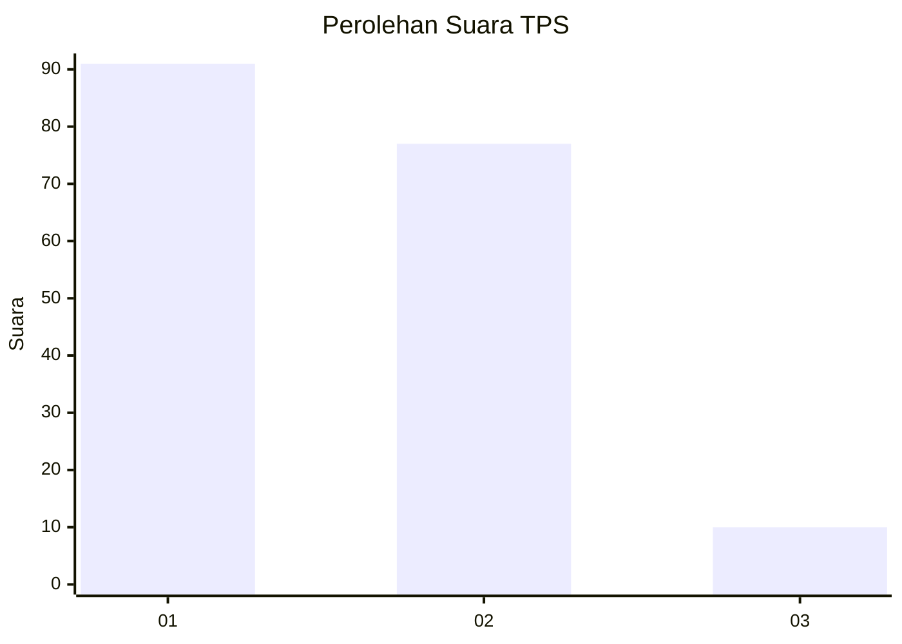
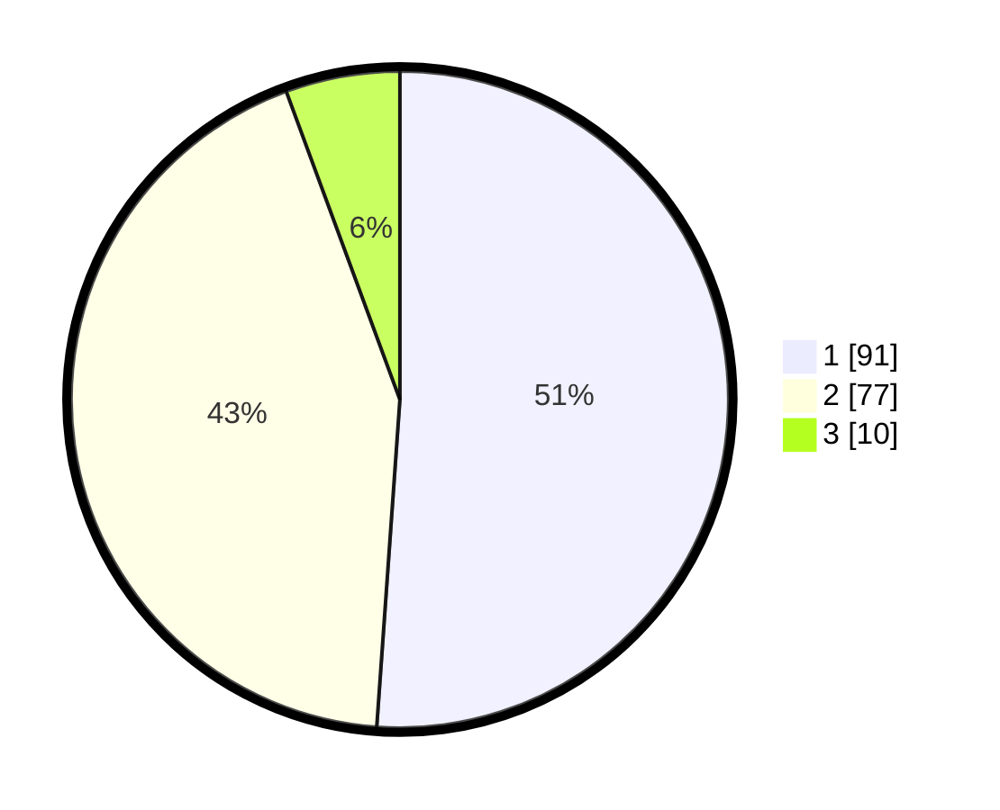

# Hasil

## Grafik

## Tabel

| No. | Nama Paslon    | Suara | Suara (raw) | Persentase |
|:--- |:-------------- | -----:| -----------:| ----------:|
| 1   | ANIES MUHAIMIN | 91    | [91][p-1]   | 51,12      |
| 2   | PRABOWO GIBRAN | 77    | [77][p-2]   | 43,26      |
| 3   | GANJAR MAHFUD  | 10    | [10][p-3]   | 5,62       |

[p-1]: https://github.com/gigit-pemilu/pemilu-2024-12-sumatera-utara/blob/main/pilpres/hitung-suara/sub/12-sumatera-utara/sub/71-kota-medan/sub/12-medan-marelan/sub/1001-labuhan-deli/sub/012-tps/sub/paslon-1.txt
[p-2]: https://github.com/gigit-pemilu/pemilu-2024-12-sumatera-utara/blob/main/pilpres/hitung-suara/sub/12-sumatera-utara/sub/71-kota-medan/sub/12-medan-marelan/sub/1001-labuhan-deli/sub/012-tps/sub/paslon-2.txt
[p-3]: https://github.com/gigit-pemilu/pemilu-2024-12-sumatera-utara/blob/main/pilpres/hitung-suara/sub/12-sumatera-utara/sub/71-kota-medan/sub/12-medan-marelan/sub/1001-labuhan-deli/sub/012-tps/sub/paslon-3.txt

## Foto C Plano

https://sirekap-obj-formc.kpu.go.id/a9fc/pemilu/ppwp/12/71/12/10/01/1271121001012-20240215-010444--ac5cd4f4-0131-4897-bbe7-5d9ea5e7d8d6.jpg

https://sirekap-obj-formc.kpu.go.id/a9fc/pemilu/ppwp/12/71/12/10/01/1271121001012-20240215-010656--0d2ae7c0-30b6-4a07-adae-f5153a895584.jpg

https://sirekap-obj-formc.kpu.go.id/a9fc/pemilu/ppwp/12/71/12/10/01/1271121001012-20240215-010859--86f98127-3168-45ed-922e-42c84512b0aa.jpg

## Metadata

| Key        | Value               |
| ---------- | ------------------- |
| Time Stamp | 2024-02-15 15:00:29 |

