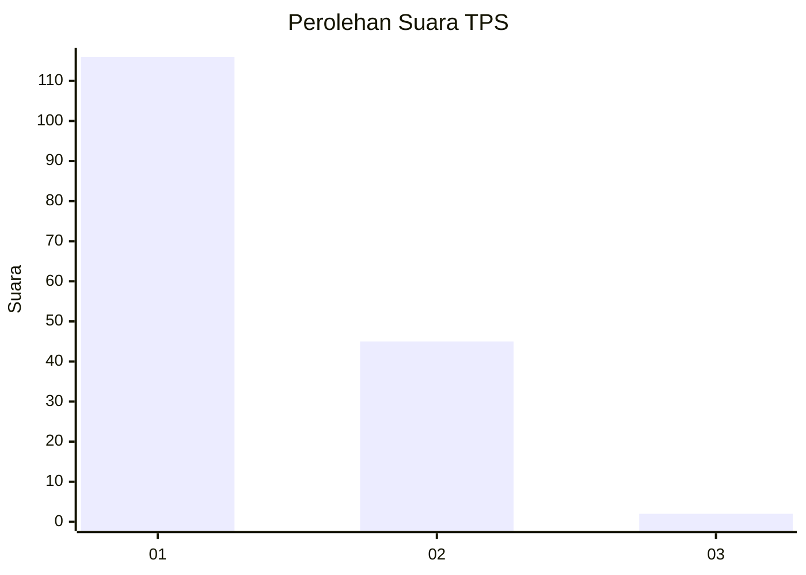
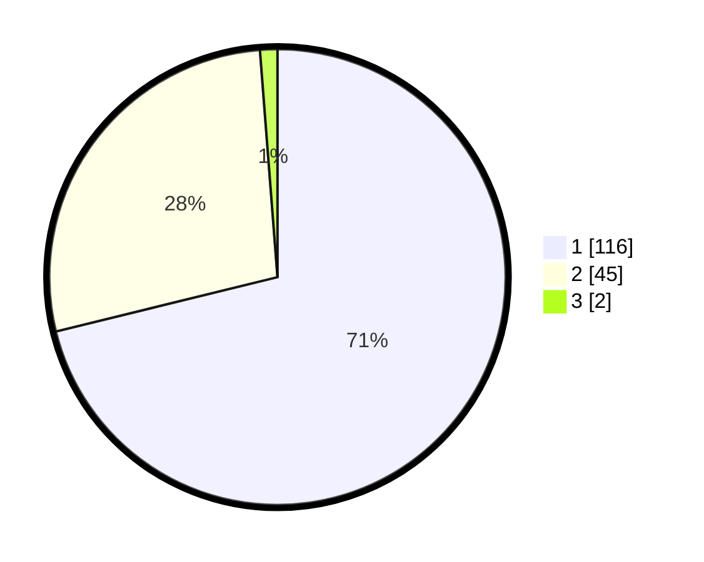

# Hasil

## Grafik

## Tabel

| No. | Nama Paslon    | Suara | Suara (raw) | Persentase |
|:--- |:-------------- | -----:| -----------:| ----------:|
| 1   | ANIES MUHAIMIN | 116   | [116][p-1]  | 71,17      |
| 2   | PRABOWO GIBRAN | 45    | [45][p-2]   | 27,61      |
| 3   | GANJAR MAHFUD  | 2     | [2][p-3]    | 1,23       |

[p-1]: https://github.com/gigit-pemilu/pemilu-2024/blob/main/pilpres/hitung-suara/sub/12-sumatera-utara/sub/71-kota-medan/sub/12-medan-marelan/sub/1001-labuhan-deli/sub/053-tps/sub/paslon-1.txt
[p-2]: https://github.com/gigit-pemilu/pemilu-2024/blob/main/pilpres/hitung-suara/sub/12-sumatera-utara/sub/71-kota-medan/sub/12-medan-marelan/sub/1001-labuhan-deli/sub/053-tps/sub/paslon-2.txt
[p-3]: https://github.com/gigit-pemilu/pemilu-2024/blob/main/pilpres/hitung-suara/sub/12-sumatera-utara/sub/71-kota-medan/sub/12-medan-marelan/sub/1001-labuhan-deli/sub/053-tps/sub/paslon-3.txt

## Foto C Plano

https://sirekap-obj-formc.kpu.go.id/227f/pemilu/ppwp/12/71/12/10/01/1271121001053-20240214-213454--7ea68b60-62cd-4def-aac8-4db165b9bd11.jpg

https://sirekap-obj-formc.kpu.go.id/227f/pemilu/ppwp/12/71/12/10/01/1271121001053-20240214-223433--20473adb-932e-4973-b697-9025c36fca00.jpg

https://sirekap-obj-formc.kpu.go.id/227f/pemilu/ppwp/12/71/12/10/01/1271121001053-20240214-224432--61850515-91b8-40d8-bdbd-61016b1bc962.jpg

## Metadata

| Key        | Value               |
| ---------- | ------------------- |
| Time Stamp | 2024-02-16 23:00:00 |

