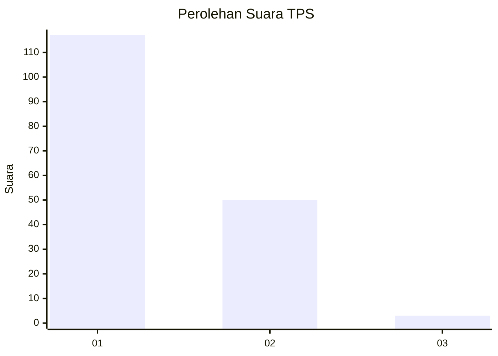
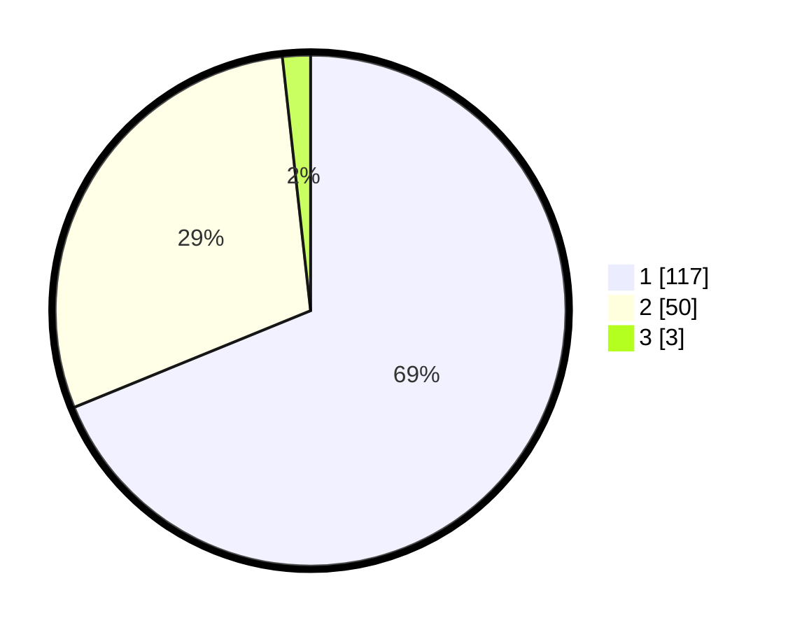

# Hasil

## Grafik

## Tabel

| No. | Nama Paslon    | Suara | Suara (raw) | Persentase |
|:--- |:-------------- | -----:| -----------:| ----------:|
| 1   | ANIES MUHAIMIN | 117   | [117][p-1]  | 68,82      |
| 2   | PRABOWO GIBRAN | 50    | [50][p-2]   | 29,41      |
| 3   | GANJAR MAHFUD  | 3     | [3][p-3]    | 1,76       |

[p-1]: https://github.com/gigit-pemilu/pemilu-2024/blob/main/pilpres/hitung-suara/sub/12-sumatera-utara/sub/71-kota-medan/sub/12-medan-marelan/sub/1002-rengas-pulau/sub/005-tps/sub/paslon-1.txt
[p-2]: https://github.com/gigit-pemilu/pemilu-2024/blob/main/pilpres/hitung-suara/sub/12-sumatera-utara/sub/71-kota-medan/sub/12-medan-marelan/sub/1002-rengas-pulau/sub/005-tps/sub/paslon-2.txt
[p-3]: https://github.com/gigit-pemilu/pemilu-2024/blob/main/pilpres/hitung-suara/sub/12-sumatera-utara/sub/71-kota-medan/sub/12-medan-marelan/sub/1002-rengas-pulau/sub/005-tps/sub/paslon-3.txt

## Foto C Plano

https://sirekap-obj-formc.kpu.go.id/917c/pemilu/ppwp/12/71/12/10/02/1271121002005-20240215-004248--dd6b9bc4-7fe4-4c7a-af64-ec54d817f199.jpg

https://sirekap-obj-formc.kpu.go.id/917c/pemilu/ppwp/12/71/12/10/02/1271121002005-20240215-004619--7d1871b3-c99e-4ec4-bbf7-9bc56a2757ba.jpg

https://sirekap-obj-formc.kpu.go.id/917c/pemilu/ppwp/12/71/12/10/02/1271121002005-20240215-004428--59430590-97ba-4e4a-8390-06fe7ad7df70.jpg

## Metadata

| Key        | Value               |
| ---------- | ------------------- |
| Time Stamp | 2024-02-16 23:30:00 |

