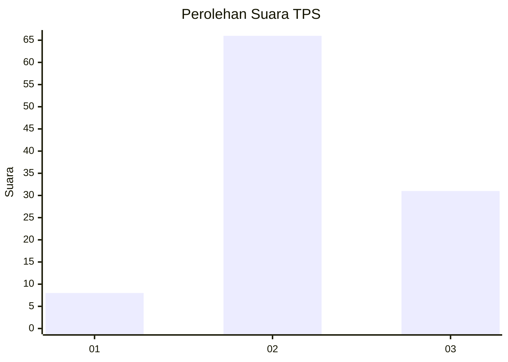
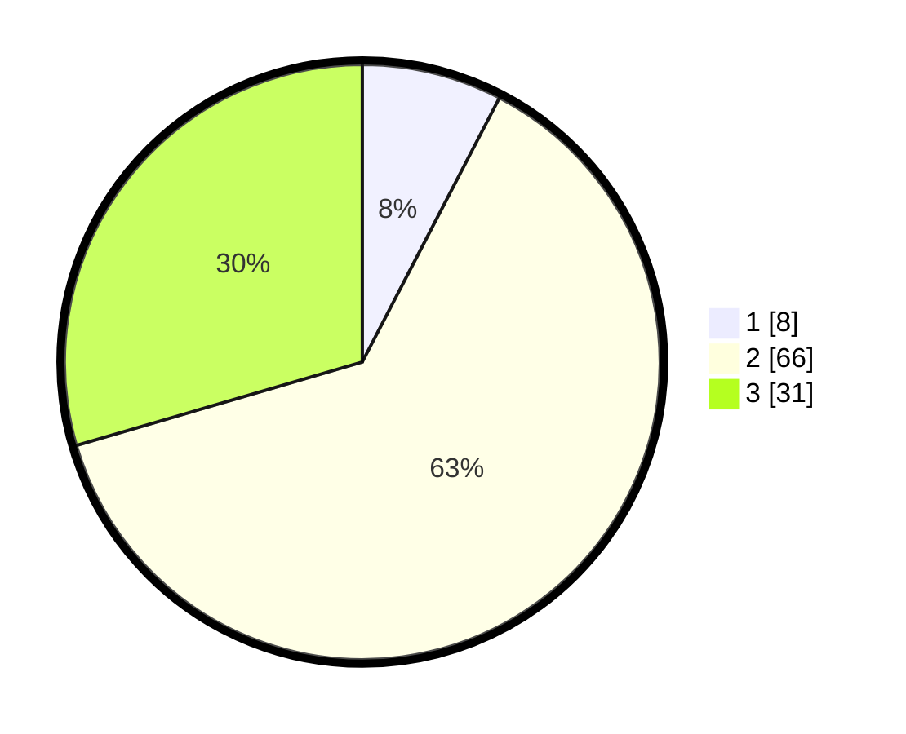

# Hasil

## Grafik

## Tabel

| No. | Nama Paslon    | Suara | Suara (raw) | Persentase |
|:--- |:-------------- | -----:| -----------:| ----------:|
| 1   | ANIES MUHAIMIN | 8     | [8][p-1]    | 7,62       |
| 2   | PRABOWO GIBRAN | 66    | [66][p-2]   | 62,86      |
| 3   | GANJAR MAHFUD  | 31    | [31][p-3]   | 29,52      |

[p-1]: https://github.com/gigit-pemilu/pemilu-2024/blob/main/pilpres/hitung-suara/sub/12-sumatera-utara/sub/71-kota-medan/sub/12-medan-marelan/sub/1002-rengas-pulau/sub/011-tps/sub/paslon-1.txt
[p-2]: https://github.com/gigit-pemilu/pemilu-2024/blob/main/pilpres/hitung-suara/sub/12-sumatera-utara/sub/71-kota-medan/sub/12-medan-marelan/sub/1002-rengas-pulau/sub/011-tps/sub/paslon-2.txt
[p-3]: https://github.com/gigit-pemilu/pemilu-2024/blob/main/pilpres/hitung-suara/sub/12-sumatera-utara/sub/71-kota-medan/sub/12-medan-marelan/sub/1002-rengas-pulau/sub/011-tps/sub/paslon-3.txt

## Foto C Plano

https://sirekap-obj-formc.kpu.go.id/1c5b/pemilu/ppwp/12/71/12/10/02/1271121002011-20240215-014812--c8407573-25fc-46aa-865a-5fcf28032e09.jpg

https://sirekap-obj-formc.kpu.go.id/1c5b/pemilu/ppwp/12/71/12/10/02/1271121002011-20240214-234501--e66de00e-d9af-4c9e-ab1a-2a7cb2349674.jpg

https://sirekap-obj-formc.kpu.go.id/1c5b/pemilu/ppwp/12/71/12/10/02/1271121002011-20240214-234658--38debf67-98df-455a-917f-5b13e3227564.jpg

## Metadata

| Key        | Value               |
| ---------- | ------------------- |
| Time Stamp | 2024-02-24 22:31:28 |

