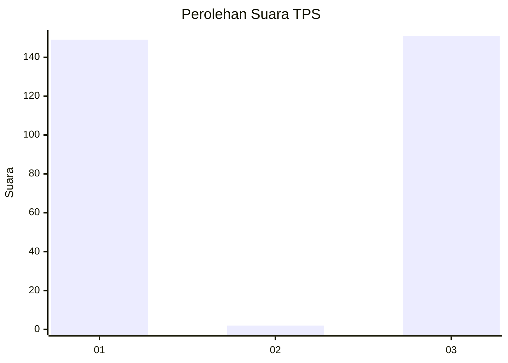
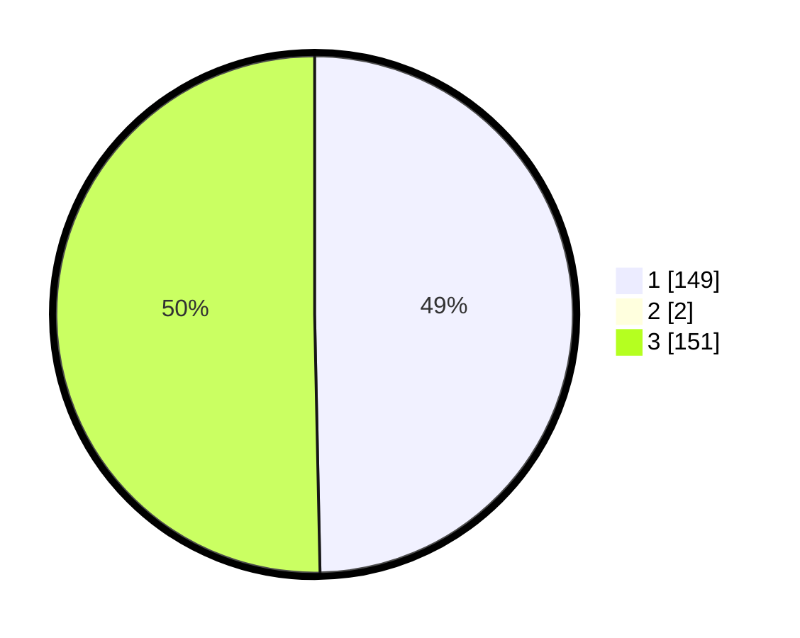

# Hasil

## Grafik

## Tabel

| No. | Nama Paslon    | Suara | Suara (raw) | Persentase |
|:--- |:-------------- | -----:| -----------:| ----------:|
| 1   | ANIES MUHAIMIN | 149   | [149][p-1]  | 49,34      |
| 2   | PRABOWO GIBRAN | 2     | [2][p-2]    | 0,66       |
| 3   | GANJAR MAHFUD  | 151   | [151][p-3]  | 50,00      |

[p-1]: https://github.com/gigit-pemilu/pemilu-2024-12-sumatera-utara/blob/main/pilpres/hitung-suara/sub/12-sumatera-utara/sub/71-kota-medan/sub/12-medan-marelan/sub/1002-rengas-pulau/sub/025-tps/sub/paslon-1.txt
[p-2]: https://github.com/gigit-pemilu/pemilu-2024-12-sumatera-utara/blob/main/pilpres/hitung-suara/sub/12-sumatera-utara/sub/71-kota-medan/sub/12-medan-marelan/sub/1002-rengas-pulau/sub/025-tps/sub/paslon-2.txt
[p-3]: https://github.com/gigit-pemilu/pemilu-2024-12-sumatera-utara/blob/main/pilpres/hitung-suara/sub/12-sumatera-utara/sub/71-kota-medan/sub/12-medan-marelan/sub/1002-rengas-pulau/sub/025-tps/sub/paslon-3.txt

## Foto C Plano

https://sirekap-obj-formc.kpu.go.id/2d0d/pemilu/ppwp/12/71/12/10/02/1271121002025-20240214-215114--45483e19-5704-4dc1-a4ac-bc6a2928b1dd.jpg

https://sirekap-obj-formc.kpu.go.id/2d0d/pemilu/ppwp/12/71/12/10/02/1271121002025-20240214-215240--737c4263-47b5-45da-a029-85138df5ff04.jpg

https://sirekap-obj-formc.kpu.go.id/2d0d/pemilu/ppwp/12/71/12/10/02/1271121002025-20240214-215342--6f3bef5c-47e6-417a-ab8a-9c5b88e45ec1.jpg

## Metadata

| Key        | Value               |
| ---------- | ------------------- |
| Time Stamp | 2024-02-25 11:00:00 |

