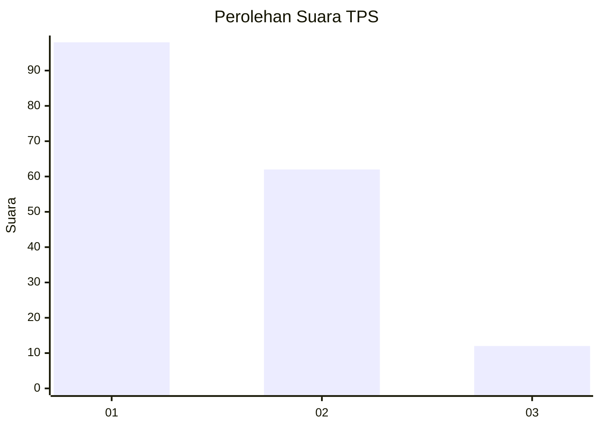
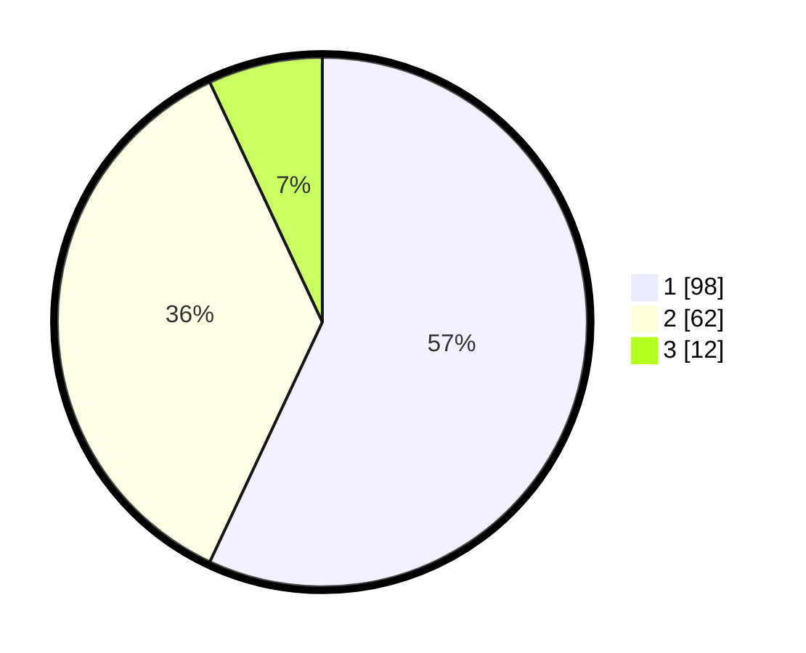

# Hasil

## Grafik

## Tabel

| No. | Nama Paslon    | Suara | Suara (raw) | Persentase |
|:--- |:-------------- | -----:| -----------:| ----------:|
| 1   | ANIES MUHAIMIN | 98    | [98][p-1]   | 56,98      |
| 2   | PRABOWO GIBRAN | 62    | [62][p-2]   | 36,05      |
| 3   | GANJAR MAHFUD  | 12    | [12][p-3]   | 6,98       |

[p-1]: https://github.com/gigit-pemilu/pemilu-2024-12-sumatera-utara/blob/main/pilpres/hitung-suara/sub/12-sumatera-utara/sub/71-kota-medan/sub/12-medan-marelan/sub/1002-rengas-pulau/sub/059-tps/sub/paslon-1.txt
[p-2]: https://github.com/gigit-pemilu/pemilu-2024-12-sumatera-utara/blob/main/pilpres/hitung-suara/sub/12-sumatera-utara/sub/71-kota-medan/sub/12-medan-marelan/sub/1002-rengas-pulau/sub/059-tps/sub/paslon-2.txt
[p-3]: https://github.com/gigit-pemilu/pemilu-2024-12-sumatera-utara/blob/main/pilpres/hitung-suara/sub/12-sumatera-utara/sub/71-kota-medan/sub/12-medan-marelan/sub/1002-rengas-pulau/sub/059-tps/sub/paslon-3.txt

## Foto C Plano

https://sirekap-obj-formc.kpu.go.id/f20a/pemilu/ppwp/12/71/12/10/02/1271121002059-20240214-202553--7f5078db-9d64-4031-b135-04dd17119be5.jpg

https://sirekap-obj-formc.kpu.go.id/f20a/pemilu/ppwp/12/71/12/10/02/1271121002059-20240214-202705--47793f5f-a0c8-45ce-88ba-3e47ce389ab3.jpg

https://sirekap-obj-formc.kpu.go.id/f20a/pemilu/ppwp/12/71/12/10/02/1271121002059-20240214-202747--eb01a28e-277d-4905-904c-f6de39d0ca1a.jpg

## Metadata

| Key        | Value               |
| ---------- | ------------------- |
| Time Stamp | 2024-02-16 03:00:26 |

## DATA PEMILIH TETAP

Jumlah pemilih dalam DPT: **243**.
 * L: **225**.
 * P: **223**.

## DATA PENGGUNA HAK PILIH

Jumlah pengguna hak pilih dalam DPT: **356**.
 * L: **272**.
 * P: **384**.

Jumlah pengguna hak pilih dalam DPTb: **229**.
 * L: **224**.
 * P: **335**.

Jumlah pengguna hak pilih dalam DPK: **288**.
 * L: **440**.
 * P: **32**.

Jumlah pengguna hak pilih: **236**.
 * L: **276**.
 * P: **304**.

## JUMLAH SUARA SAH DAN TIDAK SAH

JUMLAH SELURUH SUARA SAH: **172**.

JUMLAH SUARA TIDAK SAH: **3**.

JUMLAH SELURUH SUARA SAH DAN SUARA TIDAK SAH: **175**.

