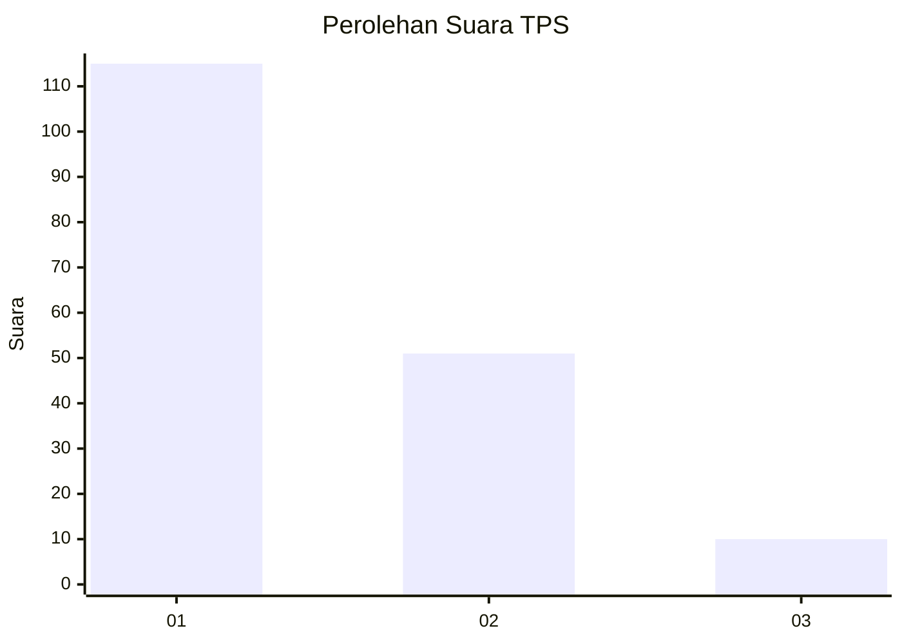
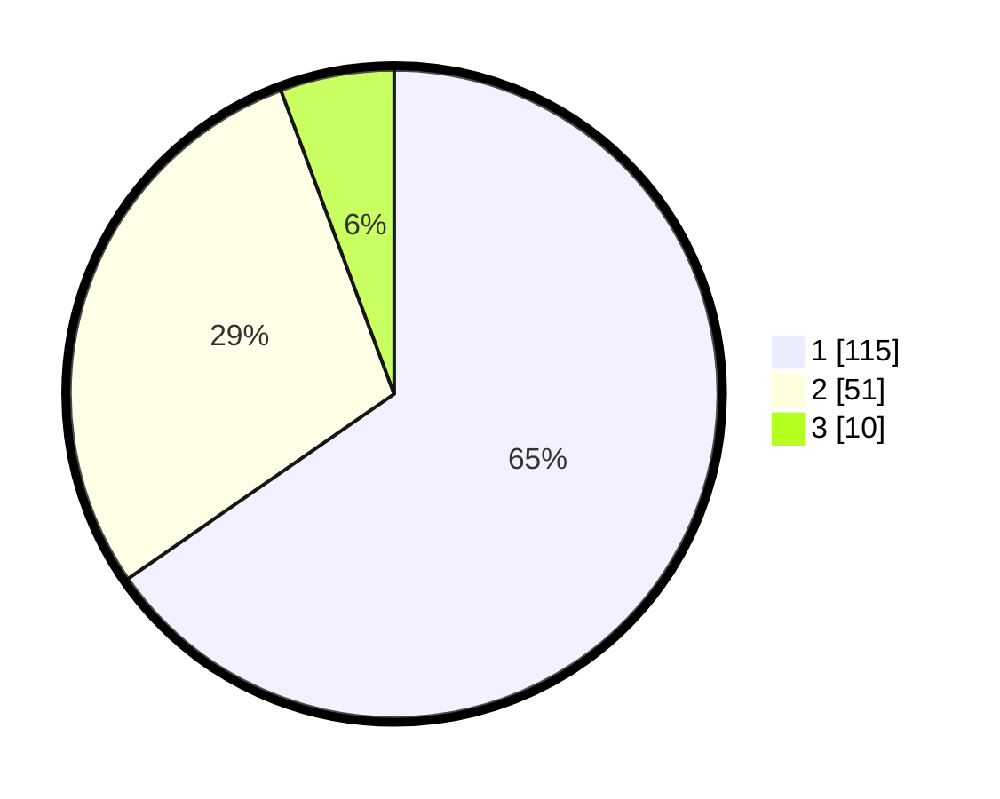

# Hasil

## Grafik

## Tabel

| No. | Nama Paslon    | Suara | Suara (raw) | Persentase |
|:--- |:-------------- | -----:| -----------:| ----------:|
| 1   | ANIES MUHAIMIN | 115   | [115][p-1]  | 65,34      |
| 2   | PRABOWO GIBRAN | 51    | [51][p-2]   | 28,98      |
| 3   | GANJAR MAHFUD  | 10    | [10][p-3]   | 5,68       |

[p-1]: https://github.com/gigit-pemilu/pemilu-2024/blob/main/pilpres/hitung-suara/sub/12-sumatera-utara/sub/71-kota-medan/sub/12-medan-marelan/sub/1003-terjun/sub/004-tps/sub/paslon-1.txt
[p-2]: https://github.com/gigit-pemilu/pemilu-2024/blob/main/pilpres/hitung-suara/sub/12-sumatera-utara/sub/71-kota-medan/sub/12-medan-marelan/sub/1003-terjun/sub/004-tps/sub/paslon-2.txt
[p-3]: https://github.com/gigit-pemilu/pemilu-2024/blob/main/pilpres/hitung-suara/sub/12-sumatera-utara/sub/71-kota-medan/sub/12-medan-marelan/sub/1003-terjun/sub/004-tps/sub/paslon-3.txt

## Foto C Plano

https://sirekap-obj-formc.kpu.go.id/9185/pemilu/ppwp/12/71/12/10/03/1271121003004-20240215-011858--c8d61d1e-8093-4ba2-a905-5fa8a21d662e.jpg

https://sirekap-obj-formc.kpu.go.id/9185/pemilu/ppwp/12/71/12/10/03/1271121003004-20240215-012038--bf53e908-8474-4f08-9057-bbe05e607097.jpg

https://sirekap-obj-formc.kpu.go.id/9185/pemilu/ppwp/12/71/12/10/03/1271121003004-20240214-221922--a0aced66-8760-4d6e-8fe9-e97368f047a4.jpg

## Metadata

| Key        | Value               |
| ---------- | ------------------- |
| Time Stamp | 2024-02-25 20:00:00 |

