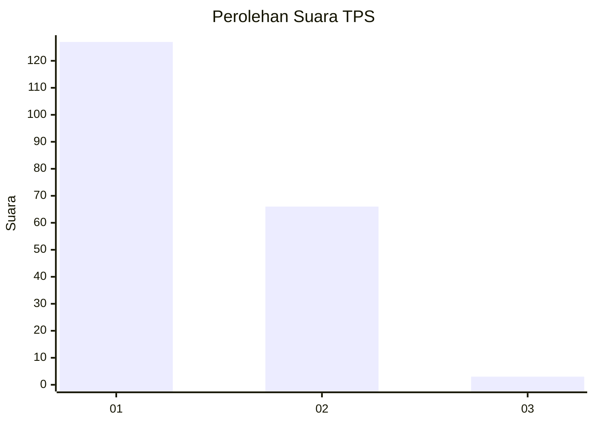
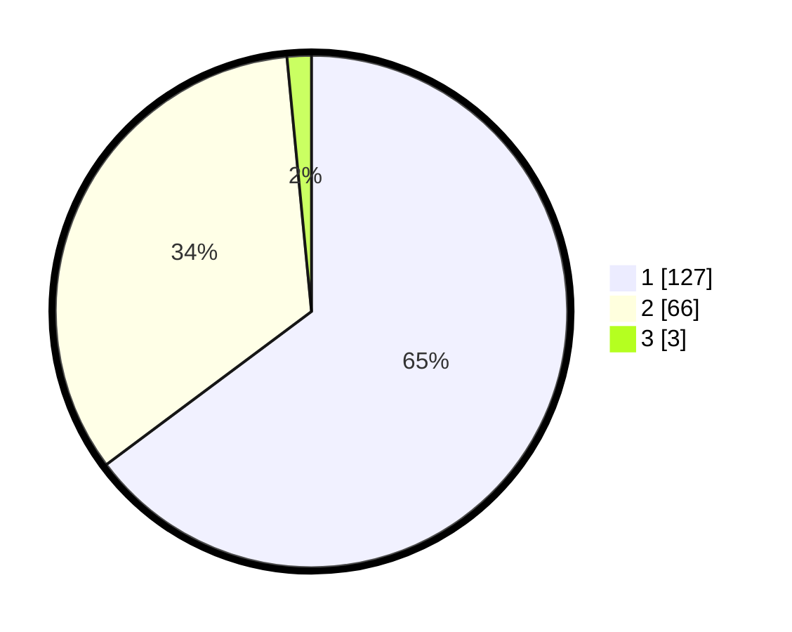

# Hasil

## Grafik

## Tabel

| No. | Nama Paslon    | Suara | Suara (raw) | Persentase |
|:--- |:-------------- | -----:| -----------:| ----------:|
| 1   | ANIES MUHAIMIN | 127   | [127][p-1]  | 64,80      |
| 2   | PRABOWO GIBRAN | 66    | [66][p-2]   | 33,67      |
| 3   | GANJAR MAHFUD  | 3     | [3][p-3]    | 1,53       |

[p-1]: https://github.com/gigit-pemilu/pemilu-2024-12-sumatera-utara/blob/main/pilpres/hitung-suara/sub/12-sumatera-utara/sub/71-kota-medan/sub/12-medan-marelan/sub/1003-terjun/sub/072-tps/sub/paslon-1.txt
[p-2]: https://github.com/gigit-pemilu/pemilu-2024-12-sumatera-utara/blob/main/pilpres/hitung-suara/sub/12-sumatera-utara/sub/71-kota-medan/sub/12-medan-marelan/sub/1003-terjun/sub/072-tps/sub/paslon-2.txt
[p-3]: https://github.com/gigit-pemilu/pemilu-2024-12-sumatera-utara/blob/main/pilpres/hitung-suara/sub/12-sumatera-utara/sub/71-kota-medan/sub/12-medan-marelan/sub/1003-terjun/sub/072-tps/sub/paslon-3.txt

## Foto C Plano

https://sirekap-obj-formc.kpu.go.id/2543/pemilu/ppwp/12/71/12/10/03/1271121003072-20240215-041627--6c7e2062-96db-44b3-a1a7-8635ed8ff8fd.jpg

https://sirekap-obj-formc.kpu.go.id/2543/pemilu/ppwp/12/71/12/10/03/1271121003072-20240215-041657--1267a6a1-89d3-4c89-849b-f3eaf2a7c092.jpg

https://sirekap-obj-formc.kpu.go.id/2543/pemilu/ppwp/12/71/12/10/03/1271121003072-20240215-041727--941490e6-07e9-4220-99db-37f71023c422.jpg

## Metadata

| Key        | Value               |
| ---------- | ------------------- |
| Time Stamp | 2024-02-25 13:00:00 |

