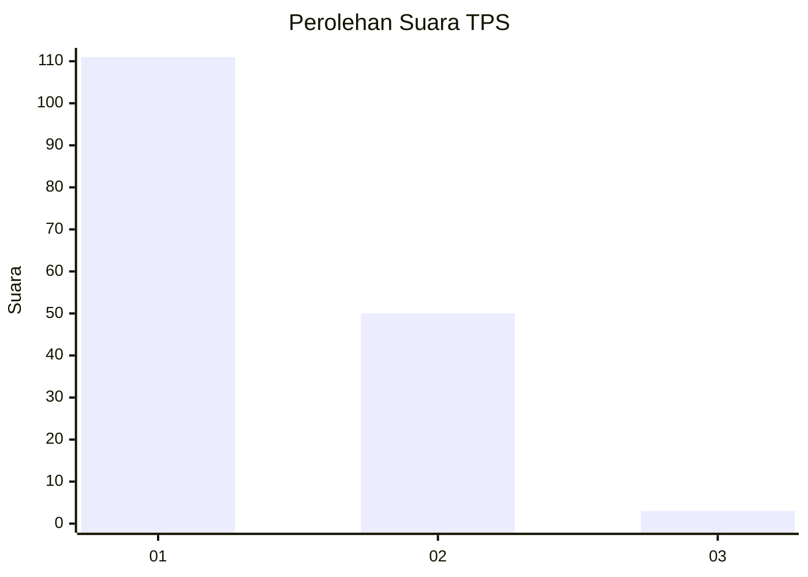
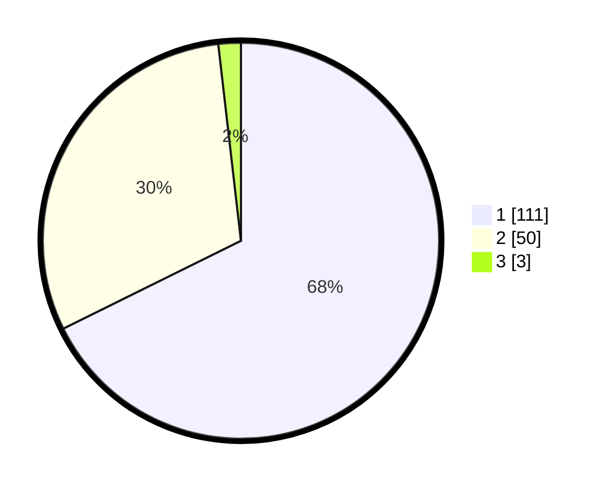

# Hasil

## Grafik

## Tabel

| No. | Nama Paslon    | Suara | Suara (raw) | Persentase |
|:--- |:-------------- | -----:| -----------:| ----------:|
| 1   | ANIES MUHAIMIN | 111   | [111][p-1]  | 67,68      |
| 2   | PRABOWO GIBRAN | 50    | [50][p-2]   | 30,49      |
| 3   | GANJAR MAHFUD  | 3     | [3][p-3]    | 1,83       |

[p-1]: https://github.com/gigit-pemilu/pemilu-2024-12-sumatera-utara/blob/main/pilpres/hitung-suara/sub/12-sumatera-utara/sub/71-kota-medan/sub/12-medan-marelan/sub/1004-tanah-enam-ratus/sub/006-tps/sub/paslon-1.txt
[p-2]: https://github.com/gigit-pemilu/pemilu-2024-12-sumatera-utara/blob/main/pilpres/hitung-suara/sub/12-sumatera-utara/sub/71-kota-medan/sub/12-medan-marelan/sub/1004-tanah-enam-ratus/sub/006-tps/sub/paslon-2.txt
[p-3]: https://github.com/gigit-pemilu/pemilu-2024-12-sumatera-utara/blob/main/pilpres/hitung-suara/sub/12-sumatera-utara/sub/71-kota-medan/sub/12-medan-marelan/sub/1004-tanah-enam-ratus/sub/006-tps/sub/paslon-3.txt

## Foto C Plano

https://sirekap-obj-formc.kpu.go.id/32a4/pemilu/ppwp/12/71/12/10/04/1271121004006-20240215-000133--c09226a2-7c93-4035-ac5a-ec8f933b82c1.jpg

https://sirekap-obj-formc.kpu.go.id/32a4/pemilu/ppwp/12/71/12/10/04/1271121004006-20240215-000341--a29f27a1-2b6b-4793-96bc-a7cdc6cab24f.jpg

https://sirekap-obj-formc.kpu.go.id/32a4/pemilu/ppwp/12/71/12/10/04/1271121004006-20240215-000439--2c3b7352-6d72-4cf8-b949-8d3222ed5f72.jpg

## Metadata

| Key        | Value               |
| ---------- | ------------------- |
| Time Stamp | 2024-02-15 12:00:28 |

