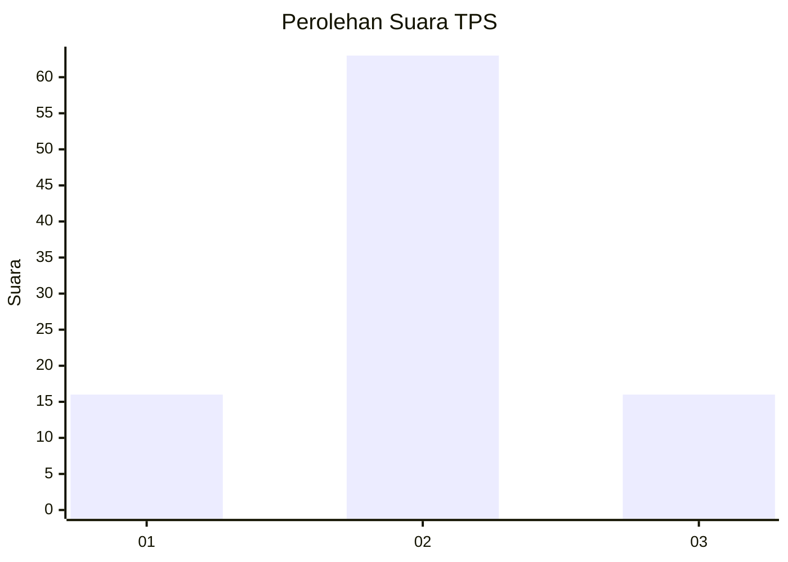
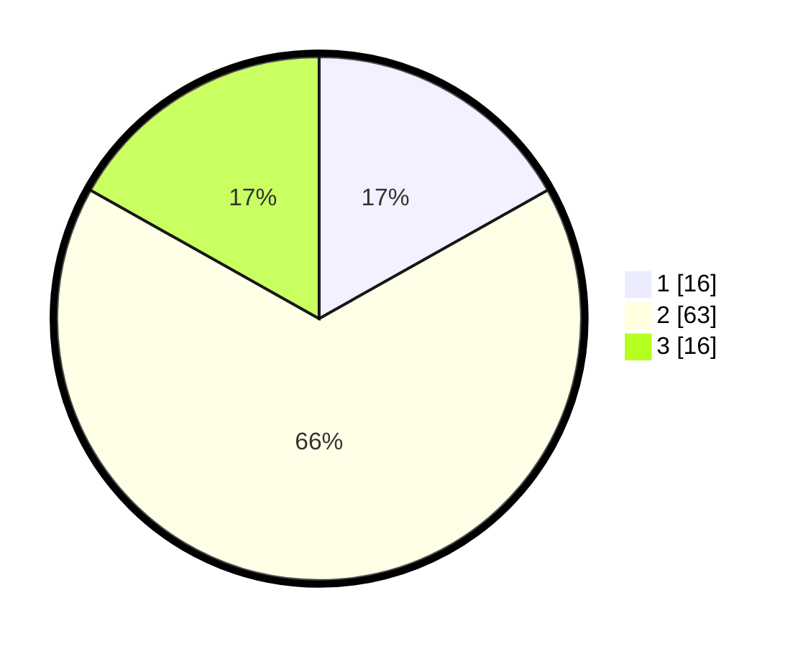

# Hasil

## Grafik

## Tabel

| No. | Nama Paslon    | Suara | Suara (raw) | Persentase |
|:--- |:-------------- | -----:| -----------:| ----------:|
| 1   | ANIES MUHAIMIN | 16    | [16][p-1]   | 16,84      |
| 2   | PRABOWO GIBRAN | 63    | [63][p-2]   | 66,32      |
| 3   | GANJAR MAHFUD  | 16    | [16][p-3]   | 16,84      |

[p-1]: https://github.com/gigit-pemilu/pemilu-2024/blob/main/pilpres/hitung-suara/sub/12-sumatera-utara/sub/71-kota-medan/sub/13-medan-labuhan/sub/1001-pekan-labuhan/sub/004-tps/sub/paslon-1.txt
[p-2]: https://github.com/gigit-pemilu/pemilu-2024/blob/main/pilpres/hitung-suara/sub/12-sumatera-utara/sub/71-kota-medan/sub/13-medan-labuhan/sub/1001-pekan-labuhan/sub/004-tps/sub/paslon-2.txt
[p-3]: https://github.com/gigit-pemilu/pemilu-2024/blob/main/pilpres/hitung-suara/sub/12-sumatera-utara/sub/71-kota-medan/sub/13-medan-labuhan/sub/1001-pekan-labuhan/sub/004-tps/sub/paslon-3.txt

## Foto C Plano

https://sirekap-obj-formc.kpu.go.id/50cf/pemilu/ppwp/12/71/13/10/01/1271131001004-20240214-234743--e3e320fd-269d-4464-b4a0-9e9b54c16942.jpg

https://sirekap-obj-formc.kpu.go.id/50cf/pemilu/ppwp/12/71/13/10/01/1271131001004-20240214-234920--f32612c3-8b08-4669-88a5-87effcb83162.jpg

https://sirekap-obj-formc.kpu.go.id/50cf/pemilu/ppwp/12/71/13/10/01/1271131001004-20240214-235355--53329a1b-8f69-4d0e-b8d8-ff89e457f93d.jpg

## Metadata

| Key        | Value               |
| ---------- | ------------------- |
| Time Stamp | 2024-02-24 22:31:28 |

