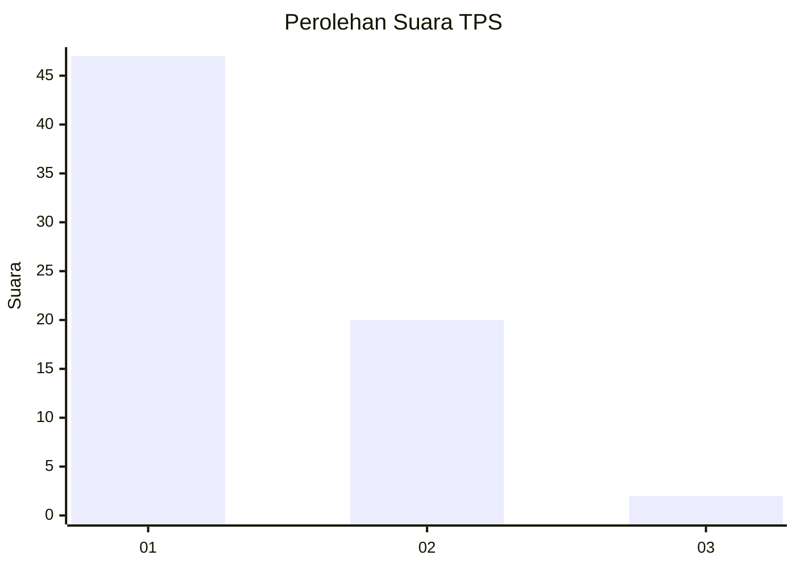
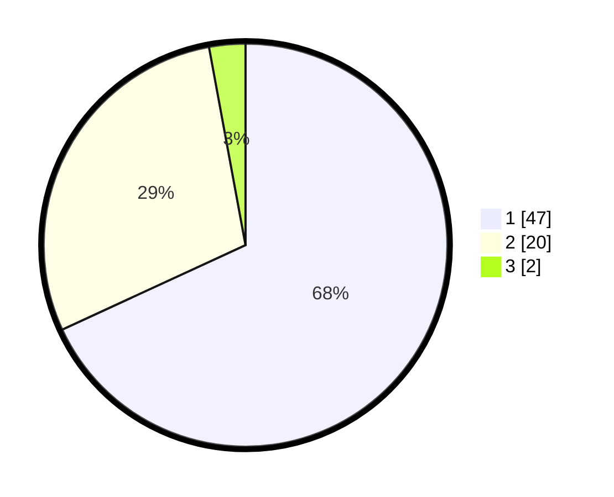

# Hasil

## Grafik

## Tabel

| No. | Nama Paslon    | Suara | Suara (raw) | Persentase |
|:--- |:-------------- | -----:| -----------:| ----------:|
| 1   | ANIES MUHAIMIN | 47    | [47][p-1]   | 68,12      |
| 2   | PRABOWO GIBRAN | 20    | [20][p-2]   | 28,99      |
| 3   | GANJAR MAHFUD  | 2     | [2][p-3]    | 2,90       |

[p-1]: https://github.com/gigit-pemilu/pemilu-2024-12-sumatera-utara/blob/main/pilpres/hitung-suara/sub/12-sumatera-utara/sub/71-kota-medan/sub/13-medan-labuhan/sub/1001-pekan-labuhan/sub/016-tps/sub/paslon-1.txt
[p-2]: https://github.com/gigit-pemilu/pemilu-2024-12-sumatera-utara/blob/main/pilpres/hitung-suara/sub/12-sumatera-utara/sub/71-kota-medan/sub/13-medan-labuhan/sub/1001-pekan-labuhan/sub/016-tps/sub/paslon-2.txt
[p-3]: https://github.com/gigit-pemilu/pemilu-2024-12-sumatera-utara/blob/main/pilpres/hitung-suara/sub/12-sumatera-utara/sub/71-kota-medan/sub/13-medan-labuhan/sub/1001-pekan-labuhan/sub/016-tps/sub/paslon-3.txt

## Foto C Plano

https://sirekap-obj-formc.kpu.go.id/43fd/pemilu/ppwp/12/71/13/10/01/1271131001016-20240214-232028--0965e9c5-c782-4424-89fe-f5c2493e35e4.jpg

https://sirekap-obj-formc.kpu.go.id/43fd/pemilu/ppwp/12/71/13/10/01/1271131001016-20240214-232559--1f072e0a-f82a-4245-a538-7521b132a0de.jpg

https://sirekap-obj-formc.kpu.go.id/43fd/pemilu/ppwp/12/71/13/10/01/1271131001016-20240214-232829--a5c663eb-c91a-4255-9d6f-dcd4ed69c087.jpg

## Metadata

| Key        | Value               |
| ---------- | ------------------- |
| Time Stamp | 2024-02-15 19:00:26 |

## DATA PEMILIH TETAP

Jumlah pemilih dalam DPT: **106**.
 * L: **51**.
 * P: **55**.

## DATA PENGGUNA HAK PILIH

Jumlah pengguna hak pilih dalam DPT: **68**.
 * L: **31**.
 * P: **37**.

Jumlah pengguna hak pilih dalam DPTb: **0**.
 * L: **0**.
 * P: **0**.

Jumlah pengguna hak pilih dalam DPK: **1**.
 * L: **0**.
 * P: **1**.

Jumlah pengguna hak pilih: **69**.
 * L: **31**.
 * P: **38**.

## JUMLAH SUARA SAH DAN TIDAK SAH

JUMLAH SELURUH SUARA SAH: **69**.

JUMLAH SUARA TIDAK SAH: **0**.

JUMLAH SELURUH SUARA SAH DAN SUARA TIDAK SAH: **69**.

