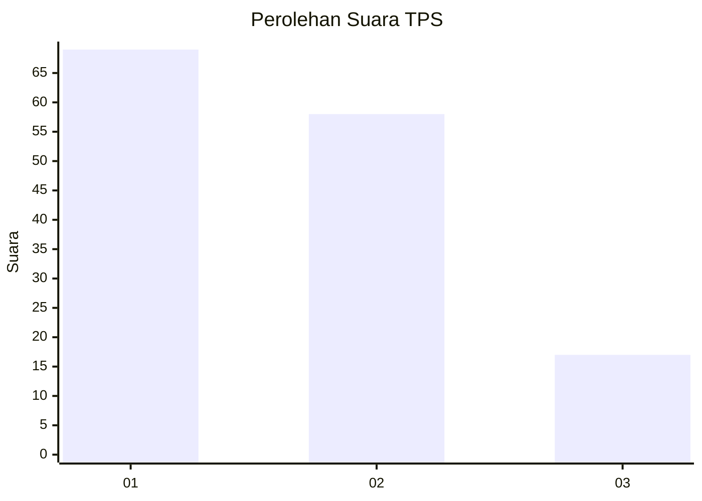
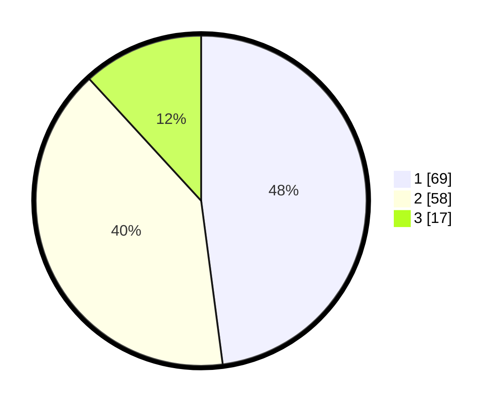

# Hasil

## Grafik

## Tabel

| No. | Nama Paslon    | Suara | Suara (raw) | Persentase |
|:--- |:-------------- | -----:| -----------:| ----------:|
| 1   | ANIES MUHAIMIN | 69    | [69][p-1]   | 47,92      |
| 2   | PRABOWO GIBRAN | 58    | [58][p-2]   | 40,28      |
| 3   | GANJAR MAHFUD  | 17    | [17][p-3]   | 11,81      |

[p-1]: https://github.com/gigit-pemilu/pemilu-2024/blob/main/pilpres/hitung-suara/sub/12-sumatera-utara/sub/71-kota-medan/sub/13-medan-labuhan/sub/1002-sei-mati/sub/013-tps/sub/paslon-1.txt
[p-2]: https://github.com/gigit-pemilu/pemilu-2024/blob/main/pilpres/hitung-suara/sub/12-sumatera-utara/sub/71-kota-medan/sub/13-medan-labuhan/sub/1002-sei-mati/sub/013-tps/sub/paslon-2.txt
[p-3]: https://github.com/gigit-pemilu/pemilu-2024/blob/main/pilpres/hitung-suara/sub/12-sumatera-utara/sub/71-kota-medan/sub/13-medan-labuhan/sub/1002-sei-mati/sub/013-tps/sub/paslon-3.txt

## Foto C Plano

https://sirekap-obj-formc.kpu.go.id/953f/pemilu/ppwp/12/71/13/10/02/1271131002013-20240214-194506--77b9a745-000e-453a-a574-6cfcd5c92f0e.jpg

https://sirekap-obj-formc.kpu.go.id/953f/pemilu/ppwp/12/71/13/10/02/1271131002013-20240214-200810--f9d913b9-8b85-486f-9bdc-e27fda3de270.jpg

https://sirekap-obj-formc.kpu.go.id/953f/pemilu/ppwp/12/71/13/10/02/1271131002013-20240214-201058--68c9a1ae-f417-401b-86f3-9ae92e7051a7.jpg

## Metadata

| Key        | Value               |
| ---------- | ------------------- |
| Time Stamp | 2024-02-14 21:46:01 |

## DATA PEMILIH TETAP

Jumlah pemilih dalam DPT: **235**.
 * L: **466**.
 * P: **445**.

## DATA PENGGUNA HAK PILIH

Jumlah pengguna hak pilih dalam DPT: **645**.
 * L: **874**.
 * P: **78**.

Jumlah pengguna hak pilih dalam DPTb: **888**.
 * L: **88**.
 * P: **8**.

Jumlah pengguna hak pilih dalam DPK: **888**.
 * L: **888**.
 * P: **880**.

Jumlah pengguna hak pilih: **445**.
 * L: **874**.
 * P: **875**.

## JUMLAH SUARA SAH DAN TIDAK SAH

JUMLAH SELURUH SUARA SAH: **144**.

JUMLAH SUARA TIDAK SAH: **1**.

JUMLAH SELURUH SUARA SAH DAN SUARA TIDAK SAH: **145**.

