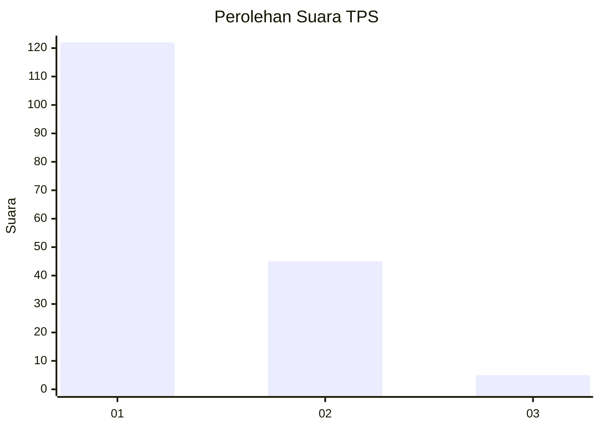
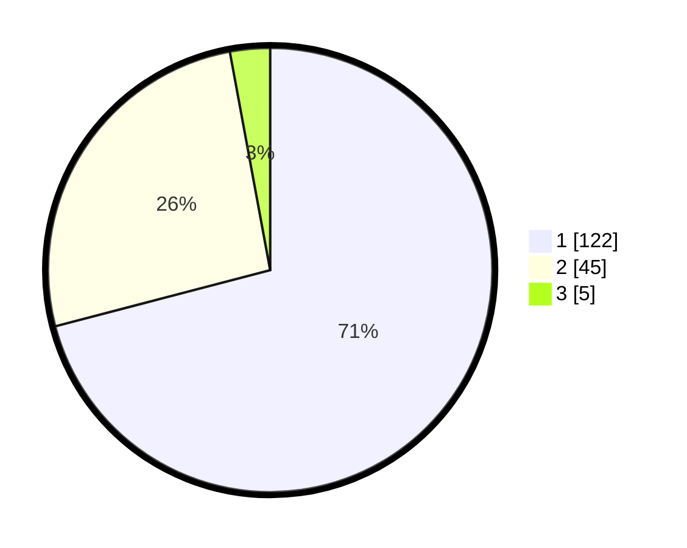

# Hasil

## Grafik

## Tabel

| No. | Nama Paslon    | Suara | Suara (raw) | Persentase |
|:--- |:-------------- | -----:| -----------:| ----------:|
| 1   | ANIES MUHAIMIN | 122   | [122][p-1]  | 70,93      |
| 2   | PRABOWO GIBRAN | 45    | [45][p-2]   | 26,16      |
| 3   | GANJAR MAHFUD  | 5     | [5][p-3]    | 2,91       |

[p-1]: https://github.com/gigit-pemilu/pemilu-2024/blob/main/pilpres/hitung-suara/sub/12-sumatera-utara/sub/71-kota-medan/sub/13-medan-labuhan/sub/1003-besar/sub/043-tps/sub/paslon-1.txt
[p-2]: https://github.com/gigit-pemilu/pemilu-2024/blob/main/pilpres/hitung-suara/sub/12-sumatera-utara/sub/71-kota-medan/sub/13-medan-labuhan/sub/1003-besar/sub/043-tps/sub/paslon-2.txt
[p-3]: https://github.com/gigit-pemilu/pemilu-2024/blob/main/pilpres/hitung-suara/sub/12-sumatera-utara/sub/71-kota-medan/sub/13-medan-labuhan/sub/1003-besar/sub/043-tps/sub/paslon-3.txt

## Foto C Plano

https://sirekap-obj-formc.kpu.go.id/7134/pemilu/ppwp/12/71/13/10/03/1271131003043-20240215-003558--70b74b0e-90af-4cc3-9b6a-ed9cad364d0a.jpg

https://sirekap-obj-formc.kpu.go.id/7134/pemilu/ppwp/12/71/13/10/03/1271131003043-20240215-003128--cc574de2-2149-4ba4-9a1b-06deda68fd8b.jpg

https://sirekap-obj-formc.kpu.go.id/7134/pemilu/ppwp/12/71/13/10/03/1271131003043-20240215-003839--fa444801-c327-4f82-b73f-f2599cf89748.jpg

## Metadata

| Key        | Value               |
| ---------- | ------------------- |
| Time Stamp | 2024-02-25 20:00:00 |

