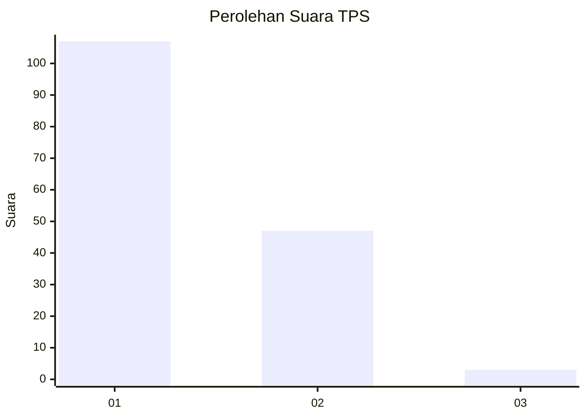
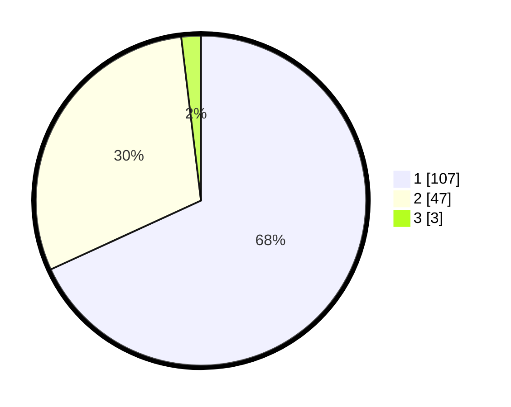

# Hasil

## Grafik

## Tabel

| No. | Nama Paslon    | Suara | Suara (raw) | Persentase |
|:--- |:-------------- | -----:| -----------:| ----------:|
| 1   | ANIES MUHAIMIN | 107   | [107][p-1]  | 68,15      |
| 2   | PRABOWO GIBRAN | 47    | [47][p-2]   | 29,94      |
| 3   | GANJAR MAHFUD  | 3     | [3][p-3]    | 1,91       |

[p-1]: https://github.com/gigit-pemilu/pemilu-2024-12-sumatera-utara/blob/main/pilpres/hitung-suara/sub/12-sumatera-utara/sub/71-kota-medan/sub/13-medan-labuhan/sub/1003-besar/sub/059-tps/sub/paslon-1.txt
[p-2]: https://github.com/gigit-pemilu/pemilu-2024-12-sumatera-utara/blob/main/pilpres/hitung-suara/sub/12-sumatera-utara/sub/71-kota-medan/sub/13-medan-labuhan/sub/1003-besar/sub/059-tps/sub/paslon-2.txt
[p-3]: https://github.com/gigit-pemilu/pemilu-2024-12-sumatera-utara/blob/main/pilpres/hitung-suara/sub/12-sumatera-utara/sub/71-kota-medan/sub/13-medan-labuhan/sub/1003-besar/sub/059-tps/sub/paslon-3.txt

## Foto C Plano

https://sirekap-obj-formc.kpu.go.id/57dc/pemilu/ppwp/12/71/13/10/03/1271131003059-20240215-213900--5462f5ba-cf63-4aa7-948d-c992ab15ce29.jpg

https://sirekap-obj-formc.kpu.go.id/57dc/pemilu/ppwp/12/71/13/10/03/1271131003059-20240215-134650--fc2e0b4f-afe7-494a-b9d5-54e839bfb8f4.jpg

https://sirekap-obj-formc.kpu.go.id/57dc/pemilu/ppwp/12/71/13/10/03/1271131003059-20240215-134819--85a4209f-418d-48d6-b922-eb6028809e26.jpg

## Metadata

| Key        | Value               |
| ---------- | ------------------- |
| Time Stamp | 2024-02-25 18:00:00 |

