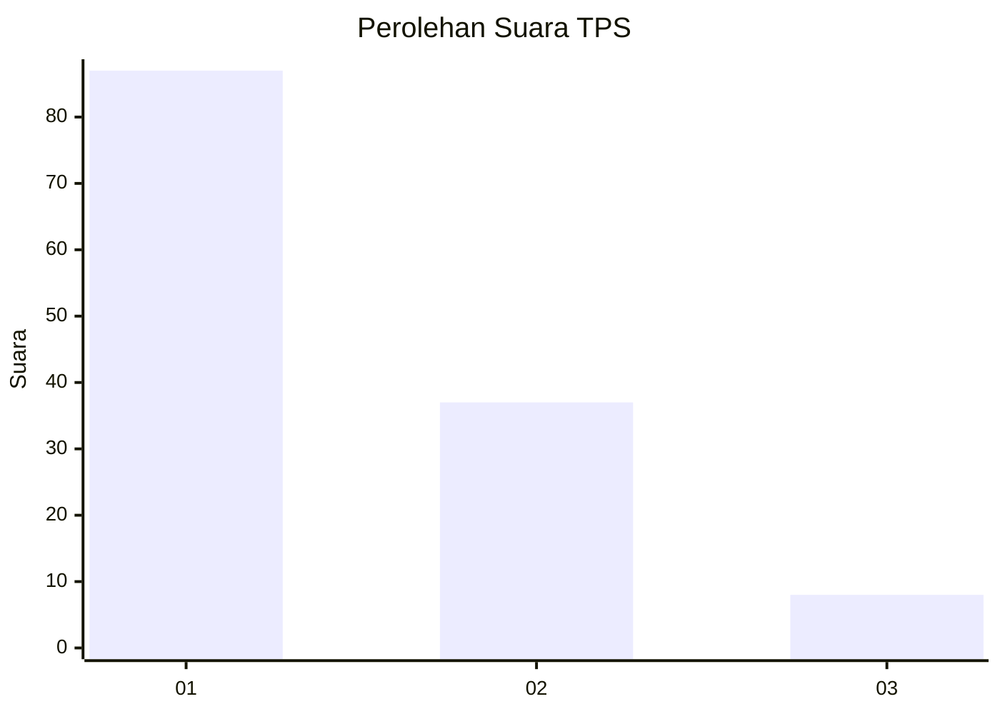
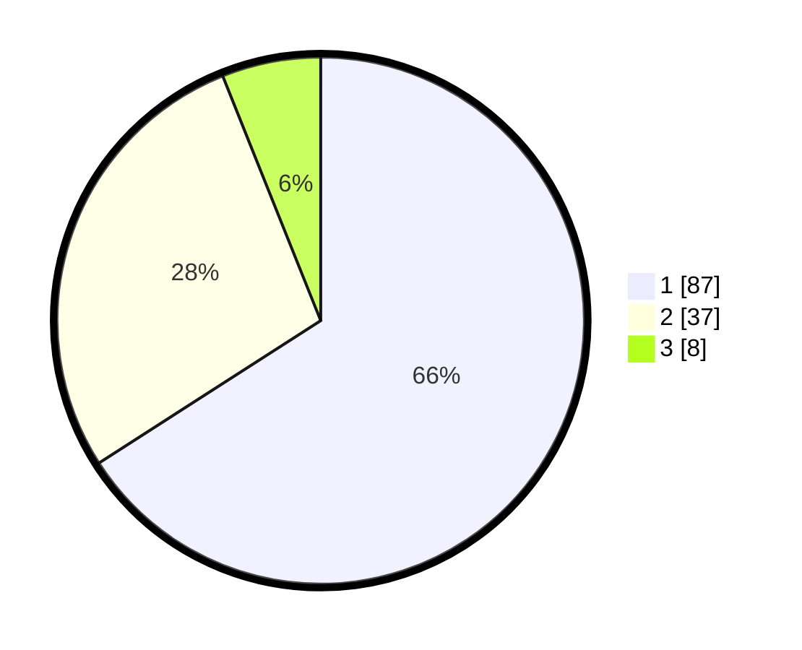

# Hasil

## Grafik

## Tabel

| No. | Nama Paslon    | Suara | Suara (raw) | Persentase |
|:--- |:-------------- | -----:| -----------:| ----------:|
| 1   | ANIES MUHAIMIN | 87    | [87][p-1]   | 65,91      |
| 2   | PRABOWO GIBRAN | 37    | [37][p-2]   | 28,03      |
| 3   | GANJAR MAHFUD  | 8     | [8][p-3]    | 6,06       |

[p-1]: https://github.com/gigit-pemilu/pemilu-2024-12-sumatera-utara/blob/main/pilpres/hitung-suara/sub/12-sumatera-utara/sub/71-kota-medan/sub/13-medan-labuhan/sub/1004-martubung/sub/014-tps/sub/paslon-1.txt
[p-2]: https://github.com/gigit-pemilu/pemilu-2024-12-sumatera-utara/blob/main/pilpres/hitung-suara/sub/12-sumatera-utara/sub/71-kota-medan/sub/13-medan-labuhan/sub/1004-martubung/sub/014-tps/sub/paslon-2.txt
[p-3]: https://github.com/gigit-pemilu/pemilu-2024-12-sumatera-utara/blob/main/pilpres/hitung-suara/sub/12-sumatera-utara/sub/71-kota-medan/sub/13-medan-labuhan/sub/1004-martubung/sub/014-tps/sub/paslon-3.txt

## Foto C Plano

https://sirekap-obj-formc.kpu.go.id/ab4f/pemilu/ppwp/12/71/13/10/04/1271131004014-20240215-003101--cdc1fa40-7274-457d-950d-2114fae8ccf9.jpg

https://sirekap-obj-formc.kpu.go.id/ab4f/pemilu/ppwp/12/71/13/10/04/1271131004014-20240215-002544--1eca892e-2093-4388-aa50-f47793b41d4e.jpg

https://sirekap-obj-formc.kpu.go.id/ab4f/pemilu/ppwp/12/71/13/10/04/1271131004014-20240215-003213--1616fecb-4e6c-4cfe-985f-6f7356cd7e33.jpg

## Metadata

| Key        | Value               |
| ---------- | ------------------- |
| Time Stamp | 2024-02-16 23:30:00 |

