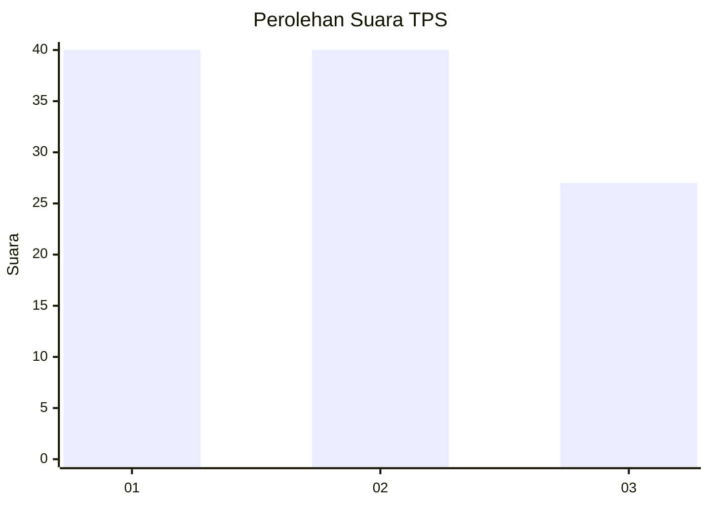
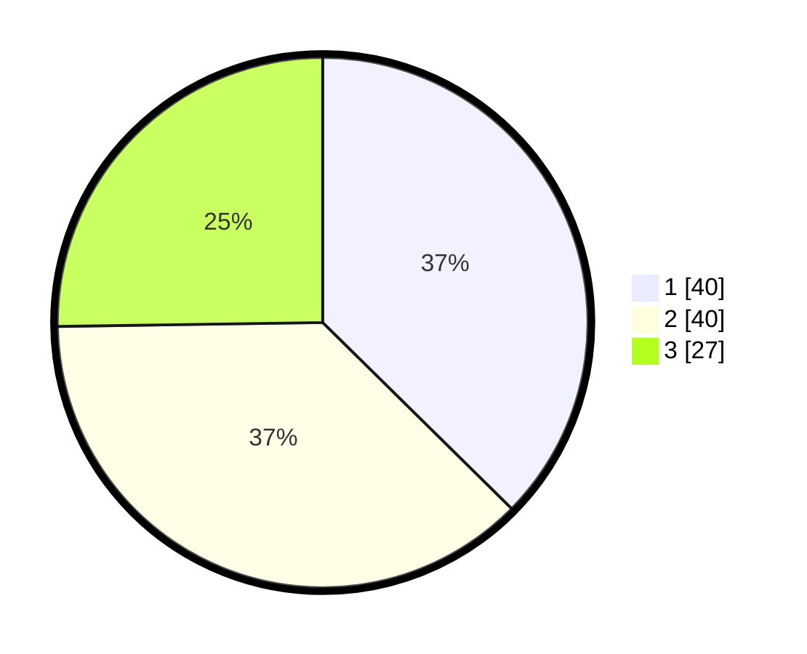

# Hasil

## Grafik

## Tabel

| No. | Nama Paslon    | Suara | Suara (raw) | Persentase |
|:--- |:-------------- | -----:| -----------:| ----------:|
| 1   | ANIES MUHAIMIN | 40    | [40][p-1]   | 37,38      |
| 2   | PRABOWO GIBRAN | 40    | [40][p-2]   | 37,38      |
| 3   | GANJAR MAHFUD  | 27    | [27][p-3]   | 25,23      |

[p-1]: https://github.com/gigit-pemilu/pemilu-2024-12-sumatera-utara/blob/main/pilpres/hitung-suara/sub/12-sumatera-utara/sub/71-kota-medan/sub/13-medan-labuhan/sub/1004-martubung/sub/036-tps/sub/paslon-1.txt
[p-2]: https://github.com/gigit-pemilu/pemilu-2024-12-sumatera-utara/blob/main/pilpres/hitung-suara/sub/12-sumatera-utara/sub/71-kota-medan/sub/13-medan-labuhan/sub/1004-martubung/sub/036-tps/sub/paslon-2.txt
[p-3]: https://github.com/gigit-pemilu/pemilu-2024-12-sumatera-utara/blob/main/pilpres/hitung-suara/sub/12-sumatera-utara/sub/71-kota-medan/sub/13-medan-labuhan/sub/1004-martubung/sub/036-tps/sub/paslon-3.txt

## Foto C Plano

https://sirekap-obj-formc.kpu.go.id/2fef/pemilu/ppwp/12/71/13/10/04/1271131004036-20240214-205522--eddb185d-1431-49ec-8a43-6019f01a8799.jpg

https://sirekap-obj-formc.kpu.go.id/2fef/pemilu/ppwp/12/71/13/10/04/1271131004036-20240214-205619--39c215ba-837f-4678-a6ca-0d73466cfb2d.jpg

https://sirekap-obj-formc.kpu.go.id/2fef/pemilu/ppwp/12/71/13/10/04/1271131004036-20240214-205720--8339ffb5-ddf6-4d8c-8bce-4472fce606c4.jpg

## Metadata

| Key        | Value               |
| ---------- | ------------------- |
| Time Stamp | 2024-02-24 23:00:00 |

