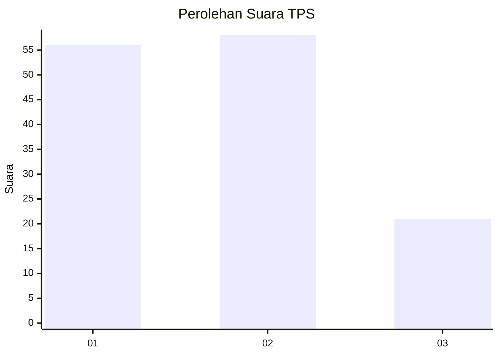
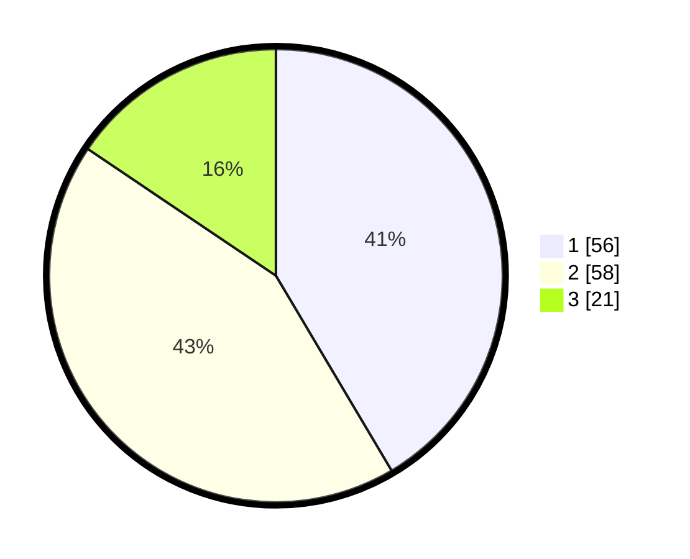

# Hasil

## Grafik

## Tabel

| No. | Nama Paslon    | Suara | Suara (raw) | Persentase |
|:--- |:-------------- | -----:| -----------:| ----------:|
| 1   | ANIES MUHAIMIN | 56    | [56][p-1]   | 41,48      |
| 2   | PRABOWO GIBRAN | 58    | [58][p-2]   | 42,96      |
| 3   | GANJAR MAHFUD  | 21    | [21][p-3]   | 15,56      |

[p-1]: https://github.com/gigit-pemilu/pemilu-2024-12-sumatera-utara/blob/main/pilpres/hitung-suara/sub/12-sumatera-utara/sub/71-kota-medan/sub/13-medan-labuhan/sub/1004-martubung/sub/037-tps/sub/paslon-1.txt
[p-2]: https://github.com/gigit-pemilu/pemilu-2024-12-sumatera-utara/blob/main/pilpres/hitung-suara/sub/12-sumatera-utara/sub/71-kota-medan/sub/13-medan-labuhan/sub/1004-martubung/sub/037-tps/sub/paslon-2.txt
[p-3]: https://github.com/gigit-pemilu/pemilu-2024-12-sumatera-utara/blob/main/pilpres/hitung-suara/sub/12-sumatera-utara/sub/71-kota-medan/sub/13-medan-labuhan/sub/1004-martubung/sub/037-tps/sub/paslon-3.txt

## Foto C Plano

https://sirekap-obj-formc.kpu.go.id/de11/pemilu/ppwp/12/71/13/10/04/1271131004037-20240215-004403--12f29939-f204-4053-8ae2-3f57f1d43dec.jpg

https://sirekap-obj-formc.kpu.go.id/de11/pemilu/ppwp/12/71/13/10/04/1271131004037-20240214-203524--909b07f4-f379-4a11-b6f6-569d1ca62a98.jpg

https://sirekap-obj-formc.kpu.go.id/de11/pemilu/ppwp/12/71/13/10/04/1271131004037-20240214-203416--5503f406-447f-46be-98aa-b1c74f8b5b0c.jpg

## Metadata

| Key        | Value               |
| ---------- | ------------------- |
| Time Stamp | 2024-02-25 00:00:00 |

