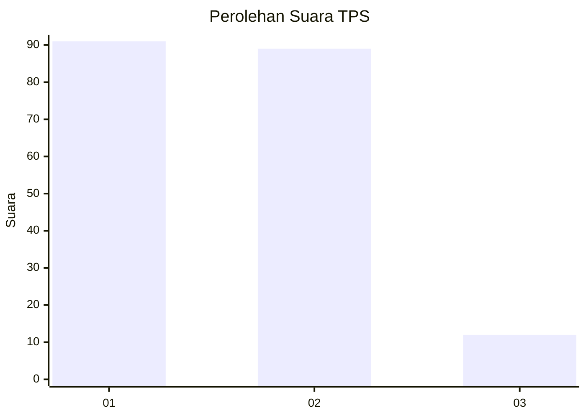
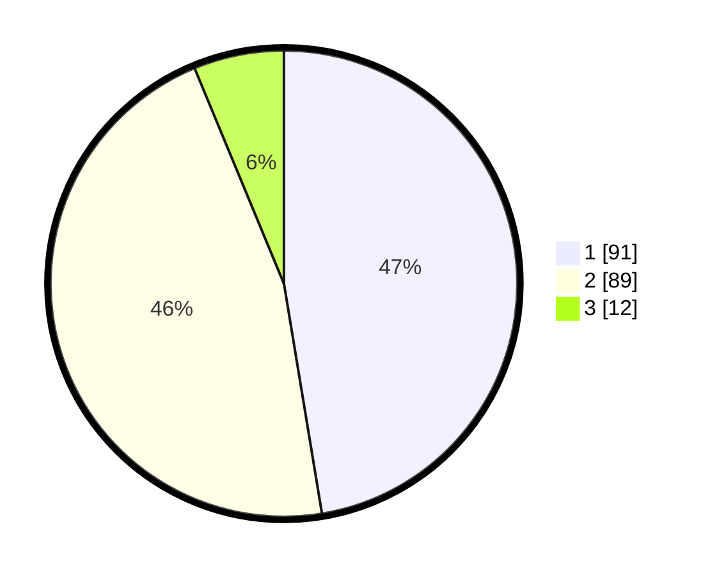

# Hasil

## Grafik

## Tabel

| No. | Nama Paslon    | Suara | Suara (raw) | Persentase |
|:--- |:-------------- | -----:| -----------:| ----------:|
| 1   | ANIES MUHAIMIN | 91    | [91][p-1]   | 47,40      |
| 2   | PRABOWO GIBRAN | 89    | [89][p-2]   | 46,35      |
| 3   | GANJAR MAHFUD  | 12    | [12][p-3]   | 6,25       |

[p-1]: https://github.com/gigit-pemilu/pemilu-2024-12-sumatera-utara/blob/main/pilpres/hitung-suara/sub/12-sumatera-utara/sub/71-kota-medan/sub/14-medan-tembung/sub/1001-indra-kasih/sub/007-tps/sub/paslon-1.txt
[p-2]: https://github.com/gigit-pemilu/pemilu-2024-12-sumatera-utara/blob/main/pilpres/hitung-suara/sub/12-sumatera-utara/sub/71-kota-medan/sub/14-medan-tembung/sub/1001-indra-kasih/sub/007-tps/sub/paslon-2.txt
[p-3]: https://github.com/gigit-pemilu/pemilu-2024-12-sumatera-utara/blob/main/pilpres/hitung-suara/sub/12-sumatera-utara/sub/71-kota-medan/sub/14-medan-tembung/sub/1001-indra-kasih/sub/007-tps/sub/paslon-3.txt

## Foto C Plano

https://sirekap-obj-formc.kpu.go.id/2d18/pemilu/ppwp/12/71/14/10/01/1271141001007-20240215-004656--7ab6e54f-c374-4ded-ad98-abc7d141fe94.jpg

https://sirekap-obj-formc.kpu.go.id/2d18/pemilu/ppwp/12/71/14/10/01/1271141001007-20240215-004856--3ff82463-23a2-4356-b9fc-2925f6ffce7f.jpg

https://sirekap-obj-formc.kpu.go.id/2d18/pemilu/ppwp/12/71/14/10/01/1271141001007-20240215-004950--7eb0c238-6762-462c-bdb6-8de7e9b1a107.jpg

## Metadata

| Key        | Value               |
| ---------- | ------------------- |
| Time Stamp | 2024-02-25 15:00:00 |

