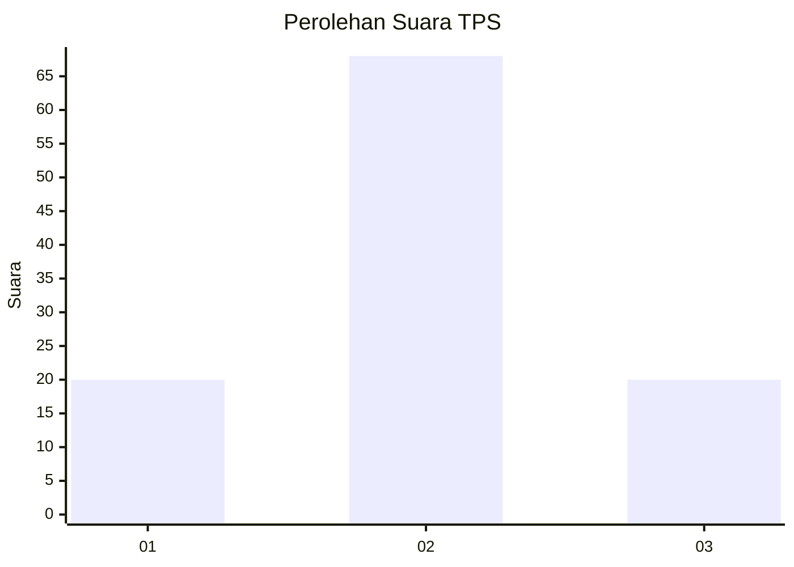
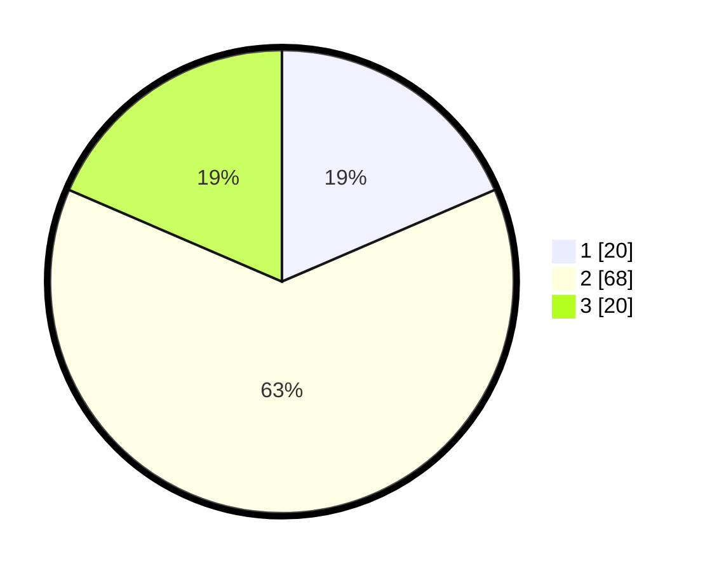

# Hasil

## Grafik

## Tabel

| No. | Nama Paslon    | Suara | Suara (raw) | Persentase |
|:--- |:-------------- | -----:| -----------:| ----------:|
| 1   | ANIES MUHAIMIN | 20    | [20][p-1]   | 18,52      |
| 2   | PRABOWO GIBRAN | 68    | [68][p-2]   | 62,96      |
| 3   | GANJAR MAHFUD  | 20    | [20][p-3]   | 18,52      |

[p-1]: https://github.com/gigit-pemilu/pemilu-2024/blob/main/pilpres/hitung-suara/sub/12-sumatera-utara/sub/71-kota-medan/sub/14-medan-tembung/sub/1003-sidorejo/sub/047-tps/sub/paslon-1.txt
[p-2]: https://github.com/gigit-pemilu/pemilu-2024/blob/main/pilpres/hitung-suara/sub/12-sumatera-utara/sub/71-kota-medan/sub/14-medan-tembung/sub/1003-sidorejo/sub/047-tps/sub/paslon-2.txt
[p-3]: https://github.com/gigit-pemilu/pemilu-2024/blob/main/pilpres/hitung-suara/sub/12-sumatera-utara/sub/71-kota-medan/sub/14-medan-tembung/sub/1003-sidorejo/sub/047-tps/sub/paslon-3.txt

## Foto C Plano

https://sirekap-obj-formc.kpu.go.id/ef09/pemilu/ppwp/12/71/14/10/03/1271141003047-20240215-032020--806ddf1b-4938-47c2-af5c-67b012e6fcec.jpg

https://sirekap-obj-formc.kpu.go.id/ef09/pemilu/ppwp/12/71/14/10/03/1271141003047-20240215-032231--cc7e0d88-080c-487f-bd84-240f17d25a9c.jpg

https://sirekap-obj-formc.kpu.go.id/ef09/pemilu/ppwp/12/71/14/10/03/1271141003047-20240215-032357--f7ae745d-3261-4c2b-8243-1f20abf1b28c.jpg

## Metadata

| Key        | Value               |
| ---------- | ------------------- |
| Time Stamp | 2024-02-25 17:00:00 |

