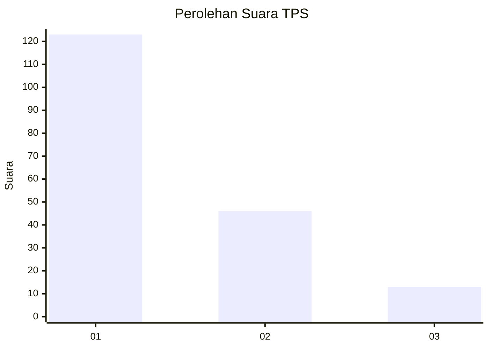
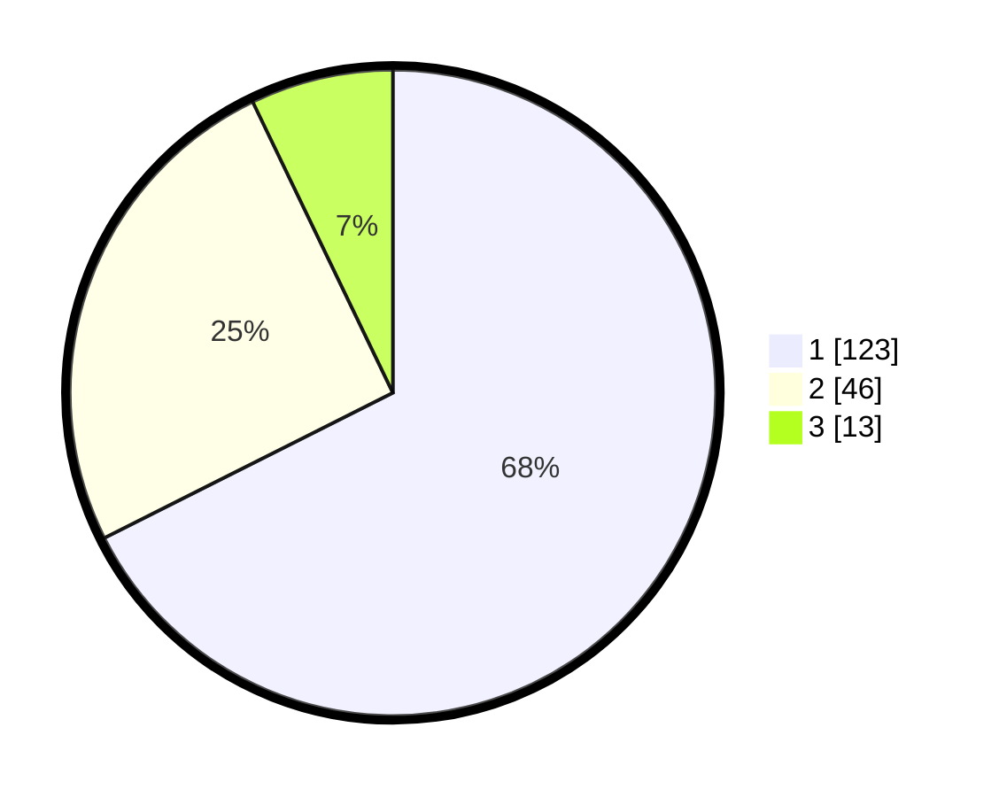

# Hasil

## Grafik

## Tabel

| No. | Nama Paslon    | Suara | Suara (raw) | Persentase |
|:--- |:-------------- | -----:| -----------:| ----------:|
| 1   | ANIES MUHAIMIN | 123   | [123][p-1]  | 67,58      |
| 2   | PRABOWO GIBRAN | 46    | [46][p-2]   | 25,27      |
| 3   | GANJAR MAHFUD  | 13    | [13][p-3]   | 7,14       |

[p-1]: https://github.com/gigit-pemilu/pemilu-2024-12-sumatera-utara/blob/main/pilpres/hitung-suara/sub/12-sumatera-utara/sub/71-kota-medan/sub/14-medan-tembung/sub/1004-bantan/sub/037-tps/sub/paslon-1.txt
[p-2]: https://github.com/gigit-pemilu/pemilu-2024-12-sumatera-utara/blob/main/pilpres/hitung-suara/sub/12-sumatera-utara/sub/71-kota-medan/sub/14-medan-tembung/sub/1004-bantan/sub/037-tps/sub/paslon-2.txt
[p-3]: https://github.com/gigit-pemilu/pemilu-2024-12-sumatera-utara/blob/main/pilpres/hitung-suara/sub/12-sumatera-utara/sub/71-kota-medan/sub/14-medan-tembung/sub/1004-bantan/sub/037-tps/sub/paslon-3.txt

## Foto C Plano

https://sirekap-obj-formc.kpu.go.id/5d01/pemilu/ppwp/12/71/14/10/04/1271141004037-20240215-024239--0ecd46d5-fb17-401d-bff6-618ee3f7c18a.jpg

https://sirekap-obj-formc.kpu.go.id/5d01/pemilu/ppwp/12/71/14/10/04/1271141004037-20240215-024426--e262aa0e-3963-41aa-9ae0-ef1ecd55008e.jpg

https://sirekap-obj-formc.kpu.go.id/5d01/pemilu/ppwp/12/71/14/10/04/1271141004037-20240215-024528--c7e4aeab-a6d9-4894-9145-e3b73086f823.jpg

## Metadata

| Key        | Value               |
| ---------- | ------------------- |
| Time Stamp | 2024-02-25 13:00:00 |

