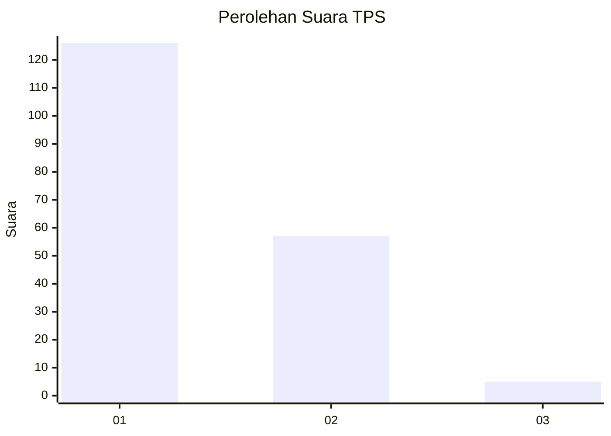
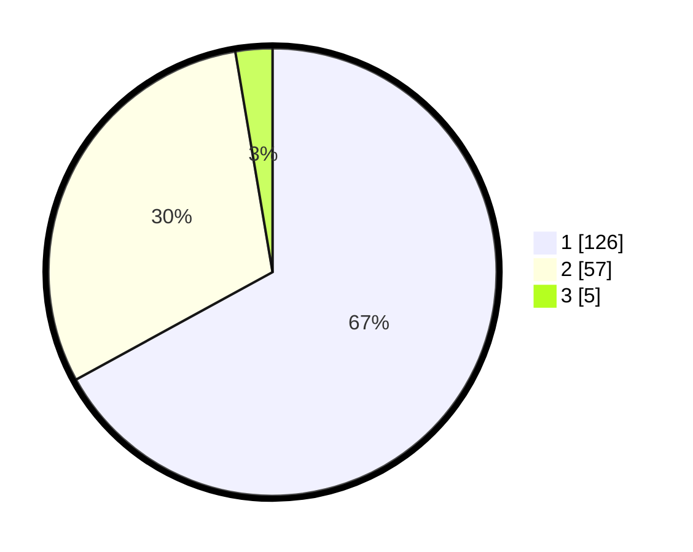

# Hasil

## Grafik

## Tabel

| No. | Nama Paslon    | Suara | Suara (raw) | Persentase |
|:--- |:-------------- | -----:| -----------:| ----------:|
| 1   | ANIES MUHAIMIN | 126   | [126][p-1]  | 67,02      |
| 2   | PRABOWO GIBRAN | 57    | [57][p-2]   | 30,32      |
| 3   | GANJAR MAHFUD  | 5     | [5][p-3]    | 2,66       |

[p-1]: https://github.com/gigit-pemilu/pemilu-2024/blob/main/pilpres/hitung-suara/sub/12-sumatera-utara/sub/71-kota-medan/sub/14-medan-tembung/sub/1004-bantan/sub/048-tps/sub/paslon-1.txt
[p-2]: https://github.com/gigit-pemilu/pemilu-2024/blob/main/pilpres/hitung-suara/sub/12-sumatera-utara/sub/71-kota-medan/sub/14-medan-tembung/sub/1004-bantan/sub/048-tps/sub/paslon-2.txt
[p-3]: https://github.com/gigit-pemilu/pemilu-2024/blob/main/pilpres/hitung-suara/sub/12-sumatera-utara/sub/71-kota-medan/sub/14-medan-tembung/sub/1004-bantan/sub/048-tps/sub/paslon-3.txt

## Foto C Plano

https://sirekap-obj-formc.kpu.go.id/030b/pemilu/ppwp/12/71/14/10/04/1271141004048-20240215-081137--8d1970f1-d247-4bda-8002-d27656e69112.jpg

https://sirekap-obj-formc.kpu.go.id/030b/pemilu/ppwp/12/71/14/10/04/1271141004048-20240215-081205--aab99310-7954-48cf-92ba-dd201c6a98fd.jpg

https://sirekap-obj-formc.kpu.go.id/030b/pemilu/ppwp/12/71/14/10/04/1271141004048-20240215-081231--27c69f0f-a541-4276-a0f4-f16dde41ecbf.jpg

## Metadata

| Key        | Value               |
| ---------- | ------------------- |
| Time Stamp | 2024-02-25 12:00:00 |

