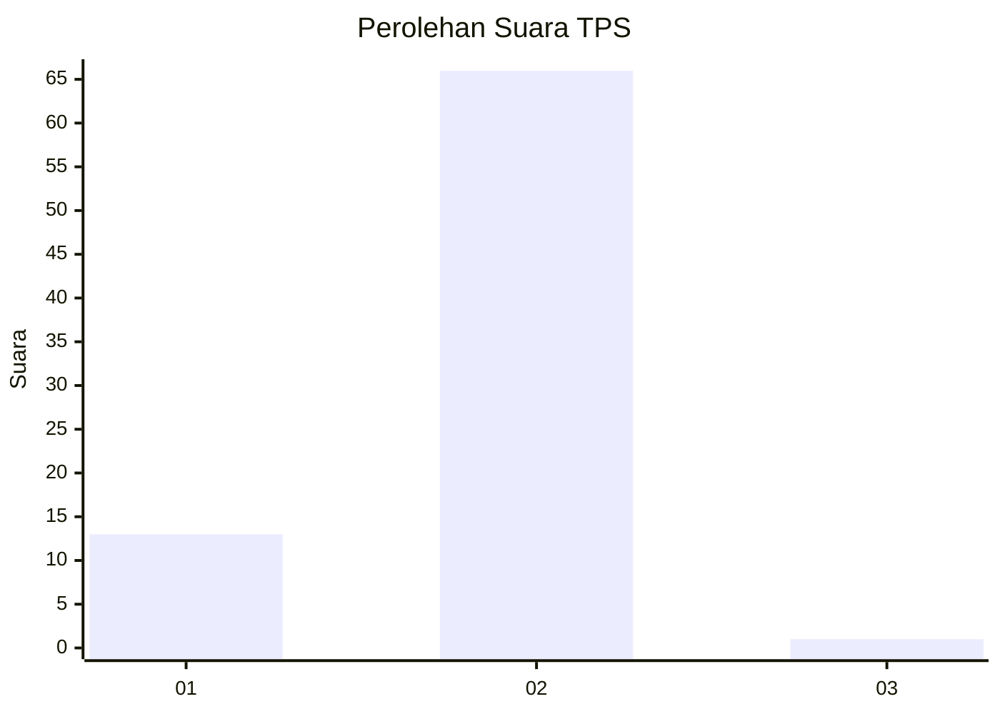
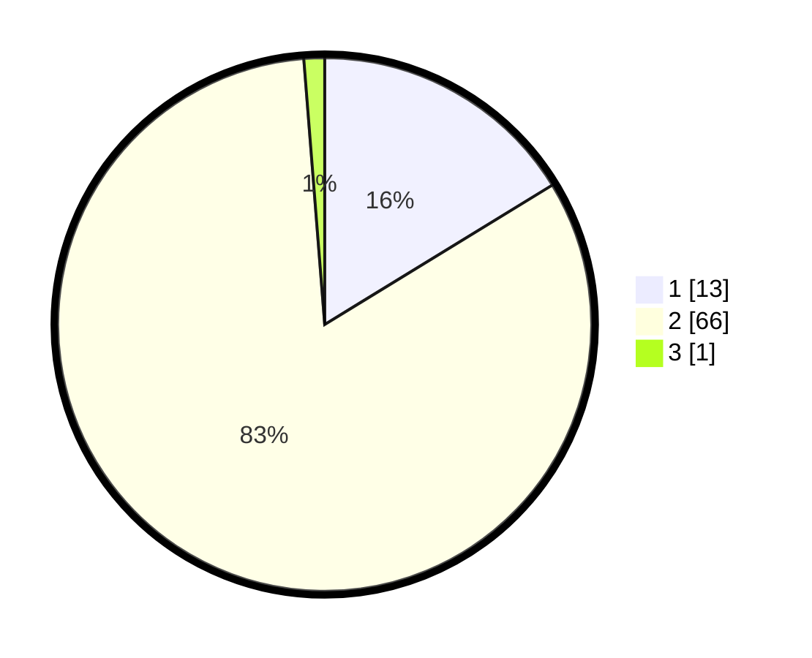

# Hasil

## Grafik

## Tabel

| No. | Nama Paslon    | Suara | Suara (raw) | Persentase |
|:--- |:-------------- | -----:| -----------:| ----------:|
| 1   | ANIES MUHAIMIN | 13    | [13][p-1]   | 16,25      |
| 2   | PRABOWO GIBRAN | 66    | [66][p-2]   | 82,50      |
| 3   | GANJAR MAHFUD  | 1     | [1][p-3]    | 1,25       |

[p-1]: https://github.com/gigit-pemilu/pemilu-2024/blob/main/pilpres/hitung-suara/sub/12-sumatera-utara/sub/71-kota-medan/sub/14-medan-tembung/sub/1005-tembung/sub/007-tps/sub/paslon-1.txt
[p-2]: https://github.com/gigit-pemilu/pemilu-2024/blob/main/pilpres/hitung-suara/sub/12-sumatera-utara/sub/71-kota-medan/sub/14-medan-tembung/sub/1005-tembung/sub/007-tps/sub/paslon-2.txt
[p-3]: https://github.com/gigit-pemilu/pemilu-2024/blob/main/pilpres/hitung-suara/sub/12-sumatera-utara/sub/71-kota-medan/sub/14-medan-tembung/sub/1005-tembung/sub/007-tps/sub/paslon-3.txt

## Foto C Plano

https://sirekap-obj-formc.kpu.go.id/7e10/pemilu/ppwp/12/71/14/10/05/1271141005007-20240215-052850--7fa41675-383d-43e8-a23f-482890e8f078.jpg

https://sirekap-obj-formc.kpu.go.id/7e10/pemilu/ppwp/12/71/14/10/05/1271141005007-20240215-070333--f74134d5-d382-41f8-a68a-da2d75d95900.jpg

https://sirekap-obj-formc.kpu.go.id/7e10/pemilu/ppwp/12/71/14/10/05/1271141005007-20240215-053817--bf18aa2b-6447-430e-b5e6-3cdab1de78b5.jpg

## Metadata

| Key        | Value               |
| ---------- | ------------------- |
| Time Stamp | 2024-02-25 18:00:00 |

