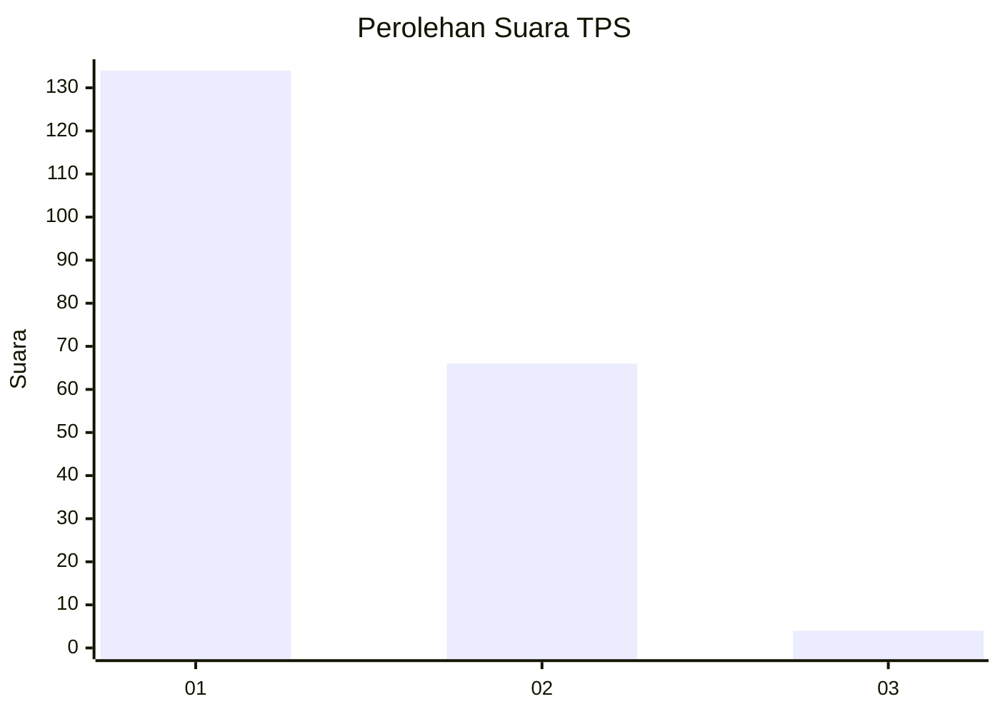
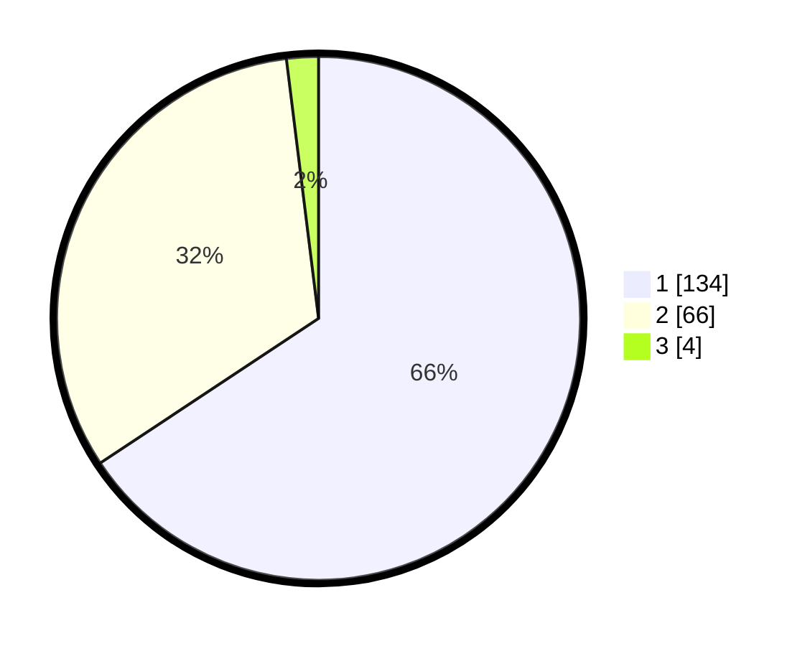

# Hasil

## Grafik

## Tabel

| No. | Nama Paslon    | Suara | Suara (raw) | Persentase |
|:--- |:-------------- | -----:| -----------:| ----------:|
| 1   | ANIES MUHAIMIN | 134   | [134][p-1]  | 65,69      |
| 2   | PRABOWO GIBRAN | 66    | [66][p-2]   | 32,35      |
| 3   | GANJAR MAHFUD  | 4     | [4][p-3]    | 1,96       |

[p-1]: https://github.com/gigit-pemilu/pemilu-2024/blob/main/pilpres/hitung-suara/sub/12-sumatera-utara/sub/71-kota-medan/sub/14-medan-tembung/sub/1005-tembung/sub/017-tps/sub/paslon-1.txt
[p-2]: https://github.com/gigit-pemilu/pemilu-2024/blob/main/pilpres/hitung-suara/sub/12-sumatera-utara/sub/71-kota-medan/sub/14-medan-tembung/sub/1005-tembung/sub/017-tps/sub/paslon-2.txt
[p-3]: https://github.com/gigit-pemilu/pemilu-2024/blob/main/pilpres/hitung-suara/sub/12-sumatera-utara/sub/71-kota-medan/sub/14-medan-tembung/sub/1005-tembung/sub/017-tps/sub/paslon-3.txt

## Foto C Plano

https://sirekap-obj-formc.kpu.go.id/3048/pemilu/ppwp/12/71/14/10/05/1271141005017-20240215-010128--caa692b3-f23e-4346-a4d0-108bf0f0f766.jpg

https://sirekap-obj-formc.kpu.go.id/3048/pemilu/ppwp/12/71/14/10/05/1271141005017-20240214-185804--d4ae6a9f-f3e7-4353-8889-0ed72f18a4dc.jpg

https://sirekap-obj-formc.kpu.go.id/3048/pemilu/ppwp/12/71/14/10/05/1271141005017-20240215-010248--0a57d60b-9fbd-4b34-89ff-675ae310c482.jpg

## Metadata

| Key        | Value               |
| ---------- | ------------------- |
| Time Stamp | 2024-02-16 00:00:26 |

