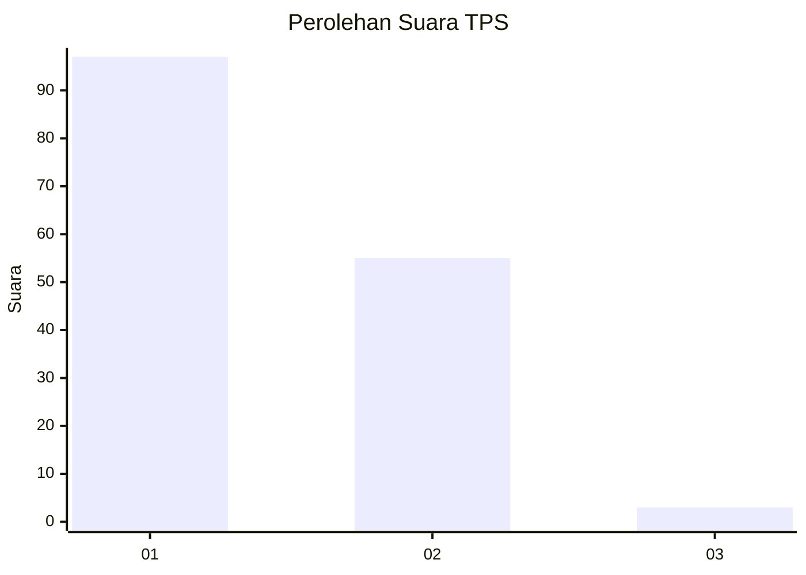
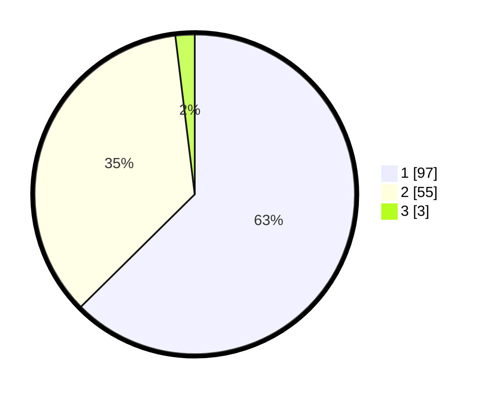

# Hasil

## Grafik

## Tabel

| No. | Nama Paslon    | Suara | Suara (raw) | Persentase |
|:--- |:-------------- | -----:| -----------:| ----------:|
| 1   | ANIES MUHAIMIN | 97    | [97][p-1]   | 62,58      |
| 2   | PRABOWO GIBRAN | 55    | [55][p-2]   | 35,48      |
| 3   | GANJAR MAHFUD  | 3     | [3][p-3]    | 1,94       |

[p-1]: https://github.com/gigit-pemilu/pemilu-2024-12-sumatera-utara/blob/main/pilpres/hitung-suara/sub/12-sumatera-utara/sub/71-kota-medan/sub/14-medan-tembung/sub/1006-bandar-selamat/sub/010-tps/sub/paslon-1.txt
[p-2]: https://github.com/gigit-pemilu/pemilu-2024-12-sumatera-utara/blob/main/pilpres/hitung-suara/sub/12-sumatera-utara/sub/71-kota-medan/sub/14-medan-tembung/sub/1006-bandar-selamat/sub/010-tps/sub/paslon-2.txt
[p-3]: https://github.com/gigit-pemilu/pemilu-2024-12-sumatera-utara/blob/main/pilpres/hitung-suara/sub/12-sumatera-utara/sub/71-kota-medan/sub/14-medan-tembung/sub/1006-bandar-selamat/sub/010-tps/sub/paslon-3.txt

## Foto C Plano

https://sirekap-obj-formc.kpu.go.id/8a2d/pemilu/ppwp/12/71/14/10/06/1271141006010-20240214-231038--d0105949-521f-4290-bc84-0b396a54b98d.jpg

https://sirekap-obj-formc.kpu.go.id/8a2d/pemilu/ppwp/12/71/14/10/06/1271141006010-20240214-203713--66f37b2a-35d7-475d-8d8b-19936375dd66.jpg

https://sirekap-obj-formc.kpu.go.id/8a2d/pemilu/ppwp/12/71/14/10/06/1271141006010-20240214-230820--56a358b1-a769-4c02-abdb-ff5bd5a202b7.jpg

## Metadata

| Key        | Value               |
| ---------- | ------------------- |
| Time Stamp | 2024-02-16 00:00:26 |

