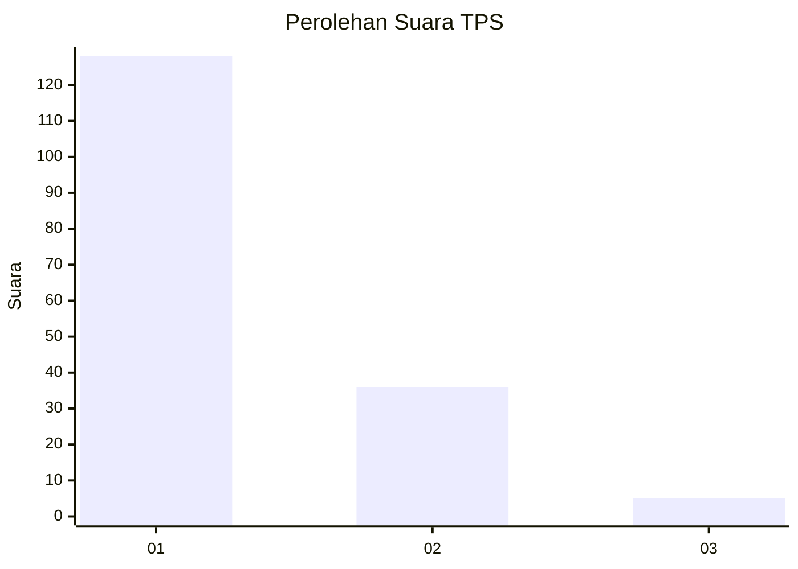
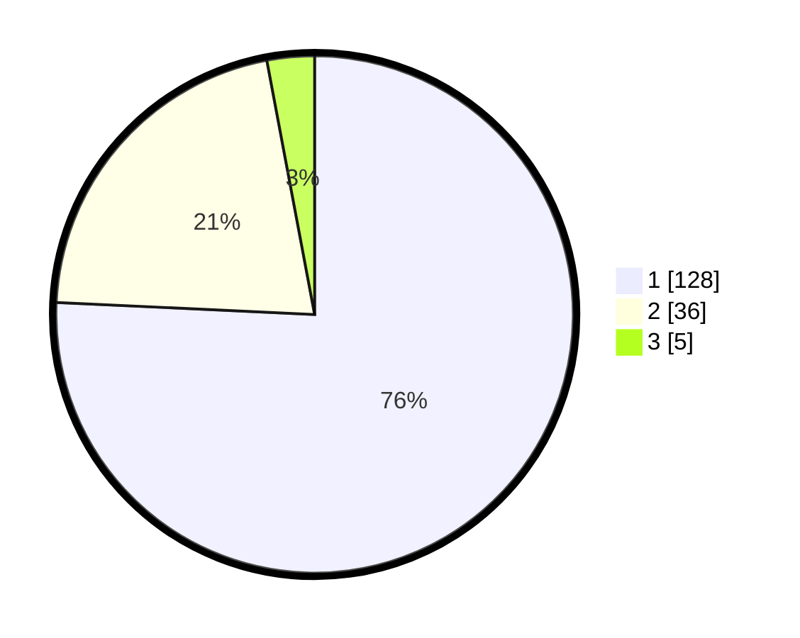

# Hasil

## Grafik

## Tabel

| No. | Nama Paslon    | Suara | Suara (raw) | Persentase |
|:--- |:-------------- | -----:| -----------:| ----------:|
| 1   | ANIES MUHAIMIN | 128   | [128][p-1]  | 75,74      |
| 2   | PRABOWO GIBRAN | 36    | [36][p-2]   | 21,30      |
| 3   | GANJAR MAHFUD  | 5     | [5][p-3]    | 2,96       |

[p-1]: https://github.com/gigit-pemilu/pemilu-2024/blob/main/pilpres/hitung-suara/sub/12-sumatera-utara/sub/71-kota-medan/sub/14-medan-tembung/sub/1006-bandar-selamat/sub/015-tps/sub/paslon-1.txt
[p-2]: https://github.com/gigit-pemilu/pemilu-2024/blob/main/pilpres/hitung-suara/sub/12-sumatera-utara/sub/71-kota-medan/sub/14-medan-tembung/sub/1006-bandar-selamat/sub/015-tps/sub/paslon-2.txt
[p-3]: https://github.com/gigit-pemilu/pemilu-2024/blob/main/pilpres/hitung-suara/sub/12-sumatera-utara/sub/71-kota-medan/sub/14-medan-tembung/sub/1006-bandar-selamat/sub/015-tps/sub/paslon-3.txt

## Foto C Plano

https://sirekap-obj-formc.kpu.go.id/7d8d/pemilu/ppwp/12/71/14/10/06/1271141006015-20240214-200855--068d8254-6bc5-4a95-83d0-dc073bc63ddd.jpg

https://sirekap-obj-formc.kpu.go.id/7d8d/pemilu/ppwp/12/71/14/10/06/1271141006015-20240214-201247--9cf7f3bf-2554-4265-8c4b-9bc117056bce.jpg

https://sirekap-obj-formc.kpu.go.id/7d8d/pemilu/ppwp/12/71/14/10/06/1271141006015-20240214-201359--475c91ab-7467-4278-b40b-e360926368f6.jpg

## Metadata

| Key        | Value               |
| ---------- | ------------------- |
| Time Stamp | 2024-02-25 16:00:00 |

