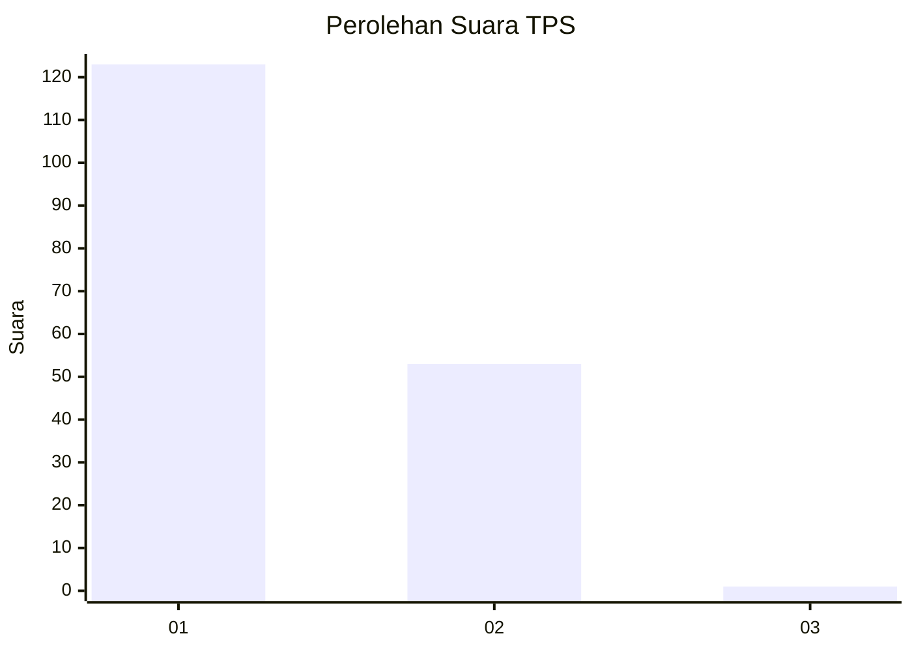
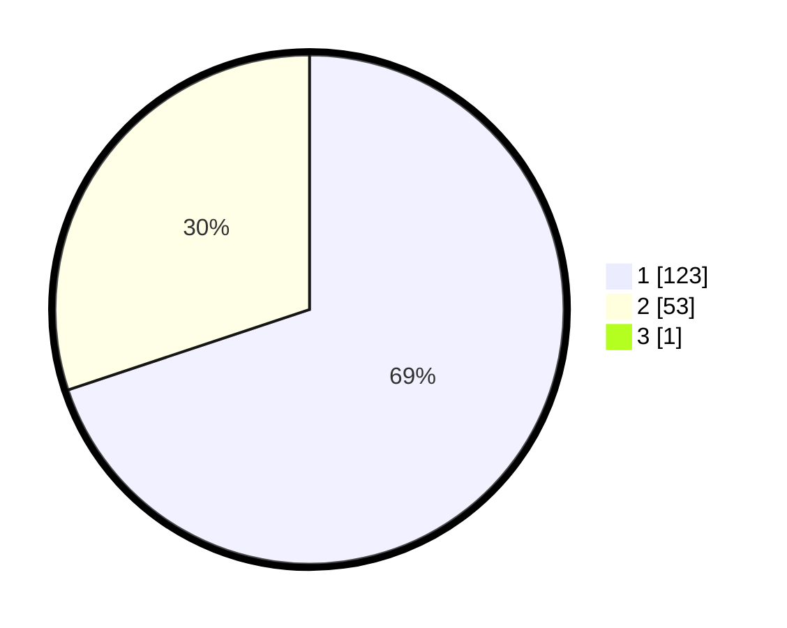

# Hasil

## Grafik

## Tabel

| No. | Nama Paslon    | Suara | Suara (raw) | Persentase |
|:--- |:-------------- | -----:| -----------:| ----------:|
| 1   | ANIES MUHAIMIN | 123   | [123][p-1]  | 69,49      |
| 2   | PRABOWO GIBRAN | 53    | [53][p-2]   | 29,94      |
| 3   | GANJAR MAHFUD  | 1     | [1][p-3]    | 0,56       |

[p-1]: https://github.com/gigit-pemilu/pemilu-2024/blob/main/pilpres/hitung-suara/sub/12-sumatera-utara/sub/71-kota-medan/sub/14-medan-tembung/sub/1006-bandar-selamat/sub/028-tps/sub/paslon-1.txt
[p-2]: https://github.com/gigit-pemilu/pemilu-2024/blob/main/pilpres/hitung-suara/sub/12-sumatera-utara/sub/71-kota-medan/sub/14-medan-tembung/sub/1006-bandar-selamat/sub/028-tps/sub/paslon-2.txt
[p-3]: https://github.com/gigit-pemilu/pemilu-2024/blob/main/pilpres/hitung-suara/sub/12-sumatera-utara/sub/71-kota-medan/sub/14-medan-tembung/sub/1006-bandar-selamat/sub/028-tps/sub/paslon-3.txt

## Foto C Plano

https://sirekap-obj-formc.kpu.go.id/cfc0/pemilu/ppwp/12/71/14/10/06/1271141006028-20240215-004252--e64b5034-0137-4ee6-86b5-85eea8512507.jpg

https://sirekap-obj-formc.kpu.go.id/cfc0/pemilu/ppwp/12/71/14/10/06/1271141006028-20240215-004526--904f181c-dd41-4db4-8f60-2bed470d63b9.jpg

https://sirekap-obj-formc.kpu.go.id/cfc0/pemilu/ppwp/12/71/14/10/06/1271141006028-20240215-004721--908d2c37-6a61-4bd1-923d-af2f4c2661a3.jpg

## Metadata

| Key        | Value               |
| ---------- | ------------------- |
| Time Stamp | 2024-02-16 00:00:26 |

