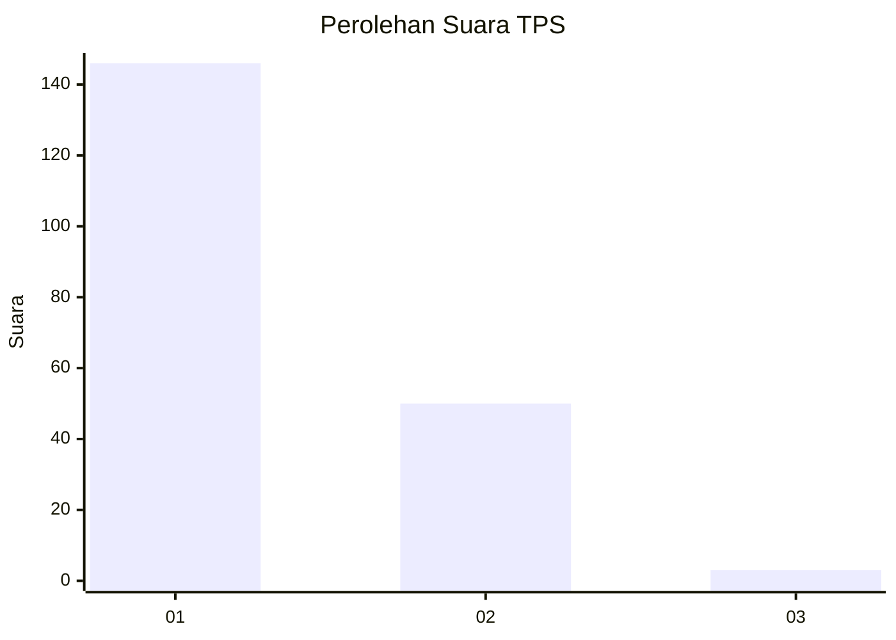
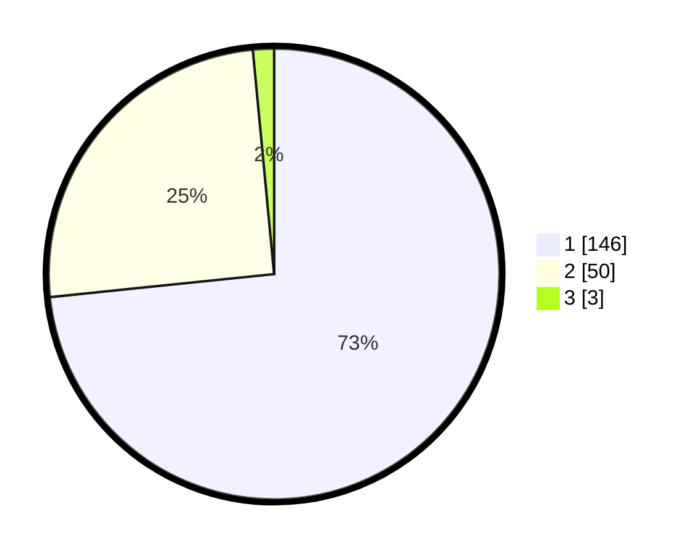

# Hasil

## Grafik

## Tabel

| No. | Nama Paslon    | Suara | Suara (raw) | Persentase |
|:--- |:-------------- | -----:| -----------:| ----------:|
| 1   | ANIES MUHAIMIN | 146   | [146][p-1]  | 73,37      |
| 2   | PRABOWO GIBRAN | 50    | [50][p-2]   | 25,13      |
| 3   | GANJAR MAHFUD  | 3     | [3][p-3]    | 1,51       |

[p-1]: https://github.com/gigit-pemilu/pemilu-2024/blob/main/pilpres/hitung-suara/sub/12-sumatera-utara/sub/71-kota-medan/sub/14-medan-tembung/sub/1006-bandar-selamat/sub/033-tps/sub/paslon-1.txt
[p-2]: https://github.com/gigit-pemilu/pemilu-2024/blob/main/pilpres/hitung-suara/sub/12-sumatera-utara/sub/71-kota-medan/sub/14-medan-tembung/sub/1006-bandar-selamat/sub/033-tps/sub/paslon-2.txt
[p-3]: https://github.com/gigit-pemilu/pemilu-2024/blob/main/pilpres/hitung-suara/sub/12-sumatera-utara/sub/71-kota-medan/sub/14-medan-tembung/sub/1006-bandar-selamat/sub/033-tps/sub/paslon-3.txt

## Foto C Plano

https://sirekap-obj-formc.kpu.go.id/b34e/pemilu/ppwp/12/71/14/10/06/1271141006033-20240215-002854--5b8ea31b-4351-40d8-931d-c8765469c947.jpg

https://sirekap-obj-formc.kpu.go.id/b34e/pemilu/ppwp/12/71/14/10/06/1271141006033-20240215-003049--7378c73b-eab0-4cd7-b4fe-063983e1044e.jpg

https://sirekap-obj-formc.kpu.go.id/b34e/pemilu/ppwp/12/71/14/10/06/1271141006033-20240215-003336--f73fa3d5-3f0d-4b70-8021-e0bf2ce5c742.jpg

## Metadata

| Key        | Value               |
| ---------- | ------------------- |
| Time Stamp | 2024-02-25 18:00:00 |

