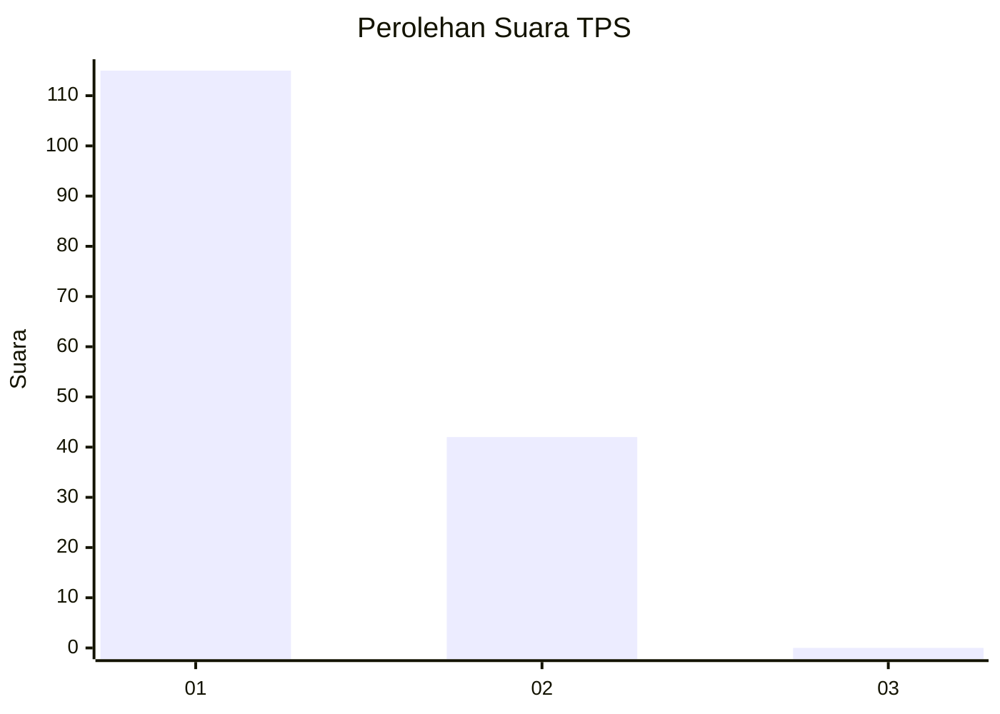
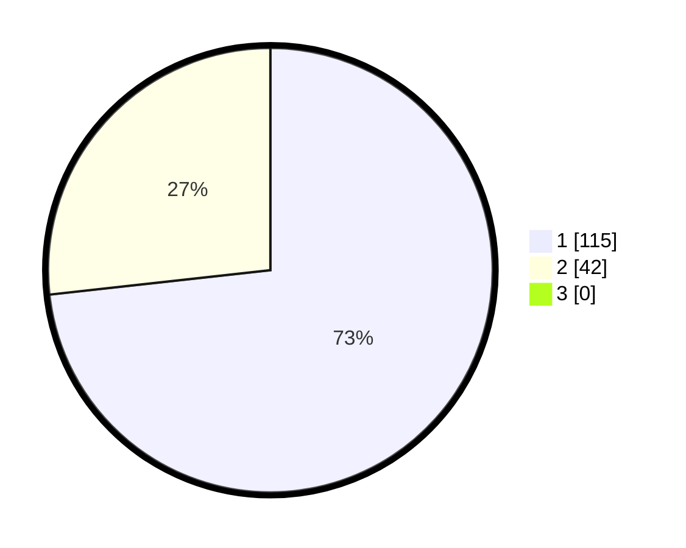

# Hasil

## Grafik

## Tabel

| No. | Nama Paslon    | Suara | Suara (raw) | Persentase |
|:--- |:-------------- | -----:| -----------:| ----------:|
| 1   | ANIES MUHAIMIN | 115   | [115][p-1]  | 73,25      |
| 2   | PRABOWO GIBRAN | 42    | [42][p-2]   | 26,75      |
| 3   | GANJAR MAHFUD  | 0     | [0][p-3]    | 0,00       |

[p-1]: https://github.com/gigit-pemilu/pemilu-2024-12-sumatera-utara/blob/main/pilpres/hitung-suara/sub/12-sumatera-utara/sub/71-kota-medan/sub/14-medan-tembung/sub/1006-bandar-selamat/sub/044-tps/sub/paslon-1.txt
[p-2]: https://github.com/gigit-pemilu/pemilu-2024-12-sumatera-utara/blob/main/pilpres/hitung-suara/sub/12-sumatera-utara/sub/71-kota-medan/sub/14-medan-tembung/sub/1006-bandar-selamat/sub/044-tps/sub/paslon-2.txt
[p-3]: https://github.com/gigit-pemilu/pemilu-2024-12-sumatera-utara/blob/main/pilpres/hitung-suara/sub/12-sumatera-utara/sub/71-kota-medan/sub/14-medan-tembung/sub/1006-bandar-selamat/sub/044-tps/sub/paslon-3.txt

## Foto C Plano

https://sirekap-obj-formc.kpu.go.id/93ce/pemilu/ppwp/12/71/14/10/06/1271141006044-20240215-063426--e7ef863b-918d-4587-bd98-836a61fb25cf.jpg

https://sirekap-obj-formc.kpu.go.id/93ce/pemilu/ppwp/12/71/14/10/06/1271141006044-20240215-063513--e2e3d9e7-0c62-4ce1-9742-1c92d9a74b9c.jpg

https://sirekap-obj-formc.kpu.go.id/93ce/pemilu/ppwp/12/71/14/10/06/1271141006044-20240215-063552--6e38296b-a971-40bc-b99d-7aef5a9ca2ca.jpg

## Metadata

| Key        | Value               |
| ---------- | ------------------- |
| Time Stamp | 2024-02-25 20:00:00 |

