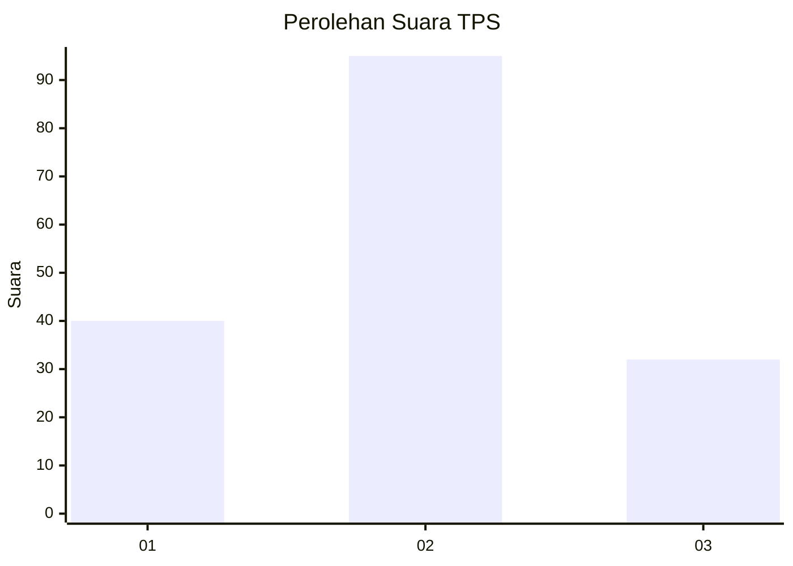
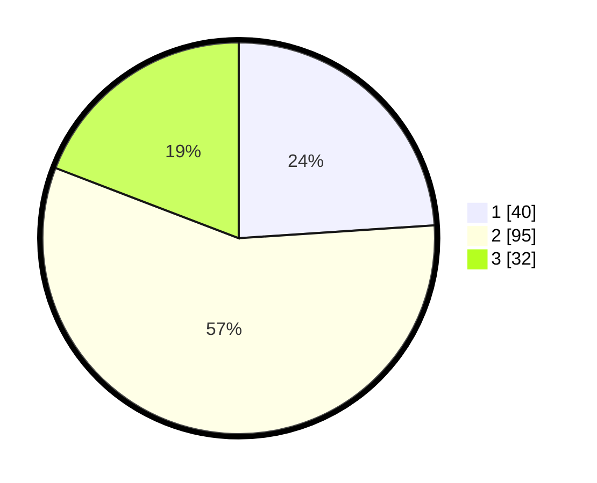

# Hasil

## Grafik

## Tabel

| No. | Nama Paslon    | Suara | Suara (raw) | Persentase |
|:--- |:-------------- | -----:| -----------:| ----------:|
| 1   | ANIES MUHAIMIN | 40    | [40][p-1]   | 23,95      |
| 2   | PRABOWO GIBRAN | 95    | [95][p-2]   | 56,89      |
| 3   | GANJAR MAHFUD  | 32    | [32][p-3]   | 19,16      |

[p-1]: https://github.com/gigit-pemilu/pemilu-2024-12-sumatera-utara/blob/main/pilpres/hitung-suara/sub/12-sumatera-utara/sub/71-kota-medan/sub/15-medan-maimun/sub/1001-a-u-r/sub/005-tps/sub/paslon-1.txt
[p-2]: https://github.com/gigit-pemilu/pemilu-2024-12-sumatera-utara/blob/main/pilpres/hitung-suara/sub/12-sumatera-utara/sub/71-kota-medan/sub/15-medan-maimun/sub/1001-a-u-r/sub/005-tps/sub/paslon-2.txt
[p-3]: https://github.com/gigit-pemilu/pemilu-2024-12-sumatera-utara/blob/main/pilpres/hitung-suara/sub/12-sumatera-utara/sub/71-kota-medan/sub/15-medan-maimun/sub/1001-a-u-r/sub/005-tps/sub/paslon-3.txt

## Foto C Plano

https://sirekap-obj-formc.kpu.go.id/9718/pemilu/ppwp/12/71/15/10/01/1271151001005-20240216-234530--4e97b4f6-6204-4dde-b730-ce500f4f8b17.jpg

https://sirekap-obj-formc.kpu.go.id/9718/pemilu/ppwp/12/71/15/10/01/1271151001005-20240217-002556--ca3fdd3f-4f14-4afa-8dba-c41edb177aef.jpg

https://sirekap-obj-formc.kpu.go.id/9718/pemilu/ppwp/12/71/15/10/01/1271151001005-20240214-203633--c583061a-5045-421d-a369-6e9ad438c15e.jpg

## Metadata

| Key        | Value               |
| ---------- | ------------------- |
| Time Stamp | 2024-02-25 16:00:00 |

