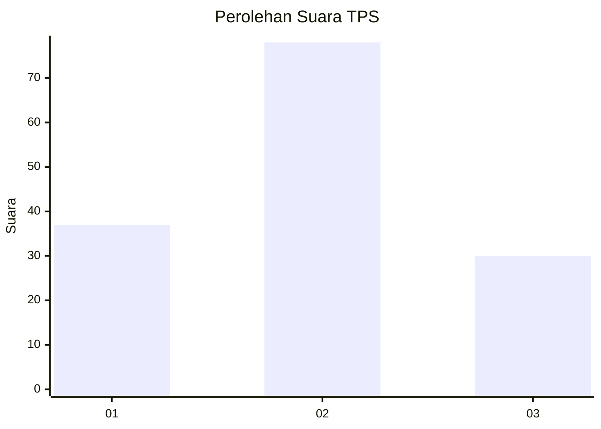
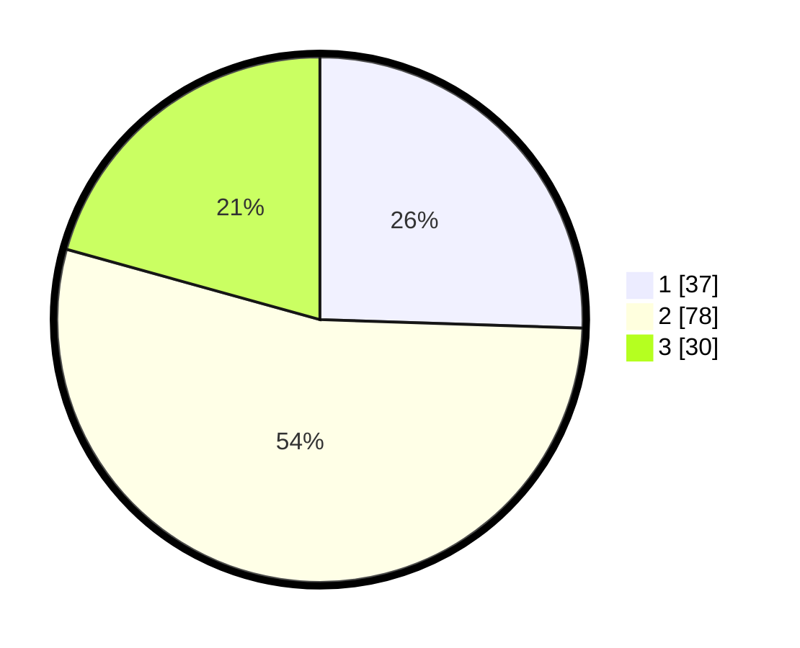

# Hasil

## Grafik

## Tabel

| No. | Nama Paslon    | Suara | Suara (raw) | Persentase |
|:--- |:-------------- | -----:| -----------:| ----------:|
| 1   | ANIES MUHAIMIN | 37    | [37][p-1]   | 25,52      |
| 2   | PRABOWO GIBRAN | 78    | [78][p-2]   | 53,79      |
| 3   | GANJAR MAHFUD  | 30    | [30][p-3]   | 20,69      |

[p-1]: https://github.com/gigit-pemilu/pemilu-2024-12-sumatera-utara/blob/main/pilpres/hitung-suara/sub/12-sumatera-utara/sub/71-kota-medan/sub/15-medan-maimun/sub/1001-a-u-r/sub/006-tps/sub/paslon-1.txt
[p-2]: https://github.com/gigit-pemilu/pemilu-2024-12-sumatera-utara/blob/main/pilpres/hitung-suara/sub/12-sumatera-utara/sub/71-kota-medan/sub/15-medan-maimun/sub/1001-a-u-r/sub/006-tps/sub/paslon-2.txt
[p-3]: https://github.com/gigit-pemilu/pemilu-2024-12-sumatera-utara/blob/main/pilpres/hitung-suara/sub/12-sumatera-utara/sub/71-kota-medan/sub/15-medan-maimun/sub/1001-a-u-r/sub/006-tps/sub/paslon-3.txt

## Foto C Plano

https://sirekap-obj-formc.kpu.go.id/b000/pemilu/ppwp/12/71/15/10/01/1271151001006-20240215-003813--a2beed5c-1301-410b-a54e-b7dc2411a727.jpg

https://sirekap-obj-formc.kpu.go.id/b000/pemilu/ppwp/12/71/15/10/01/1271151001006-20240215-003859--b76cd75c-b0b9-412e-b784-0a4f7f0765b2.jpg

https://sirekap-obj-formc.kpu.go.id/b000/pemilu/ppwp/12/71/15/10/01/1271151001006-20240214-203030--16d5509d-145e-49d3-a93c-ffee532b466c.jpg

## Metadata

| Key        | Value               |
| ---------- | ------------------- |
| Time Stamp | 2024-02-16 23:30:00 |

