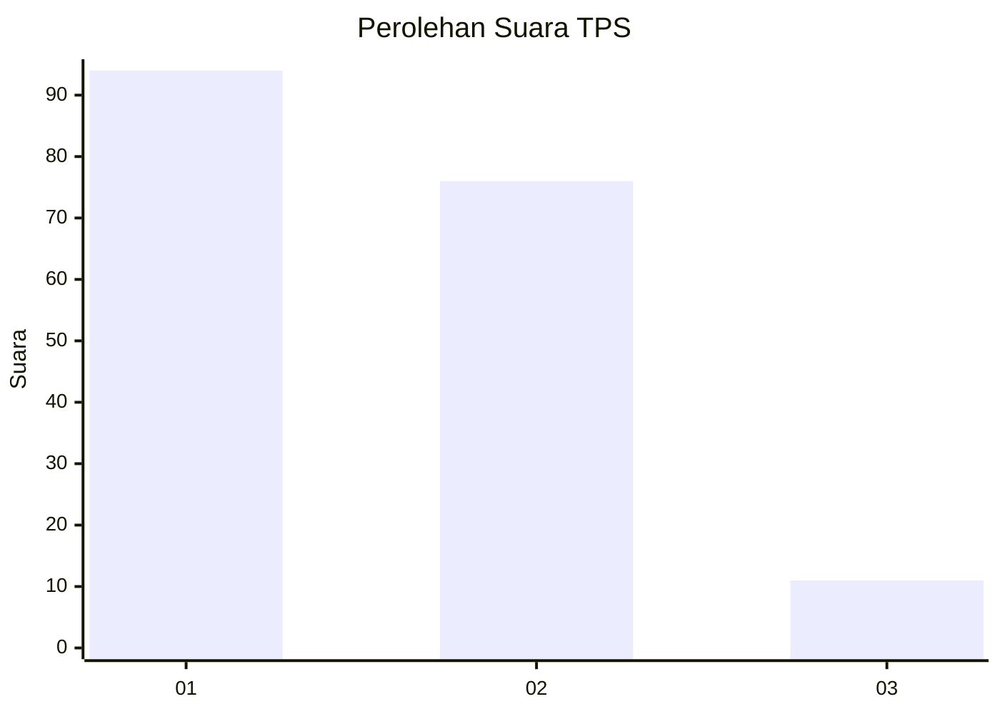
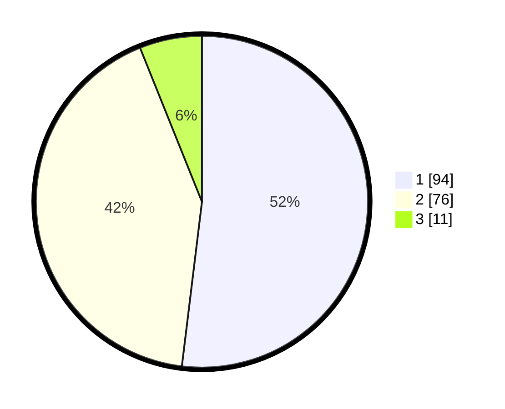

# Hasil

## Grafik

## Tabel

| No. | Nama Paslon    | Suara | Suara (raw) | Persentase |
|:--- |:-------------- | -----:| -----------:| ----------:|
| 1   | ANIES MUHAIMIN | 94    | [94][p-1]   | 51,93      |
| 2   | PRABOWO GIBRAN | 76    | [76][p-2]   | 41,99      |
| 3   | GANJAR MAHFUD  | 11    | [11][p-3]   | 6,08       |

[p-1]: https://github.com/gigit-pemilu/pemilu-2024/blob/main/pilpres/hitung-suara/sub/12-sumatera-utara/sub/71-kota-medan/sub/15-medan-maimun/sub/1001-a-u-r/sub/008-tps/sub/paslon-1.txt
[p-2]: https://github.com/gigit-pemilu/pemilu-2024/blob/main/pilpres/hitung-suara/sub/12-sumatera-utara/sub/71-kota-medan/sub/15-medan-maimun/sub/1001-a-u-r/sub/008-tps/sub/paslon-2.txt
[p-3]: https://github.com/gigit-pemilu/pemilu-2024/blob/main/pilpres/hitung-suara/sub/12-sumatera-utara/sub/71-kota-medan/sub/15-medan-maimun/sub/1001-a-u-r/sub/008-tps/sub/paslon-3.txt

## Foto C Plano

https://sirekap-obj-formc.kpu.go.id/6489/pemilu/ppwp/12/71/15/10/01/1271151001008-20240215-011954--c9d57608-5c0b-4d6a-8f83-1cd35ea76f22.jpg

https://sirekap-obj-formc.kpu.go.id/6489/pemilu/ppwp/12/71/15/10/01/1271151001008-20240215-012033--7ddbaef4-a4c5-4c6d-9ba0-7c7d87d1908d.jpg

https://sirekap-obj-formc.kpu.go.id/6489/pemilu/ppwp/12/71/15/10/01/1271151001008-20240215-012152--2e8c61b0-bae3-4ffa-a17e-a2d642f31359.jpg

## Metadata

| Key        | Value               |
| ---------- | ------------------- |
| Time Stamp | 2024-02-25 15:00:00 |

