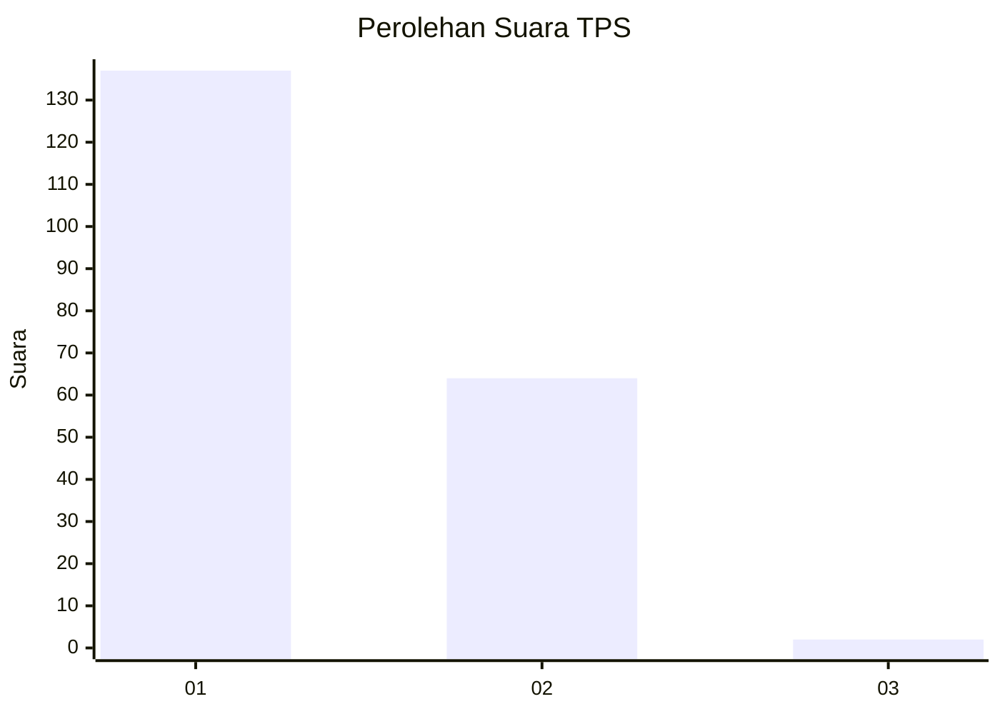
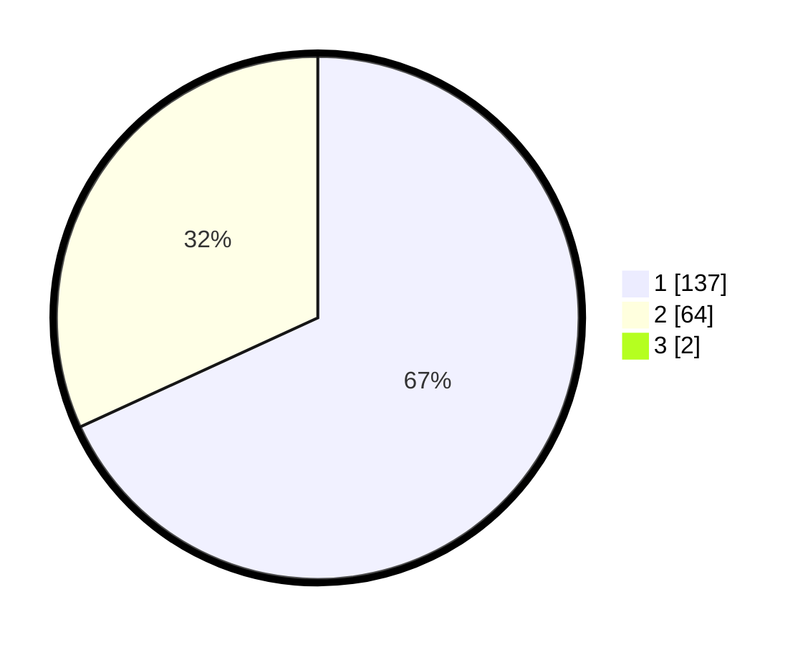

# Hasil

## Grafik

## Tabel

| No. | Nama Paslon    | Suara | Suara (raw) | Persentase |
|:--- |:-------------- | -----:| -----------:| ----------:|
| 1   | ANIES MUHAIMIN | 137   | [137][p-1]  | 67,49      |
| 2   | PRABOWO GIBRAN | 64    | [64][p-2]   | 31,53      |
| 3   | GANJAR MAHFUD  | 2     | [2][p-3]    | 0,99       |

[p-1]: https://github.com/gigit-pemilu/pemilu-2024/blob/main/pilpres/hitung-suara/sub/12-sumatera-utara/sub/71-kota-medan/sub/15-medan-maimun/sub/1005-sei-mati/sub/006-tps/sub/paslon-1.txt
[p-2]: https://github.com/gigit-pemilu/pemilu-2024/blob/main/pilpres/hitung-suara/sub/12-sumatera-utara/sub/71-kota-medan/sub/15-medan-maimun/sub/1005-sei-mati/sub/006-tps/sub/paslon-2.txt
[p-3]: https://github.com/gigit-pemilu/pemilu-2024/blob/main/pilpres/hitung-suara/sub/12-sumatera-utara/sub/71-kota-medan/sub/15-medan-maimun/sub/1005-sei-mati/sub/006-tps/sub/paslon-3.txt

## Foto C Plano

https://sirekap-obj-formc.kpu.go.id/4b9c/pemilu/ppwp/12/71/15/10/05/1271151005006-20240215-013323--ee39fa21-c83c-4664-92a2-afd67b886f0c.jpg

https://sirekap-obj-formc.kpu.go.id/4b9c/pemilu/ppwp/12/71/15/10/05/1271151005006-20240215-013450--8d5d93ff-173b-4ee2-a31e-b0f8cc49e24f.jpg

https://sirekap-obj-formc.kpu.go.id/4b9c/pemilu/ppwp/12/71/15/10/05/1271151005006-20240215-013622--b01183cc-768c-4d17-8958-1ec59f5c64a8.jpg

## Metadata

| Key        | Value               |
| ---------- | ------------------- |
| Time Stamp | 2024-02-24 22:31:28 |

