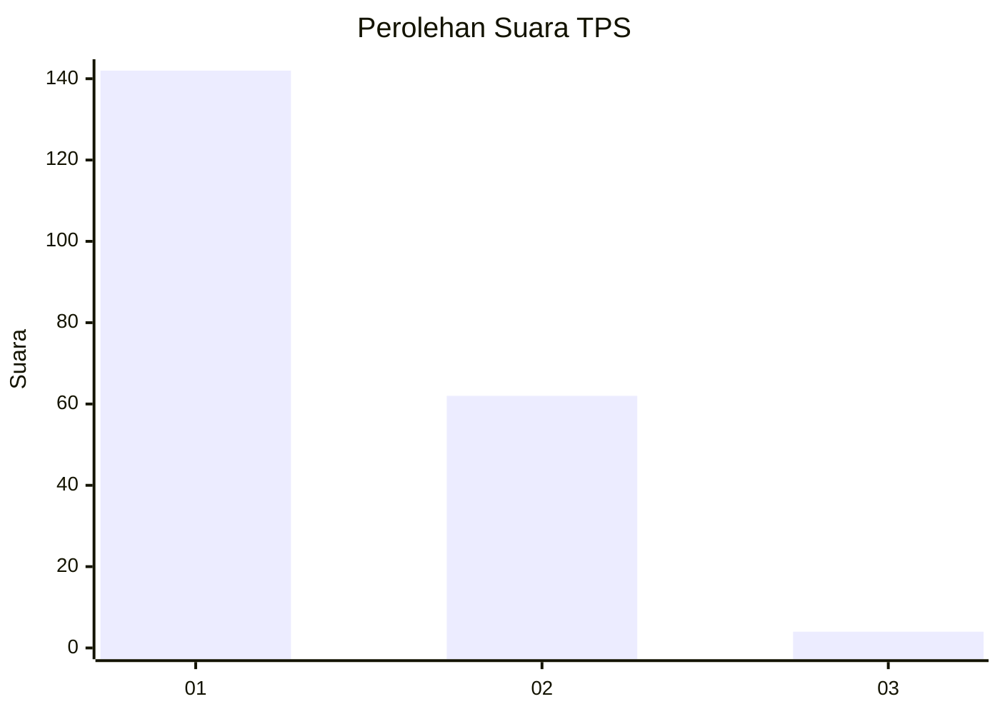
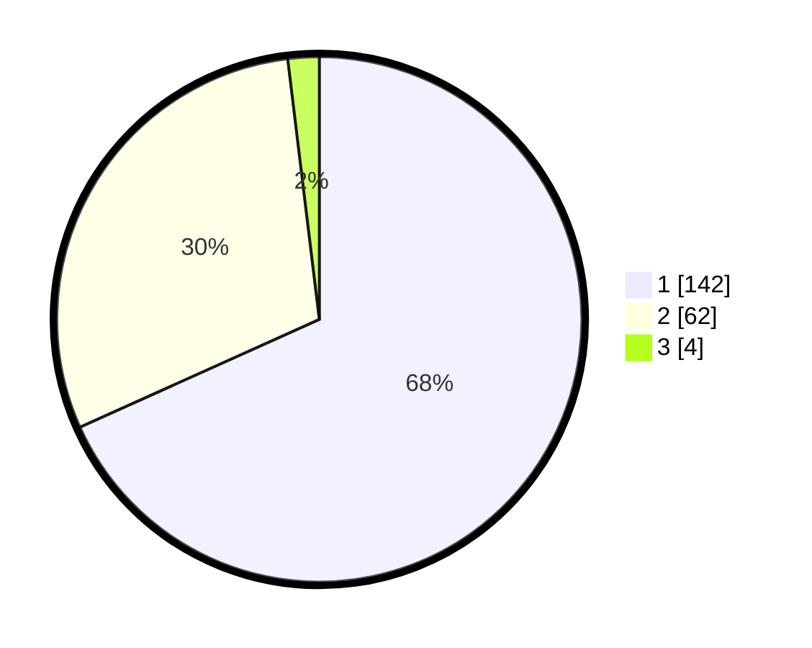

# Hasil

## Grafik

## Tabel

| No. | Nama Paslon    | Suara | Suara (raw) | Persentase |
|:--- |:-------------- | -----:| -----------:| ----------:|
| 1   | ANIES MUHAIMIN | 142   | [142][p-1]  | 68,27      |
| 2   | PRABOWO GIBRAN | 62    | [62][p-2]   | 29,81      |
| 3   | GANJAR MAHFUD  | 4     | [4][p-3]    | 1,92       |

[p-1]: https://github.com/gigit-pemilu/pemilu-2024/blob/main/pilpres/hitung-suara/sub/12-sumatera-utara/sub/71-kota-medan/sub/15-medan-maimun/sub/1005-sei-mati/sub/008-tps/sub/paslon-1.txt
[p-2]: https://github.com/gigit-pemilu/pemilu-2024/blob/main/pilpres/hitung-suara/sub/12-sumatera-utara/sub/71-kota-medan/sub/15-medan-maimun/sub/1005-sei-mati/sub/008-tps/sub/paslon-2.txt
[p-3]: https://github.com/gigit-pemilu/pemilu-2024/blob/main/pilpres/hitung-suara/sub/12-sumatera-utara/sub/71-kota-medan/sub/15-medan-maimun/sub/1005-sei-mati/sub/008-tps/sub/paslon-3.txt

## Foto C Plano

https://sirekap-obj-formc.kpu.go.id/9b44/pemilu/ppwp/12/71/15/10/05/1271151005008-20240214-214310--b2249757-df46-4042-bb7f-fc1dfa32902b.jpg

https://sirekap-obj-formc.kpu.go.id/9b44/pemilu/ppwp/12/71/15/10/05/1271151005008-20240214-214517--9fd82e81-a302-4936-84ca-99f2271a9983.jpg

https://sirekap-obj-formc.kpu.go.id/9b44/pemilu/ppwp/12/71/15/10/05/1271151005008-20240214-214713--f9d3d624-15be-4db8-bab5-8ab3abcddbe4.jpg

## Metadata

| Key        | Value               |
| ---------- | ------------------- |
| Time Stamp | 2024-02-24 22:31:28 |

