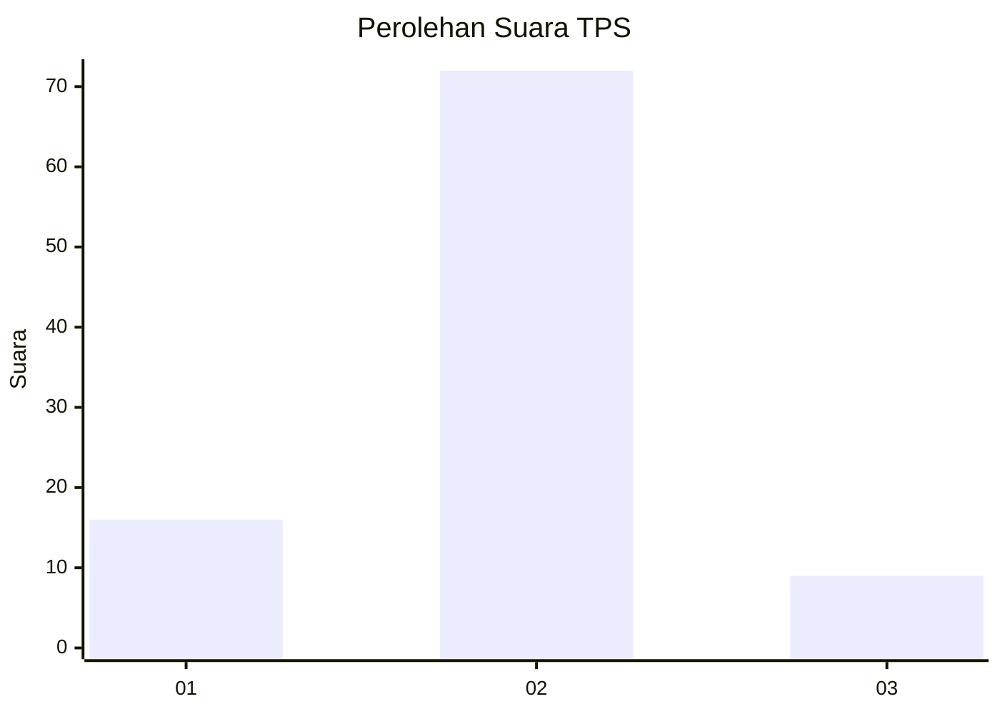
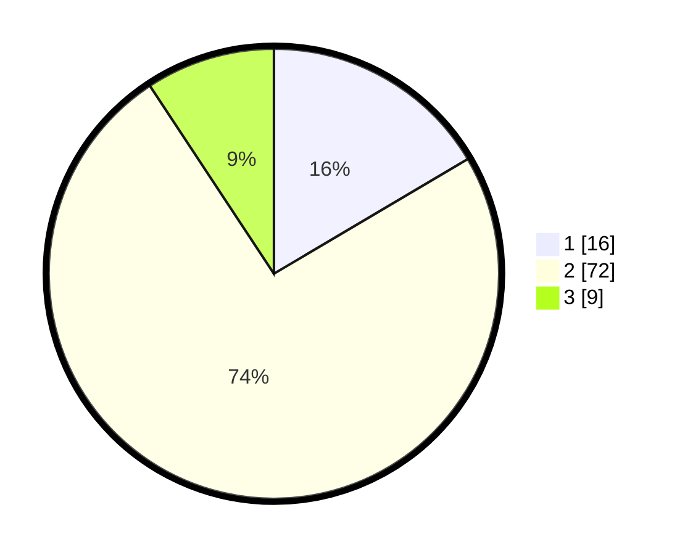

# Hasil

## Grafik

## Tabel

| No. | Nama Paslon    | Suara | Suara (raw) | Persentase |
|:--- |:-------------- | -----:| -----------:| ----------:|
| 1   | ANIES MUHAIMIN | 16    | [16][p-1]   | 16,49      |
| 2   | PRABOWO GIBRAN | 72    | [72][p-2]   | 74,23      |
| 3   | GANJAR MAHFUD  | 9     | [9][p-3]    | 9,28       |

[p-1]: https://github.com/gigit-pemilu/pemilu-2024-12-sumatera-utara/blob/main/pilpres/hitung-suara/sub/12-sumatera-utara/sub/71-kota-medan/sub/15-medan-maimun/sub/1006-kampung-baru/sub/030-tps/sub/paslon-1.txt
[p-2]: https://github.com/gigit-pemilu/pemilu-2024-12-sumatera-utara/blob/main/pilpres/hitung-suara/sub/12-sumatera-utara/sub/71-kota-medan/sub/15-medan-maimun/sub/1006-kampung-baru/sub/030-tps/sub/paslon-2.txt
[p-3]: https://github.com/gigit-pemilu/pemilu-2024-12-sumatera-utara/blob/main/pilpres/hitung-suara/sub/12-sumatera-utara/sub/71-kota-medan/sub/15-medan-maimun/sub/1006-kampung-baru/sub/030-tps/sub/paslon-3.txt

## Foto C Plano

https://sirekap-obj-formc.kpu.go.id/bcbf/pemilu/ppwp/12/71/15/10/06/1271151006030-20240216-124355--64a5efee-1a1b-4d8f-ac84-5a79f218c0dd.jpg

https://sirekap-obj-formc.kpu.go.id/bcbf/pemilu/ppwp/12/71/15/10/06/1271151006030-20240216-123435--d2bfc93d-5bc1-4773-b602-c567f8a8f786.jpg

https://sirekap-obj-formc.kpu.go.id/bcbf/pemilu/ppwp/12/71/15/10/06/1271151006030-20240216-124722--ccfc1536-ce05-4322-ba3b-21399378d811.jpg

## Metadata

| Key        | Value               |
| ---------- | ------------------- |
| Time Stamp | 2024-02-24 22:31:28 |

