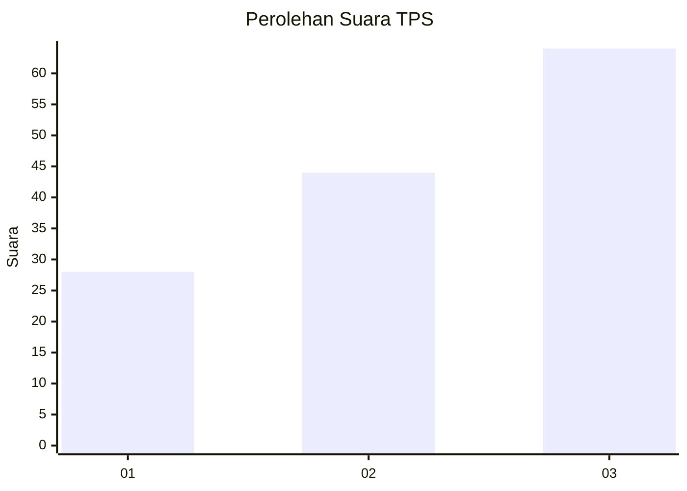
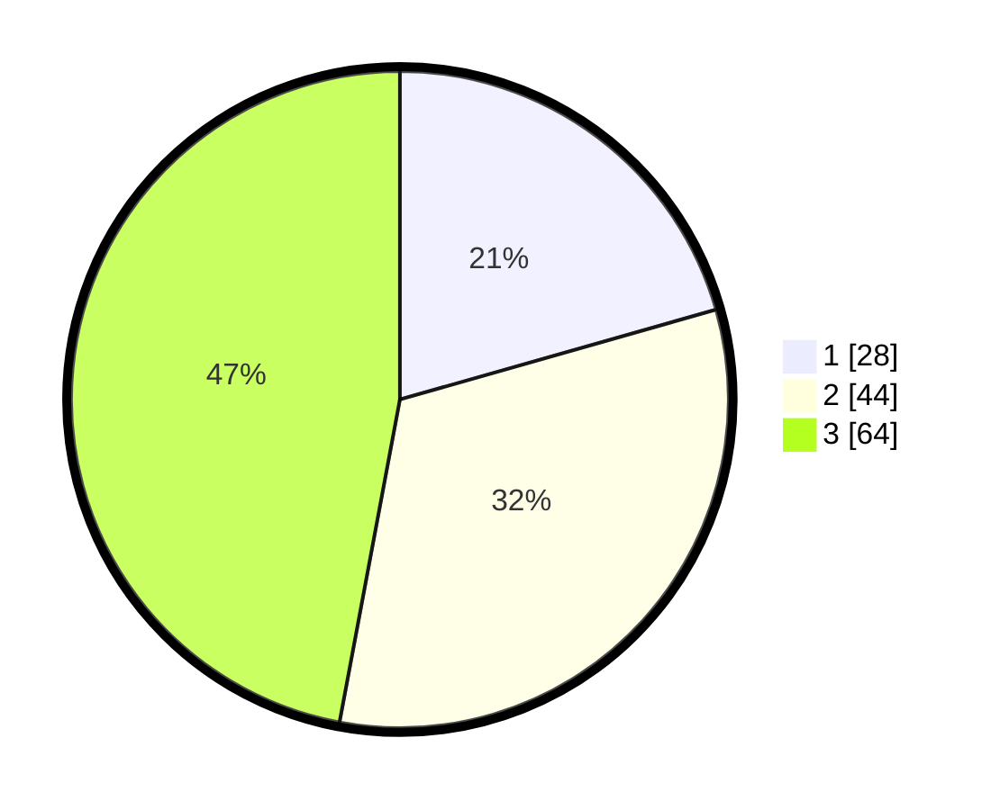

# Hasil

## Grafik

## Tabel

| No. | Nama Paslon    | Suara | Suara (raw) | Persentase |
|:--- |:-------------- | -----:| -----------:| ----------:|
| 1   | ANIES MUHAIMIN | 28    | [28][p-1]   | 20,59      |
| 2   | PRABOWO GIBRAN | 44    | [44][p-2]   | 32,35      |
| 3   | GANJAR MAHFUD  | 64    | [64][p-3]   | 47,06      |

[p-1]: https://github.com/gigit-pemilu/pemilu-2024-12-sumatera-utara/blob/main/pilpres/hitung-suara/sub/12-sumatera-utara/sub/71-kota-medan/sub/16-medan-polonia/sub/1001-madras-hulu/sub/008-tps/sub/paslon-1.txt
[p-2]: https://github.com/gigit-pemilu/pemilu-2024-12-sumatera-utara/blob/main/pilpres/hitung-suara/sub/12-sumatera-utara/sub/71-kota-medan/sub/16-medan-polonia/sub/1001-madras-hulu/sub/008-tps/sub/paslon-2.txt
[p-3]: https://github.com/gigit-pemilu/pemilu-2024-12-sumatera-utara/blob/main/pilpres/hitung-suara/sub/12-sumatera-utara/sub/71-kota-medan/sub/16-medan-polonia/sub/1001-madras-hulu/sub/008-tps/sub/paslon-3.txt

## Foto C Plano

https://sirekap-obj-formc.kpu.go.id/4033/pemilu/ppwp/12/71/16/10/01/1271161001008-20240216-155657--b86ffe4a-32da-4a8a-92a9-163748788a9c.jpg

https://sirekap-obj-formc.kpu.go.id/4033/pemilu/ppwp/12/71/16/10/01/1271161001008-20240214-194720--cc3443c2-1ce1-4f14-8e11-15c038565556.jpg

https://sirekap-obj-formc.kpu.go.id/4033/pemilu/ppwp/12/71/16/10/01/1271161001008-20240214-194912--c70a2269-037c-43e8-9c4b-8516cbd48824.jpg

## Metadata

| Key        | Value               |
| ---------- | ------------------- |
| Time Stamp | 2024-02-16 23:45:47 |

