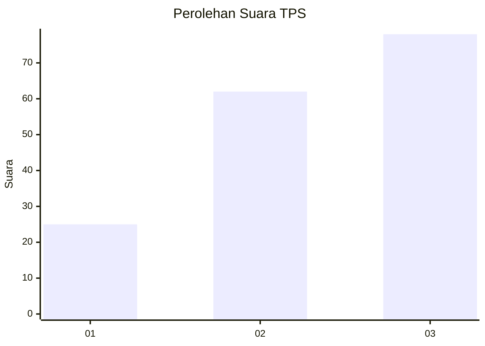
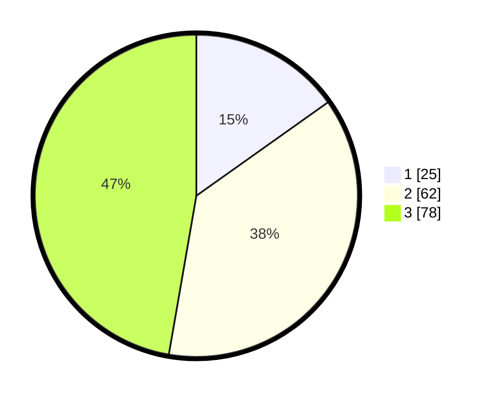

# Hasil

## Grafik

## Tabel

| No. | Nama Paslon    | Suara | Suara (raw) | Persentase |
|:--- |:-------------- | -----:| -----------:| ----------:|
| 1   | ANIES MUHAIMIN | 25    | [25][p-1]   | 15,15      |
| 2   | PRABOWO GIBRAN | 62    | [62][p-2]   | 37,58      |
| 3   | GANJAR MAHFUD  | 78    | [78][p-3]   | 47,27      |

[p-1]: https://github.com/gigit-pemilu/pemilu-2024/blob/main/pilpres/hitung-suara/sub/12-sumatera-utara/sub/71-kota-medan/sub/17-medan-baru/sub/1001-petisah-hulu/sub/006-tps/sub/paslon-1.txt
[p-2]: https://github.com/gigit-pemilu/pemilu-2024/blob/main/pilpres/hitung-suara/sub/12-sumatera-utara/sub/71-kota-medan/sub/17-medan-baru/sub/1001-petisah-hulu/sub/006-tps/sub/paslon-2.txt
[p-3]: https://github.com/gigit-pemilu/pemilu-2024/blob/main/pilpres/hitung-suara/sub/12-sumatera-utara/sub/71-kota-medan/sub/17-medan-baru/sub/1001-petisah-hulu/sub/006-tps/sub/paslon-3.txt

## Foto C Plano

https://sirekap-obj-formc.kpu.go.id/b573/pemilu/ppwp/12/71/17/10/01/1271171001006-20240214-232743--ebb24a3a-e9aa-44c9-9dbc-038d70ea2ff5.jpg

https://sirekap-obj-formc.kpu.go.id/b573/pemilu/ppwp/12/71/17/10/01/1271171001006-20240214-232852--903b6373-ffc6-4f01-a13a-e95e12806b1a.jpg

https://sirekap-obj-formc.kpu.go.id/b573/pemilu/ppwp/12/71/17/10/01/1271171001006-20240214-233038--1785a803-564c-41f5-ba1b-bf7978f3db21.jpg

## Metadata

| Key        | Value               |
| ---------- | ------------------- |
| Time Stamp | 2024-02-16 23:30:00 |

