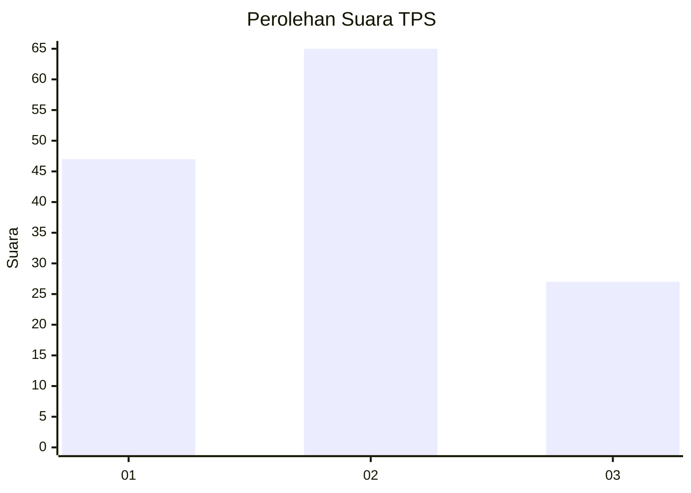
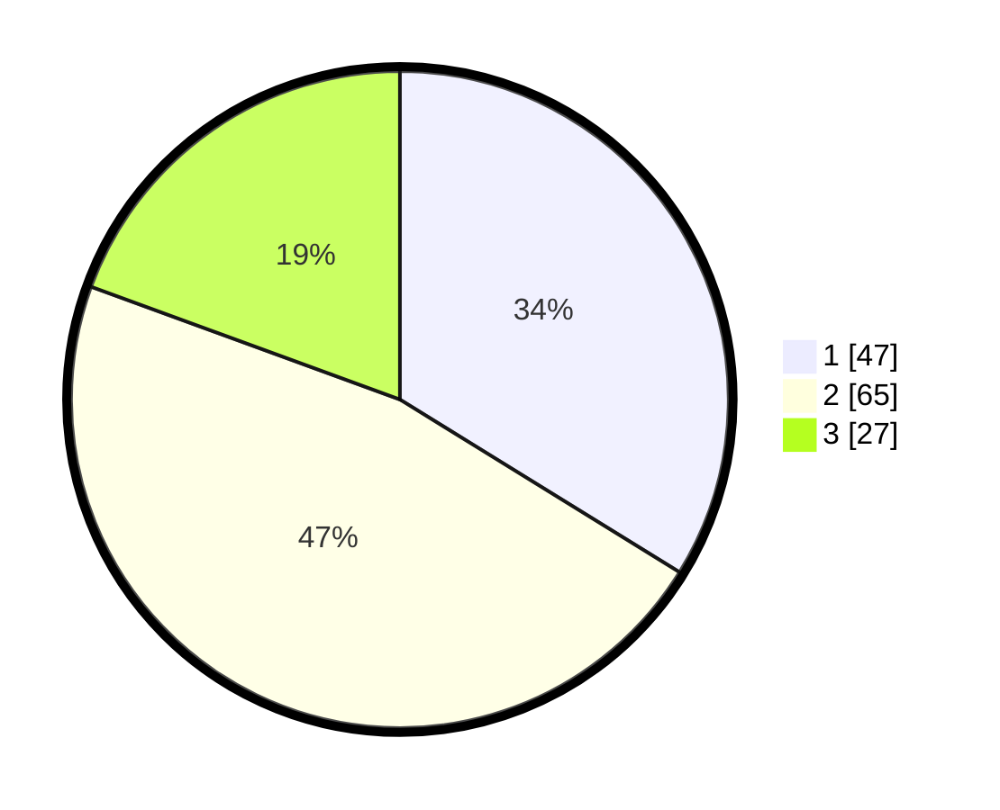

# Hasil

## Grafik

## Tabel

| No. | Nama Paslon    | Suara | Suara (raw) | Persentase |
|:--- |:-------------- | -----:| -----------:| ----------:|
| 1   | ANIES MUHAIMIN | 47    | [47][p-1]   | 33,81      |
| 2   | PRABOWO GIBRAN | 65    | [65][p-2]   | 46,76      |
| 3   | GANJAR MAHFUD  | 27    | [27][p-3]   | 19,42      |

[p-1]: https://github.com/gigit-pemilu/pemilu-2024/blob/main/pilpres/hitung-suara/sub/12-sumatera-utara/sub/71-kota-medan/sub/17-medan-baru/sub/1001-petisah-hulu/sub/018-tps/sub/paslon-1.txt
[p-2]: https://github.com/gigit-pemilu/pemilu-2024/blob/main/pilpres/hitung-suara/sub/12-sumatera-utara/sub/71-kota-medan/sub/17-medan-baru/sub/1001-petisah-hulu/sub/018-tps/sub/paslon-2.txt
[p-3]: https://github.com/gigit-pemilu/pemilu-2024/blob/main/pilpres/hitung-suara/sub/12-sumatera-utara/sub/71-kota-medan/sub/17-medan-baru/sub/1001-petisah-hulu/sub/018-tps/sub/paslon-3.txt

## Foto C Plano

https://sirekap-obj-formc.kpu.go.id/24af/pemilu/ppwp/12/71/17/10/01/1271171001018-20240214-194243--5a1dc816-43eb-4b0a-8822-e4a328968795.jpg

https://sirekap-obj-formc.kpu.go.id/24af/pemilu/ppwp/12/71/17/10/01/1271171001018-20240214-194429--772fbc2d-eb45-489b-81a8-0083eb39136a.jpg

https://sirekap-obj-formc.kpu.go.id/24af/pemilu/ppwp/12/71/17/10/01/1271171001018-20240214-194522--7a6bf8c9-c7e0-4ee6-93bb-b40f5e527021.jpg

## Metadata

| Key        | Value               |
| ---------- | ------------------- |
| Time Stamp | 2024-02-24 22:31:28 |

