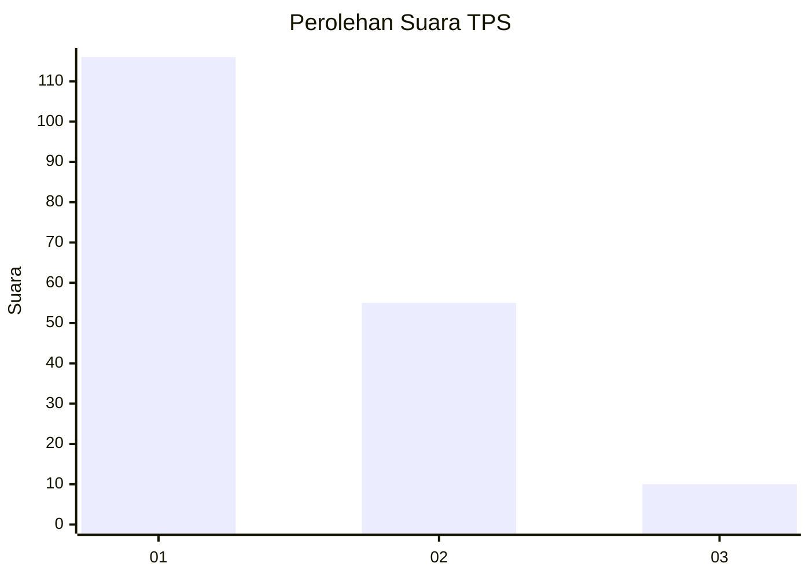
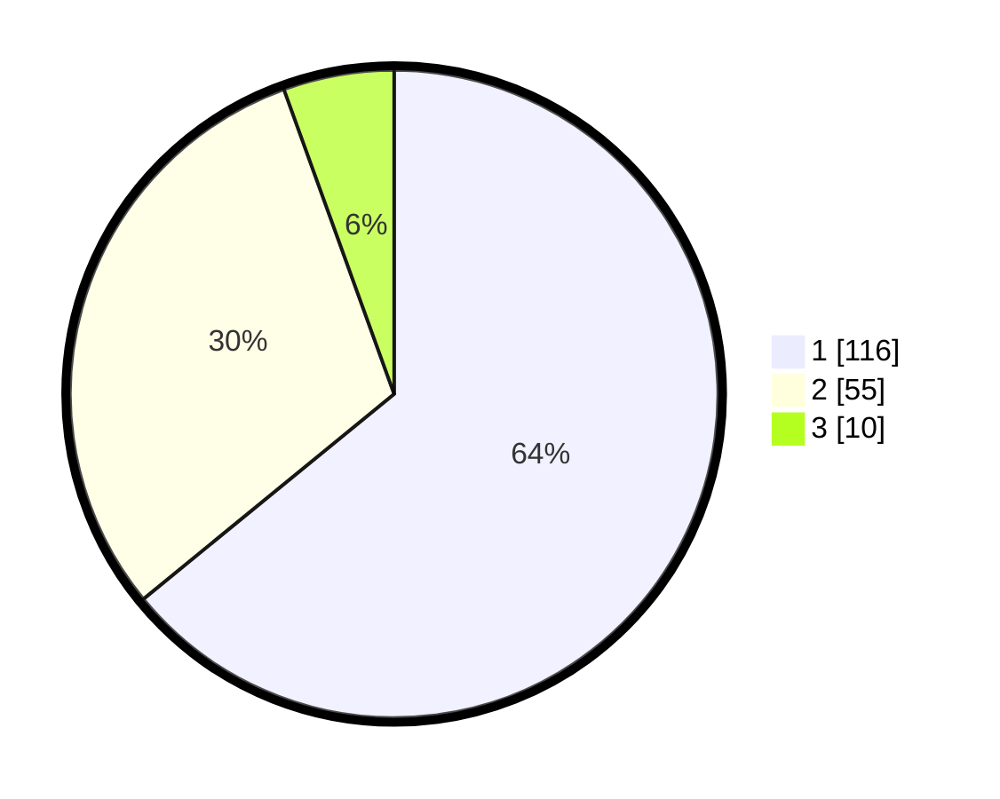

# Hasil

## Grafik

## Tabel

| No. | Nama Paslon    | Suara | Suara (raw) | Persentase |
|:--- |:-------------- | -----:| -----------:| ----------:|
| 1   | ANIES MUHAIMIN | 116   | [116][p-1]  | 64,09      |
| 2   | PRABOWO GIBRAN | 55    | [55][p-2]   | 30,39      |
| 3   | GANJAR MAHFUD  | 10    | [10][p-3]   | 5,52       |

[p-1]: https://github.com/gigit-pemilu/pemilu-2024/blob/main/pilpres/hitung-suara/sub/12-sumatera-utara/sub/71-kota-medan/sub/18-medan-perjuangan/sub/1002-pahlawan/sub/019-tps/sub/paslon-1.txt
[p-2]: https://github.com/gigit-pemilu/pemilu-2024/blob/main/pilpres/hitung-suara/sub/12-sumatera-utara/sub/71-kota-medan/sub/18-medan-perjuangan/sub/1002-pahlawan/sub/019-tps/sub/paslon-2.txt
[p-3]: https://github.com/gigit-pemilu/pemilu-2024/blob/main/pilpres/hitung-suara/sub/12-sumatera-utara/sub/71-kota-medan/sub/18-medan-perjuangan/sub/1002-pahlawan/sub/019-tps/sub/paslon-3.txt

## Foto C Plano

https://sirekap-obj-formc.kpu.go.id/6148/pemilu/ppwp/12/71/18/10/02/1271181002019-20240215-003154--52b39abd-50a5-4070-81a9-602a582fef02.jpg

https://sirekap-obj-formc.kpu.go.id/6148/pemilu/ppwp/12/71/18/10/02/1271181002019-20240214-213612--b651ca9b-a464-4456-8ebf-149fdc7fa921.jpg

https://sirekap-obj-formc.kpu.go.id/6148/pemilu/ppwp/12/71/18/10/02/1271181002019-20240214-213818--507481ea-8c4b-444d-a480-6c58a234011a.jpg

## Metadata

| Key        | Value               |
| ---------- | ------------------- |
| Time Stamp | 2024-02-25 17:00:00 |

