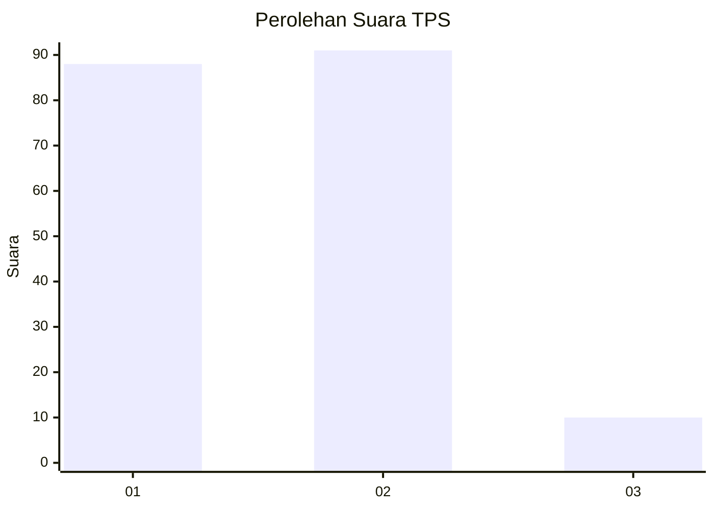
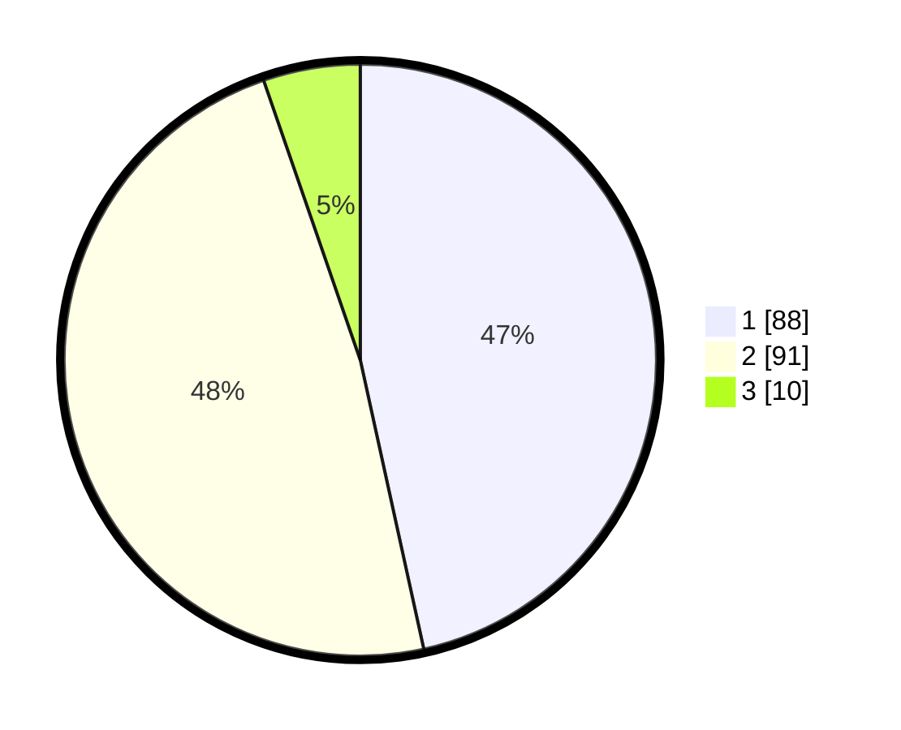

# Hasil

## Grafik

## Tabel

| No. | Nama Paslon    | Suara | Suara (raw) | Persentase |
|:--- |:-------------- | -----:| -----------:| ----------:|
| 1   | ANIES MUHAIMIN | 88    | [88][p-1]   | 46,56      |
| 2   | PRABOWO GIBRAN | 91    | [91][p-2]   | 48,15      |
| 3   | GANJAR MAHFUD  | 10    | [10][p-3]   | 5,29       |

[p-1]: https://github.com/gigit-pemilu/pemilu-2024/blob/main/pilpres/hitung-suara/sub/12-sumatera-utara/sub/71-kota-medan/sub/18-medan-perjuangan/sub/1003-sei-kera-hilir-i/sub/003-tps/sub/paslon-1.txt
[p-2]: https://github.com/gigit-pemilu/pemilu-2024/blob/main/pilpres/hitung-suara/sub/12-sumatera-utara/sub/71-kota-medan/sub/18-medan-perjuangan/sub/1003-sei-kera-hilir-i/sub/003-tps/sub/paslon-2.txt
[p-3]: https://github.com/gigit-pemilu/pemilu-2024/blob/main/pilpres/hitung-suara/sub/12-sumatera-utara/sub/71-kota-medan/sub/18-medan-perjuangan/sub/1003-sei-kera-hilir-i/sub/003-tps/sub/paslon-3.txt

## Foto C Plano

https://sirekap-obj-formc.kpu.go.id/dd53/pemilu/ppwp/12/71/18/10/03/1271181003003-20240214-155255--dcbfa70d-21ed-4ffd-a990-2810a3b7ec91.jpg

https://sirekap-obj-formc.kpu.go.id/dd53/pemilu/ppwp/12/71/18/10/03/1271181003003-20240214-155728--04d89c49-c5bb-40fc-a616-bb11be9f97b8.jpg

https://sirekap-obj-formc.kpu.go.id/dd53/pemilu/ppwp/12/71/18/10/03/1271181003003-20240214-160055--591112a7-f5ad-4ac9-afe6-a186a153b08f.jpg

## Metadata

| Key        | Value               |
| ---------- | ------------------- |
| Time Stamp | 2024-02-25 16:00:00 |

